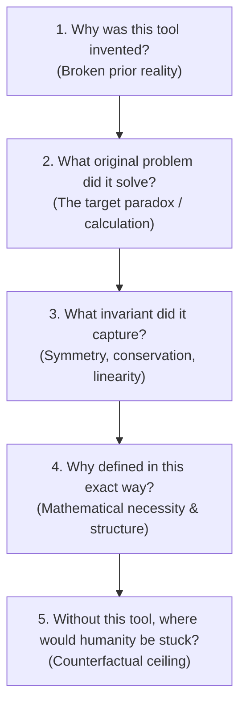

# Depth Framework (深刻的方式)

The **Depth Framework (深刻的方式 / DEPTH)** is an epistemic mental model designed to deconstruct physical concepts, mathematical abstractions, and theoretical tools to their bedrock. It replaces passive formula-memorization with active reconstruction of the historical, mathematical, and physical necessity that forced the concept into existence.

---

## The Five Depth Questions

Whenever encountering a new physical law, mathematical definition, or theoretical object, interrogate it through these five sequential questions:

### 1. Why was this tool invented? (这个工具为什么会被发明？)
- **Broken prior framework:** What physical situation or boundary condition caused the existing theory to fail?
- **Cognitive friction:** What was the conceptual impasse that older tools could neither compute nor explain?

### 2. What original problem did it solve? (它解决了什么原始问题？)
- **Target problem:** What specific calculation, experimental anomaly, or theoretical contradiction did this tool resolve?
- **Decoupling:** How does the tool isolate the core difficulty from distracting environmental noise?

### 3. What invariant did it capture? (它抓住了世界中的什么不变量？)
- **Symmetry & conservation:** What fundamental property of nature (e.g., gauge invariance, reciprocity, conservation of charge/energy) remains unchanged?
- **Geometric constancy:** What guarantees that the defined ratio or coefficient is independent of dynamic variables (e.g., current, voltage, coordinate choice)?

### 4. Why did it have to be defined in this exact way? (它为什么必须被这样定义？)
- **Mathematical necessity:** Why this specific functional form, derivative order, or dimensional ratio (e.g., $\Phi/I$ rather than $\Phi \cdot I$)?
- **Kindred contrasts & bounds:** Why does it have its specific sign constraints (e.g., self-inductance $L > 0$ vs. mutual inductance $M \gtrless 0$) and physical boundaries (e.g., $M \le \sqrt{L_1 L_2}$)?

### 5. Without this tool, where would humanity be stuck? (如果没有这个工具，人类会卡在哪里？)
- **Technological & theoretical ceiling:** If this concept had never been formulated, what modern engineering systems or fundamental physics theories would be completely impossible?

---

## Canonical Examples

### 1. Self-Inductance ($L \equiv \Phi / I$)
- **Why invented:** Kirchhoff's loop rule ($\oint \mathbf{E}\cdot\mathrm{d}\mathbf{l} = 0$) breaks down in time-varying magnetic fields ($\oint \mathbf{E}\cdot\mathrm{d}\mathbf{l} = -\frac{\mathrm{d}\Phi_B}{\mathrm{d}t} \neq 0$).
- **Original problem:** Quantifying the self-retarding back-emf without recalculating 3D vector field integrals across the circuit volume at every instant.
- **Invariant captured:** Linearity of Maxwell-Ampère / Biot–Savart equations ($\mathbf{B} \propto I$) guarantees that self-flux is strictly proportional to current ($\Phi = L I$). $L$ is a purely geometric invariant.
- **Why defined this way:** Faraday's law $\mathcal{E} = -\frac{\mathrm{d}\Phi}{\mathrm{d}t} = -L \frac{\mathrm{d}I}{\mathrm{d}t}$ demands a linear ratio between flux and current. Lenz's law and thermodynamic stability force $L > 0$.
- **Where humanity would be stuck:** No lumped-element RF circuits, filters, power electronics, or inductive energy storage ($U = \frac{1}{2}LI^2$).

### 2. Mutual Inductance ($M_{12} \equiv \Phi_{21} / I_1$)
- **Why invented:** Separate circuits interact across empty space without conductive contact via electromagnetic fields.
- **Original problem:** Predicting the induced voltage $\mathcal{E}_2(t)$ in a secondary loop driven by an arbitrary current $I_1(t)$ in a primary loop.
- **Invariant captured:** Neumann Reciprocity ($M_{12} = M_{21} = M$), rooted in electromagnetic spatial symmetry and energy conservation.
- **Why defined this way:** Decouples spatial field geometry from temporal dynamics ($\mathcal{E}_2 = -M_{12}\frac{\mathrm{d}I_1}{\mathrm{d}t}$). Energy positive-semidefiniteness requires $M \le \sqrt{L_1 L_2}$.
- **Where humanity would be stuck:** No AC electrical grid (transformers impossible), leaving humanity trapped in localized low-voltage DC microgrids (Edison's bottleneck); no wireless charging or RF transformers.

### 3. Displacement Current ($\mathbf{J}_D \equiv \epsilon_0 \frac{\partial \mathbf{E}}{\partial t}$)
- **Why invented:** Static Ampère's law $\nabla \times \mathbf{B} = \mu_0 \mathbf{J}$ implies $\nabla \cdot (\nabla \times \mathbf{B}) = 0 \implies \nabla \cdot \mathbf{J} = 0$, violating the continuity equation $\nabla \cdot \mathbf{J} = -\frac{\partial \rho}{\partial t}$ when charging capacitors.
- **Original problem:** Mathematical contradiction between Ampère's circuital law and local charge conservation.
- **Invariant captured:** Local electric charge conservation and gauge symmetry.
- **Why defined this way:** Taking the divergence of Ampère's law and substituting Gauss's law $\nabla \cdot \mathbf{E} = \rho / \epsilon_0$ uniquely fixes the missing term to $\mu_0 \epsilon_0 \frac{\partial \mathbf{E}}{\partial t}$.
- **Where humanity would be stuck:** Maxwell's equations would not support wave solutions; light would not be understood as an electromagnetic wave, and radio/radar/telecommunications would not exist.

---

## Comparison: Surface Recall vs. Depth Framework

| Level | Learning Mode | Focus | Retention & Transfer |
| :--- | :--- | :--- | :--- |
| **Surface** | Formula memorization | How to plug numbers into $\Phi = M I$ | Fragile; breaks when loop geometries rotate or exam questions invert parameters |
| **DEPTH** | Structural reconstruction | Why $M_{12}=M_{21}$, what invariant holds, where it breaks | High transfer; effortlessly recognizes reciprocity shortcuts on GRE exam traps |

---

## Related Concepts

- [[Feynman-Recall-Spaced Study Method]]
- [[Feynman Technique]]
- [[Progress-context]]
