# 10 Production and Use of Radioactive Beams

*Isao Tanihata*

**Source:** `ExperimentTechniquesNP_Chapter10-11.pdf` — book pages 343–424 (PDF pages 1–83). Scanned chapter excerpt; figures cropped from page images.

---

## Table of Contents

| | | page |
|---|---|---:|
| I. | Introduction | 343 |
| II. | Production by secondary beam method | 344 |
| | A. Projectile fragmentation of heavy ions | 344 |
| | B. Principle of separation | 347 |
| | 1. Selection of the target | 347 |
| | 2. Separation methods | 350 |
| | 3. Facilities | 354 |
| III. | Production by reacceleration method | 355 |
| | A. Outline of radioactive beam production | 355 |
| | B. Facilities | 356 |
| IV. | Studies with radioactive beams | 357 |
| | A. Nuclear structure | 359 |
| | 1. Structure near the neutron drip line. Neutron halo | 359 |
| | 2. Thick neutron skin | 361 |
| | 3. Exclusive reactions | 362 |
| | 4. Isospin dependence of nuclear radii | 363 |
| | B. Nucleosynthesis | 364 |
| | 1. Reactions in the hot CNO cycle | 365 |
| | 2. Big Bang nucleosynthesis | 366 |
| | C. Radioactive beams for other fields of study | 369 |
| | References | 370 |

---

### I. Introduction

A principal constraint for studying nuclear physics and other nuclear science was the confinement of both beam and target species to the line of stability, the well-balanced nuclei. The restriction is a fundamental one for nuclear physics, not only because it precludes access to a vast region of bound nuclei, but also because it limits the type and extent of phenomena that can be studied in the nuclei which can be reached. Because of this, it is only for the narrow band of stable nuclei that we have detailed experimental information on radii, magnetic moments, single-particle structures, giant resonance, the entire field of scattering processes, and reaction mechanisms and so on.

Recent development of radioactive beams provided us with new opportunities to extend our study using a wider range of nucleus. Studies using radioactive beams have been remarkably developed in the last few years and new knowledge has been gained in nuclear physics and astrophysics. Here in this chapter, methods of production and some recent usage of the radioactive beams will be reviewed. Two production methods, the secondary beam method and the reacceleration method, are shown in the following Sects. II and III. Both are used for producing energetic beams high enough to study nuclear reactions that involve a $\beta$ radioactive nucleus in the initial state.

Separators, which are used for production of radioactive beams, are also extensively used for other studies such as new isotope searches, mass measurements, measurements of magnetic moment of $\beta$ radioactive nuclei, and others. Several successful use of radioactive beams in nuclear physics as well as astrophysics are presented in Sect. IV.

Many articles have been published on this subject and can be found in recent proceedings of international conferences and in review articles [1, 2, 3]. Readers who need a more detailed description of a specific subject are recommended to consult these references and references therein.

### II. Production by secondary beam method

In principle, any nuclear reaction, which produces radioactive nuclei, can be used for production of secondary radioactive beams. However it only became practical to use radioactive beams for reaction studies after the discovery of "projectile fragmentation" in high-energy heavy-ion collisions. In fact the first systematic study with radioactive beams was made using the secondary beams from the projectile fragmentation. Here in this section we will review the principle of the production of secondary beams of radioactive nuclei.

#### A. Projectile fragmentation of heavy ions

At a beam energy much higher than a binding energy of a nucleon, nuclear fragments are emitted copiously into the narrow forward cone. This phenomenon is called projectile fragmentation and the emitted nuclei are called projectile fragments. The projectile fragmentation has three important characteristics for the production of radioactive beams:

1. Various nuclides including nuclei far from the stability line are produced with large cross sections. In fact many extremely neutron (and proton) rich nuclides were discovered by projectile fragmentation.
2. All projectile fragments are emitted with almost the same velocity as the projectile. Therefore the separation of nuclides is simple and high collection efficiency can be easily obtained. (see `Feynman: Why Momentum Distribution Matters`)
3. A fragmentation cross section is almost independent of the incident energy.

Since it is essential for the radioactive beam production, we see the momentum distribution of the projectile fragments in the following.

> [!Feynman]- Why Momentum Distribution Matters
> **Q:** Why is the momentum distribution of the projectile fragments essential? What role does it play in research on these topics? Follow-ups: (1) Is momentum space phase space? (2) Why an *angle* window, not only momentum? (3) How does cloud *width* control intensity?
> **Language note:** Original: *"essentional" / "fragmentats" / "what kind of role… on such topics"* → natural: *"essential" / "fragments" / "what role does it play in research on these topics?"*
>
> You already know the separator’s main job: select nuclei by magnetic rigidity $B\rho \propto p/q$. That alone needs the **parallel / total momentum** distribution. The text still spends pages on the full momentum cloud because production is not only “pick $p$” — it is “deliver as many of the *right* $A,Z$ as possible with usable beam quality.” Below: three precise points, then the production role.
>
> ---
>
> **(1) Is “momentum space” the same as phase space?**
>
> **No.** They are related but not identical.
>
> - **Momentum space:** only the momentum coordinates of each fragment — $(p_\parallel, p_t)$ or $(p_x,p_y,p_z)$. Fig. 1 is a 1D projection of that: $dN/dp$ in the projectile rest frame. The Goldhaber-style $\sigma(P_\parallel)$ in Eq. (1) lives entirely here.
> - **Phase space (classical mechanics / beam optics):** the full set of conjugate coordinates, typically 6D per particle: $(\mathbf{r},\mathbf{p})$ or, for beams, often $(x,x',y,y',\ell,\delta)$ where $x'=p_x/p_z \approx \theta_x$ is an *angle*, and $\delta=\Delta p/p$ is relative momentum.
>
> So: momentum space is the **$p$-projection** of phase space. When beam people say “phase-space acceptance of the separator,” they mean a **volume cut** in that full space (positions *and* angles *and* $\Delta p/p$), not “momentum distribution” alone. The earlier “cloud in momentum space” was intentionally only the $p$ part that this section measures.
>
> ---
>
> **(2) Why an angle window? (You already get the momentum cut — where does angle come from?)**
>
> Two different physical filters act after the target:
>
> | Filter | What it selects | Hardware |
> |---|---|---|
> | **Momentum (rigidity)** | $p/q$ (and thus $A,Z$ after $B\rho$ + energy loss) | Dipoles, degrader, slits at dispersive focus |
> | **Angle (and position)** | Direction of flight $\theta$; transverse position | Finite apertures: pipe walls, quadrupole bore, collimators, magnet gaps |
>
> After fragmentation, each nucleus has a **transverse** kick $p_t$ as well as a parallel spread $p_\parallel$. In the lab, for a forward-going relativistic fragment,
>
> $$
> \theta \approx \frac{p_t}{p_\parallel} \quad (\text{small-angle}).
> $$
>
> The text already says fragments fill a **narrow forward cone** — that *is* the angular distribution. At high energy, $p_\parallel$ is huge while $\sigma(p_t)$ stays $\sim 100\,\mathrm{MeV}/c$ (Eq. 1–2 scale), so $\theta$ is small — good for collection. But it is still nonzero: a fragment with too large $\theta$ never enters the first dipole cleanly, or hits an aperture later. That is the **angular acceptance** $\Delta\Omega$ (or $\Delta\theta_x\times\Delta\theta_y$).
>
> Geometrically (thin entrance aperture of half-height $r$ at free-flight distance $L$ from the production point): $\theta_{\mathrm{acc}} = \arctan(r/L)\approx r/L$. Only trajectories with $|\theta|<\theta_{\mathrm{acc}}$ clear the opening into the spectrometer; larger angles hit the aperture face. Residual primary ions that punch through the target are rejected mainly by **$B\rho$**, not by this angle cut.
>
> Separators are also optical systems: transport matrices map $(x,\theta)$ through the line; large $\theta$ causes larger beam spots at foci and worse resolution/purity even if $p$ was “right.” So angle is not a second magic selection variable like $B\rho$ — it is the **geometric + optical** window that decides whether a particle with the *correct* $p/q$ actually *survives the line*.
>
> Link to the note: $\sigma(P_t)\approx\sigma(P_\parallel)$ at high energy (isotropic in the moving frame) $\Rightarrow$ once you know $\sigma(P_\parallel)$, you already know the angular width scale via $\theta\sim p_t/p$.
>
> 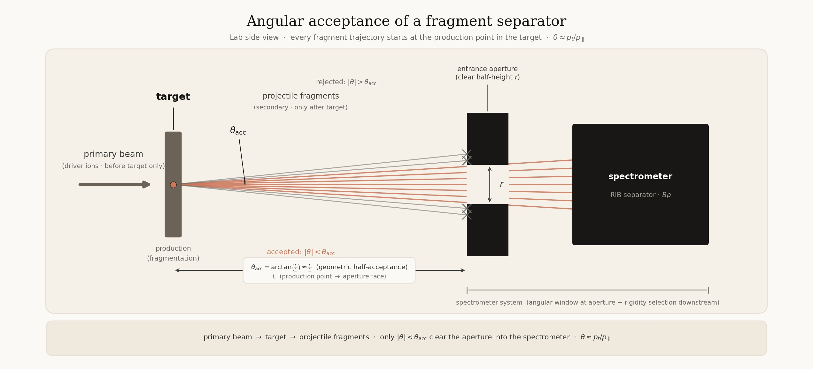
>
> *Fig. F1. Angular acceptance — lab side view. **Primary beam** only *before* the target. At the target, projectile fragmentation creates **secondary** fragments; every trajectory shares one production point. Lab angle $\theta \approx p_t/p_\parallel$. Geometric half-acceptance $\theta_{\mathrm{acc}} = \arctan(r/L) \approx r/L$ set by the entrance aperture half-height $r$ and free-flight distance $L$ (production point → aperture face). Rays with $|\theta|<\theta_{\mathrm{acc}}$ (coral) clear the aperture into the **spectrometer** (RIB separator; $B\rho$ selection downstream); $|\theta|>\theta_{\mathrm{acc}}$ hit the aperture face and are rejected.*
>
> ---
>
> **(3) Width of the cloud vs intensity (what maps to what)**
>
> Separate two rates carefully:
>
> 1. **Production rate** (at the target): $R_\mathrm{prod} \propto I_\mathrm{primary}\times N_\mathrm{target}\times\sigma_\mathrm{frag}$. This depends on cross section and target thickness — *not* on how wide the momentum cloud is. A wider cloud does **not** mean more nuclei are created.
> 2. **Delivered secondary intensity** (at the end of the separator):
>
> $$
> I_\mathrm{secondary} = R_\mathrm{prod}\times \varepsilon_\mathrm{collection}\times \varepsilon_\mathrm{transmission}\times\cdots
> $$
>
> Collection efficiency $\varepsilon_\mathrm{collection}$ is essentially the **fraction of the production distribution that falls inside the separator’s acceptance window** $(\Delta p,\,\Delta\Omega)$.
>
> Picture a normalized Gaussian $dN/dp$ with width $\sigma_p$, and a rectangular acceptance $\pm\Delta p$ centered on the peak. Then
>
> $$
> \varepsilon_p \approx \int_{-\Delta p}^{+\Delta p}\! \frac{1}{\sqrt{2\pi}\,\sigma_p}\,e^{-p^2/2\sigma_p^2}\,dp
> $$
>
> (same idea in 2D for angles). Fixed machine $\Rightarrow$ fixed $\Delta p$ and $\Delta\Omega$. **Larger $\sigma_p$ or $\sigma_\theta$ $\Rightarrow$ smaller $\varepsilon$ $\Rightarrow$ lower $I_\mathrm{secondary}$**, even though $R_\mathrm{prod}$ is unchanged. Conversely, a narrow cloud (projectile and fragment $A$ close; high beam energy so $\sigma/p$ drops — Fig. 2) packs more of the yield into the same window.
>
> Here's what trips people up: “wider cloud = more intensity” confuses **spread of kinematics** with **number of events**. Width redistributes a fixed yield over a larger $(p,\theta)$ volume; the separator only keeps a fixed sub-volume.
>
> ---
>
> **Role in RIB research (with that machinery)**
>
> - **Engineering / intensity:** predict $\varepsilon$ from $\sigma(P_\parallel),\sigma(P_t)$; choose $A_p\approx A_F$, energy, and low-$Z$ target (later §B.1) to maximize delivered $I$.
> - **Separator design:** match magnet acceptance and achromatic optics to the known cloud (requirement 2–3 in §B).
> - **Beam quality for secondary reactions:** residual $\Delta p/p$ and emittance set energy resolution and background in the physics run.
> - **Nuclear physics observable:** the same $\sigma(P)$ (Goldhaber / Fermi-motion picture) probes how nucleons moved in the projectile — production tool *and* structure probe.
>
> Bottom line for this sentence in the text: the momentum distribution is “essential” because it fixes **how much of the fragmentation yield is capturable**, **how pure and mono-energetic the secondary beam can be**, and **what acceptance the line must provide** — not because the separator “only works if you plot it.”

Figure 1 shows the momentum distribution, in the projectile rest frame, for $^{10}\mathrm{Be}$ fragments from $^{12}\mathrm{C}$ fragmentation at $2.1A~\mathrm{GeV}$ as an example [4]. As can be seen,

**Fig. 1.** Momentum distribution of $^{10}\mathrm{Be}$ fragments from $^{12}\mathrm{C}$ reaction at $2.1A~\mathrm{GeV}$. The distribution is plotted in the rest frame of the incident particle. Down shift of the central momentum and the Gaussian width characterize the distribution.

a Gaussian shape provides a good fit to the spectra observed for all isotopes regardless of beam, energy or target. It is also found that the momentum distribution is almost the same in both parallel ($\parallel$) and perpendicular (t) directions. A spectrum is characterized by its central momentum $\langle P_\parallel \rangle$ and standard deviation $\sigma(P_\parallel)$. The value of $\langle P_\parallel \rangle$ was found to be in the range of $-10$ to $-130~\mathrm{MeV}/c$ for various fragments. (A negative sign for $\langle P_\parallel \rangle$ indicates that the fragment speed is less than that of the projectile.) A fragment has almost the same velocity as the incident projectile nucleus because the total momentum of the projectile fragment is much larger than $\langle P_\parallel \rangle$.

The width of the momentum spread $\sigma(P_\parallel)$, as well as $\langle P_\parallel \rangle$, is found to be essentially independent of target mass and beam energy but does depend on the mass number of the projectile ($A_\mathrm{p}$) and of the fragment ($A_\mathrm{F}$). The dependence of $\sigma(P_\parallel)$ on $A_\mathrm{p}$ and $A_\mathrm{F}$ can be expressed as

$$
\sigma(P_\parallel) = \sigma_0 \sqrt{A_\mathrm{F}(A_\mathrm{p}-A_\mathrm{F})/(A_\mathrm{p}-1)}
\tag{1}
$$

where $\sigma_0 = 90~\mathrm{MeV}/c$; [5] $\sigma(P_\parallel)$ takes its maximum value when $A_\mathrm{F} = A_\mathrm{p}/2$. The width $\sigma(P_\mathrm{t})$ of the transverse momentum distribution of the fragment is found to be equal to $\sigma(P_\parallel)$, consistent with isotropic production of fragments in a frame moving at $\beta_\parallel = -\langle P_\parallel \rangle/E$ in the projectile frame. The value of $\sigma(P_\parallel)$ is known to remain constant down to energies approaching as low as $20~\mathrm{MeV}/\mathrm{nucleon}$ [6]. It is found that $\sigma(P_\mathrm{t})$ behaves differently at low energies. Empirically, it was shown that, at projectile energies below $200~\mathrm{MeV}/\mathrm{nucleon}$, the $\sigma(P_\mathrm{t})$ is fitted by [7]:

$$
\sigma^2(P_\mathrm{t}) = \sigma_0^2 A_\mathrm{F}(A_\mathrm{p}-A_\mathrm{F})/(A_\mathrm{p}-1) + \sigma_1^2 A_\mathrm{F}(A_\mathrm{p}-A_\mathrm{F})/A_\mathrm{p}(A_\mathrm{p}-1)
\tag{2}
$$

where $\sigma_1 = 200~\mathrm{MeV}/c$.

In order to minimize broadening of the product momentum it is important to use a primary beam of mass number close to that of the desired nucleus but, especially at high energy, to have both the proton and the neutron numbers of the projectile nucleus larger than those of the desired product nucleus.

**Fig. 2.** Energy dependence of the relative momentum width, top for parallel momentum and bottom for transverse momentum. Numbers like $20\rightarrow 12$ indicate the mass number of a projectile and a fragment.

Figure 2 shows energy dependence of the relative momentum width of the parallel momentum $[\sigma(P_\parallel)/P]$ and the transverse momentum $[\sigma(P_\mathrm{t})/P]$ for several mass regions. The numbers indicated by $20\rightarrow 12$, for example, identify the fragmentation (fragmentation of the nucleus with $A=20$ to a nucleus with $A=12$). It is clear that the higher the energy, the smaller the relative momentum broadening.

#### B. Principle of separation

In principle any type of recoil mass separator with high collection efficiencies can be used to deliver secondary beams. However, special attention is required for efficient separation. These are as follows:

1. The production target has to be selected so that a produced nuclide has a small momentum and an angular broadening.
2. The momentum and the angular acceptance of a separator should be as large as possible. (see `Feynman: Why Momentum Distribution Matters`)
3. It is desirable, in most cases, that the separable beam is delivered achromatically to a reaction target.

The requirement 1 favors projectile fragmentations of high-energy heavy-ions and some cases of low-energy transfer reactions.

##### 1. Selection of the target

Usable secondary-beam intensity and momentum spread of the fragments depend, in large measure, on the choice of the target material as well as on the properties of the production reaction as discussed in the previous section. Figure 3a, b and c shows results of a study of $^{11}\mathrm{C}$ production efficiency, primary-beam survival, and multiple scattering for a primary $400~\mathrm{MeV}/\mathrm{nucleon}$ $^{12}\mathrm{C}$ beam passing through beryllium, copper, and lead targets [8]. The horizontal axis in the figure is the remnant primary beam energy. Since the $\mathrm{d}E/\mathrm{d}x$ value is lower for a low-$Z$ target, a given beam-energy loss can also result from passage through a much thicker low-$Z$ target.

The other factor in yield consideration reflects the target mass-number dependence of the fragmentation cross-sections, which are generally proportional to $A^{2/3}$. Because the number of nuclei in a target of given thickness (in $\mathrm{g}/\mathrm{cm}^2$) is proportional to $1/A$, the production yield is proportional to $A^{-1/3}$ and therefore is larger for targets of the lighter nuclei. The fall-off in the $^{11}\mathrm{C}$ yield from the beryllium target below $300~\mathrm{MeV}/\mathrm{nucleon}$, in Fig. 3, results from the loss of $^{11}\mathrm{C}$ due to nuclear reactions and lower production rates because of a dwindling supply of primary nuclei throughout the target.

From Fig. 3 one sees that low-$Z$ materials make the best targets for secondary beam production via projectile fragmentation reactions. Production is higher, primary beams attenuate more rapidly, and there is less multiple scattering (hence less emittance growth). If all the product nuclei can be used as secondary beams, the thickness of the target is determined by maximization of the product yield. In practice however, a beam separator has limited acceptance in both momentum and angle. In addition to momentum and angular broadening arising from the production mechanism, energy loss and multiple scattering make the broadening even greater.

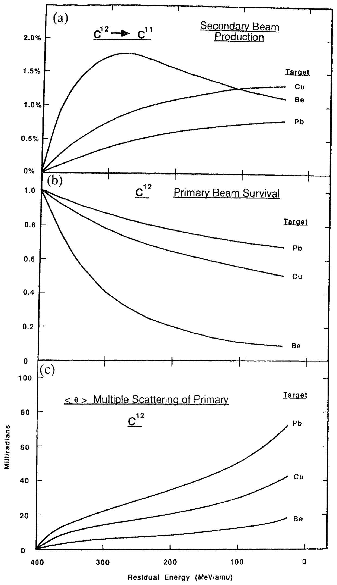

**Fig. 3.** Character of the production target for secondary beam production. (a) production yield of $^{11}\text{C}$ from $^{12}\text{C}$ for three different targets, (b) attenuation of the $^{12}\text{C}$ primary in targets, and (c) average angle of the multiple scattering of $^{12}\text{C}$ primary.

As illustrated in Fig. 4, a difference in energy loss between the projectile and the product increases should be taken into account. As shown in the figure, if the reaction occurs at the front surface of the target, the energy loss is determined by $\text{d}E/\text{d}x$ of the fragment; on the other hand, if the reaction occurs at the back surface, the energy loss is determined by $\text{d}E/\text{d}x$ of the primary beam.

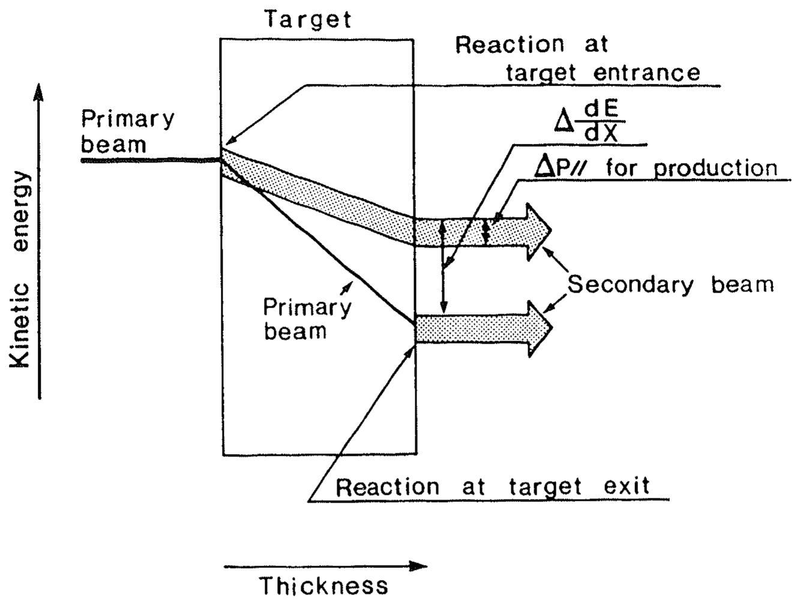

**Fig. 4.** A schematic diagram for energy loss in the target. A difference of energy loss between a projectile and a fragment produce the difference in the energy of emitted fragment after the target.

Figure 5 shows a comparison of causes of momentum broadening for the specific case of $^{8}\text{He}$ production from $800\text{ MeV/nucleon}$ $^{12}\text{C}$ primary. The effect of the energy loss difference ($\Delta\text{d}E/\text{d}x$ in the figure) contributes to the momentum spread. On the other hand, multiple Coulomb scattering sets no limit on the target thickness at this energy. However at a low energy it is important and has to be taken into account carefully.

The momentum broadening due to the energy-loss difference becomes comparable to that intrinsic to the reaction when the target is thicker than $5\text{ g/cm}^{2}$. Unless the momentum acceptance of the separator is much larger than several percent, a thicker target will not increase the intensity of the secondary beam. In practice, it is very difficult to design a separator with an acceptance larger than several percent; therefore, the target thickness is ultimately determined by the reaction between the momentum broadening intrinsic to the reaction and the energy-loss difference in the target. In general, the thickness of target which equates these effects is the optimum one.

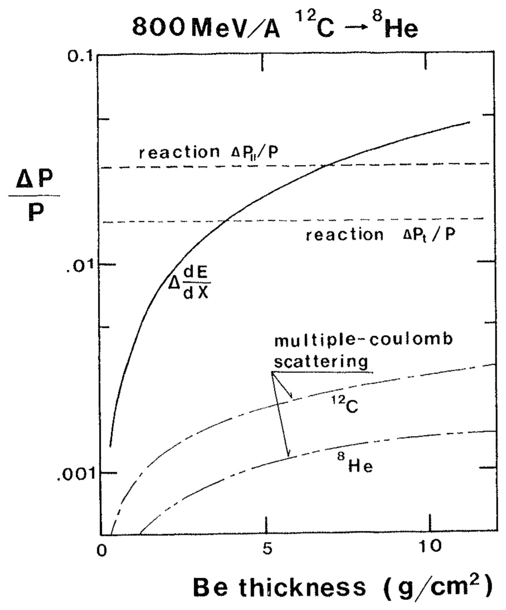

**Fig. 5.** Various contributions to the momentum broadening of $^{8}\text{He}$ fragments at $800\text{A MeV}$. The difference in the energy loss results in additional broadening of parallel momentum $P_\parallel$. The multiple scattering affects the transverse momentum $P_\text{t}$.

An example of product momentum distribution is shown in Fig. 6 for $^{11}\text{Li}$ fragments from $100\text{A MeV}$ $^{18}\text{O}$ primary on $\text{Be}$ target. Lines show the momentum distributions of $^{11}\text{Li}$ for each $0.2\text{ g/cm}^2$ step of target thickness. The peak yield increases until $1.2\text{ g/cm}^2$ of target thickness. However it then starts to decrease even if the target thickness still increases. Also the width of distribution increases monotonically with the target thickness. The optimum target thickness has to be selected considering the yield within the spectrometer acceptance and possible admixture of other nuclides.

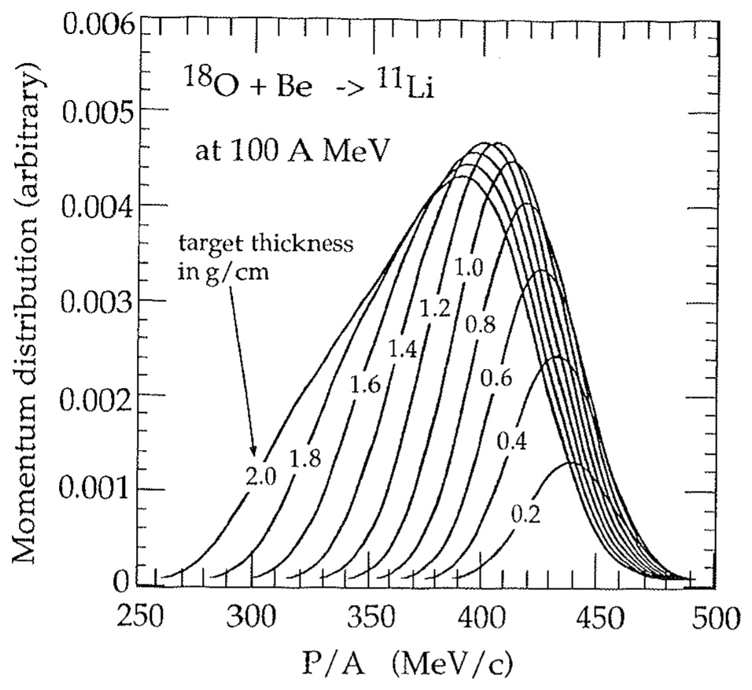

**Fig. 6.** Momentum distributions of $^{11}\text{Li}$ after targets of various thicknesses.

##### 2. Separation methods

The necessary nuclear separation depends on the specific experiment. For example, if one wishes to measure the reaction cross-section at high energy, the admixture of other nuclei in the secondary beam can be effectively rejected by identifying the nuclei one by one. On the other hand, if one wishes to study low-energy reactions with a small cross-section, a single-nuclide beam is essential because it is difficult to identify a particle.

I will not go in detail of the separation technique here because it is covered in another chapter (by G. Münzenberg) in detail. But I will just mention an essential principle for the separation of the projectile fragments in the following.

Taking advantage of the properties of the projectile fragmentation, the first beam line was constructed and used in the reaction studies at Berkeley [9]. The magnetic rigidity $R$ of a fully striped ion is written as

$$
R = \frac{P}{Z} = \frac{\beta\gamma\,m\,A}{Z}
\tag{3}
$$

where $P$ is the total momentum of the ion, $m$ is the nuclear mass unit and $\beta$, $\gamma$ are Lorentz factors. Because velocities of fragments ($\beta$) are the same, a selection by the magnetic rigidity gives an $A/Z$ separation. For many types of experiment the $A/Z$ separation is sufficient because $Z$ can be identified easily one by one before incident on a reaction target. As seen in Fig. 7 this type of separator has two sections. First, the primary beam from the accelerator is focused on the first focus (F1) where a production target is placed. Fragments produced by the target are analyzed at F2 – a focus with large momentum dispersion. A separation slit is located at F2 and nuclei within certain range of momentum are selected. Then the separated beam is focused achromatically at F3. The cleaning collimator is placed there at F3 to remove any beam halo. The separated beam is then delivered to an experimental area.

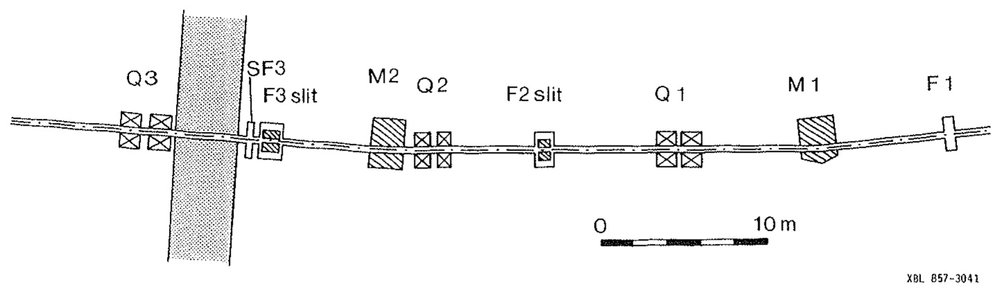

**Fig. 7.** The secondary beam line at LBL. The first beam line used for reaction studies with high-energy radioactive nuclear beams.

A certain type of experiment requires a beam without admixture of other nuclides except an objective one. An additional separation can be obtained by an energy degrader because a $\text{d}E/\text{d}x$ is proportional to $Z^2$ and is different from $A/Z$. In a particular “energy-loss achromat” method, an energy degrader technique developed at LISE of GANIL, a simple and efficient method of separation is provided [10]. Other separators, the RIPS at RIKEN, the separator at MSU, and the FRS at GSI, also use this technique.

We now discuss the principles of this separation. It is known that at intermediate energy the range $\mathscr{R}$ of the $^{A}Z$ nucleus having an energy $E$ per nucleon can be empirically expressed as

$$
\mathscr{R} = \kappa E^{\gamma} A / Z^2 + CA
\tag{4}
$$

where $\kappa$, $\gamma$, and $C$ are constants depending only on the stopping material. After some manipulation of this equation, one calculates the rigidity $R_2$ of the nucleus after passage through an absorber as

$$
R_2(A, Z, d, R_1) = R_1 \left( 1 - \frac{d \, A^{2\gamma - 1}}{\kappa \, Z^{2\gamma - 2}} R_1^{-2\gamma} \right)^{1/2\gamma}
\tag{5}
$$

The ions not separated in terms of $R_2$ are those having the same ratio $A^{2\gamma-1} / Z^{2\gamma-2}$. Using $\gamma = 1.75$ as an example (the value for an aluminium absorber) this ratio may be written as $A^{2.5} / Z^{1.5}$. This system thus provides a selection on $A$ and $Z$ that is different from the first selection which is sensitive only to $A/Z$. This difference in selectivity is shown in Fig. 8. One can see that any single nucleus can, in principle, be separated using this approach.

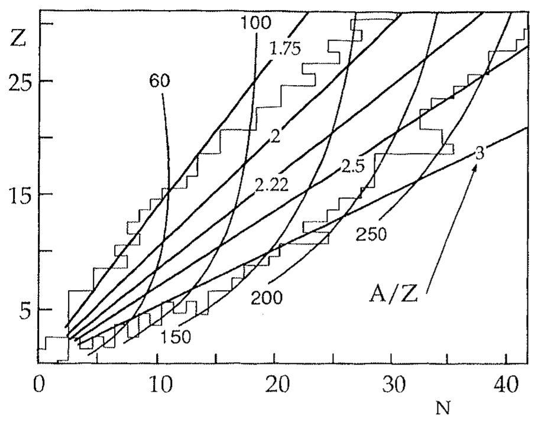

**Fig. 8.** Selectivity of the separation magnet and combined energy degrader. Straight lines show the selections made by the first part of the secondary beam line. Curved lines indicates the selection by a combination of achromatic degrader and the last half of the magnets. Application of both provide a separation of single isotope.

Usually an absorber is placed at the first dispersive focus of the separator. It would be interesting to follow how the second part of the separator functions. If the first part of the separator has dispersion $D_1$, the relation between the rigidity of a nucleus and its position $\kappa$ can be written as

$$
R_1 = R_0 (1 + \kappa / D_1)
\tag{6}
$$

As an example, if one uses an absorber of uniform thickness, the rigidity loss of the nucleus depends on its position because of the term which includes $R_1^{-2\gamma}$ in equation (5). The change in the dispersion introduced by the absorber is characterized by

$$
[\Delta R_2(x)/R_2] / [\Delta R_1(x)/R_1]
$$

, and is calculated to be

$$
1/1[1 - d/(R - CA)].
\tag{7}
$$

This means that the separator, which was achromatic before insertion of the absorber, cannot focus selected beam; it also means that the separation power is no longer optimized. If the second part of the spectrometer is designed to have variable dispersion, an optimization can be retrieved, however this adjustment has to be made directly, using precious radioactive beam. Therefore the selection of an absorber, which retains the achromatism of the separator, is preferable.

Such an absorber is, in fact, realized if $R_2$ is made proportional to $R_1$ for all $x$ values. This condition is fulfilled if $d(x)R_1^{-2\gamma}$ is independent of $x$. The shape of the absorber, which preserves the dispersion, is thus given by,

$$
d(x) = d_0(1 + x/D_1)^{2\gamma}
\tag{8}
$$

Because $\gamma$ is almost independent of $A$, $Z$, and $E$, in the intermediate energy range, it is a remarkable fact that the one type of absorber can conserve the achromatism of the separator, independently of $A$, $Z$, $E$, $R_1$, and $R_2$. Figure 9 shows an example of the separation spectrum at the FRS in GSI Germany [11]. After collimating the beam at two foci one nuclide can be selected.

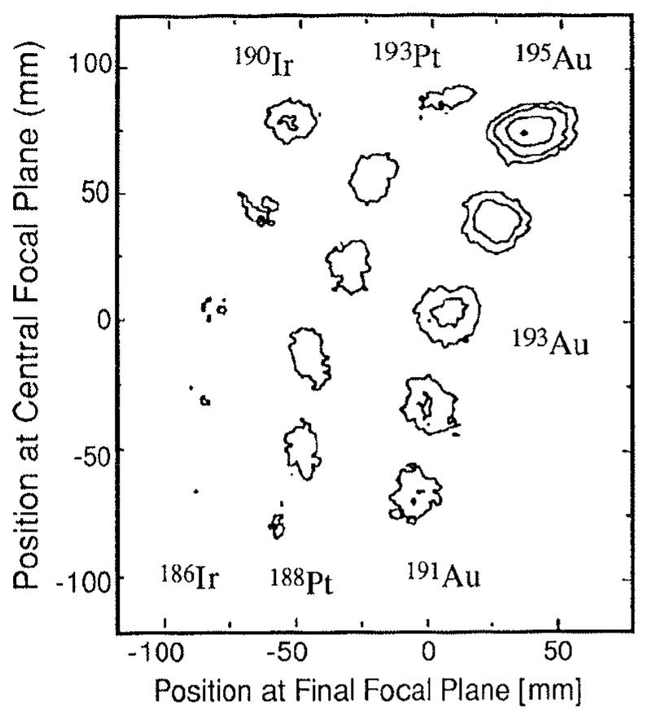

**Fig. 9.** A two dimensional position spectrum of various nuclei at two foci of the FRS in GSI. The final focus is located after the achromatic degrader. Single isotope can be selected if the collimator is used at each focus.

One other useful absorber is the monoenergetic wedge. This is the type of wedge which produces monoenergy (or uniform rigidity) beam after the absorber. Although the achromatism of the separator is destroyed, a uniformity in the range of the secondary nuclei provides further selectivity, useful in experiments which use stop nuclei in materials.

At intermediate energy, however, the velocity broadening is larger and therefore a separation by the magnetic rigidity and the energy loss is not sufficient to select out a manageable number of nuclide in particular for proton rich isotopes. At certain energy ranges a Wien filter can be used to add further separation based on the velocity of a particle. In fact it has been installed at the LISE separator at GANIL, France and demonstrated to be useful [12].

##### 3. Facilities

High and intermediate energy facilities have been constructed in several laboratories such as LBL, GSI, MSU, RIKEN, GANIL, and are under construction in many laboratories [1]. These facilities are reviewed by G. Münzenberg in another chapter so that I will not show these facilities here.

Among those, the RIPS at RIKEN has to be mentioned because of its unique setup, the beam swinger in front of the production target [13]. Using the beam swinger, the scattering angle of projectile fragments can be selected ($0\text{–}10^\circ$) by changing the incident angle of a primary beam up to $10^\circ$. It then provides a tool to select polarized nuclei. Polarized nuclei have been used for determination of their magnetic moments [14].

When one hopes to work on low energy reaction with $\beta$ unstable nuclei, low-energy heavy-ion reactions have some advantages. Although it is difficult to produce the beams of nuclei far from the stability line, $\beta$ unstable nuclei near the stability line can be produced with high intensity taking advantage of the strong primary beam. With the proper selection of an incident beam and a production reaction, a beam of small energy spreads and good purity can be obtained. Such a facility is working at the Tandem-Van-de-Graaff laboratory in Notre-Dame [15]. This facility has been used successfully for studies of low energy exclusive reactions such as an elastic scattering, a transfer reaction and a Coulomb excitation.

Many important low energy reactions to be studied exist in nuclear physics as well as in astrophysics. Low-energy heavy-ion accelerators reserve a great possibility of studies of exclusive reaction in wider isospin space.

### III. Production by reacceleration method

#### A. Outline of radioactive beam production

Reacceleration of radioactive nuclei, in some cases, has advantages compared with the recoil separator method. Best of all, they have as good beam quality as normal accelerated beams. A good energy resolution and a good emittance are essential for many reaction studies. It is well known that many unstable isotopes are produced through spallation or induced fission in high-energy proton nucleus collisions. Many ISOL facilities use these reactions with proton energies of several hundred MeV. The advantages of using a proton beam for the production of unstable nuclei are as follows:

1. High-intensity beams of up to $100\text{ }\mu\text{A}$ are available. These are orders of magnitude greater than the beam intensities available for heavy ions.
2. Thick targets can be used because the range of protons is much longer than that of heavy ions of the same energy.

Because of these characteristics, one usually obtains the largest production yield of exotic nuclei by using high-energy proton reactions. However, if one wishes to use these product nuclei as secondary beams, several difficulties arise. First, because the recoil energies of the products are very low, extraction of exotic isotopes is not a trivial process but requires very advanced technology. In fact, this is the main area of development at the ISOL facilities. Also it is of limited applicability because the extraction efficiency depends strongly on the element and it is often very difficult to extract the nuclei of interest. It is usually easy to extract alkaline elements with high efficiency, but in the case of gases such as nitrogen the efficiency is typically much lower. However this limitation may be overcome by using a special technique for individual cases. As an example, a high intensity nitrogen beam has been obtained at Louvain-la-Neuve, recently (see the next section). The second difficulty in the extraction of the secondary beam arises in the case of short-lived nuclei because the time for extraction of the isotopes is generally longer than seconds. The estimated intensity of the accelerated beams in this method can be seen in the proposal of the Isospin Laboratory for example [15].

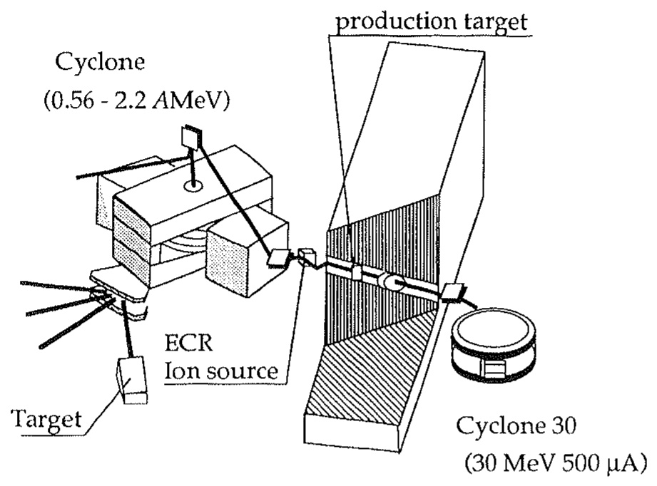

**Fig. 10.** Low energy beam facility at Louvain-la-Neuve. Two cyclotrons are used in tandem to produce the high quality beams of $^{13}\text{N}$ and other nuclei.

#### B. Facilities

Recently great efforts in Louvain-la-Neuve have borne fruit. They used high-intensity (up to $500\text{ }\mu\text{A}$ cyclotron (Cyclone 30)) for the production of $^{13}\text{N}$ through the $^{13}\text{C}(\text{p}, ^{13}\text{N})\text{n}$ reaction (see Fig. 10). The $^{13}\text{N}$ extracted from ECR ion source is injected into the second cyclotron and accelerated. The beam of $5 \times 10^8/\text{s}$ in intensity was used to determine the cross section of $^{13}\text{N}(\text{p}, \gamma)^{14}\text{O}$ reaction, one of the most important reactions for stellar nucleosynthesis. Also $^{19}\text{Ne}$ beams of $3 \times 10^8/\text{s}$ were accelerated to $0.65\text{ }A\text{ MeV}$ [17]. Because this is the first radioactive beam acceleration, we see a little more in the technical part. Details have already been published so interested readers should forward to those references [17].

The $^{13}\text{N}$ atoms ($T_{1/2}$) are produced by the $^{13}\text{C}(\text{p}, \text{n})^{13}\text{N}$ reaction with a total yield of $1.6 \times 10^{-3}\text{ }^{13}\text{N}$ nuclei per incident $30\text{ MeV}$ proton for a pure $^{13}\text{C}$ target. The target was a thick disk of graphite enriched for $^{13}\text{C}$ to $50\%$. This target was made so that it can dissipate the $6\text{ kW}$ power of a $30\text{ MeV}$, $200\text{ }\mu\text{A}$ proton beam.

The $^{13}\text{N}$ was extracted as $^{13}\text{N}-\text{}^{14}\text{N}$ molecules by a small nitrogen gas flow. An extraction efficiency of $20\%$ was routinely achieved. Then $\text{N}$ were ionized in the ECR ion source and the ionization efficiency was about $8\%$ for nitrogen $1^+$.

The ions with a mass-to-charge ratio equal to $13$ were injected in the CYCLONE. This beam however, contained not only $^{13}\text{N}^{1+}$ but also $^{13}\text{C}^{1+}$ and $^{12}\text{CH}^+$, the latter being at least $10^3$ times more intense than $^{13}\text{N}^{1+}$. The cyclotron itself was used to separate $^{13}\text{C}^{1+}$ using its mass resolving power. However the $^{12}\text{CH}^+$ was not separated even after the acceleration. It was removed by a charge stripper foil located after the cyclotron and before the beam switching magnet. Only $^{13}\text{N}^{5+}$ ions were guided to the experimental room.

They also accelerated $^{19}\text{Ne}$ beam in a similar manner. The efficiency of each separation and acceleration step are summarized in Table 1. They are also extending the project to accelerate other light radioactive nuclei.

**Table 1.** Efficiency of the different steps involved in the acceleration

| | $^{13}\text{N}$ | $^{19}\text{Ne}$ |
| :--- | :--- | :--- |
| Proton intensity ($\mu\text{A}$) | 170 | 150 |
| Production yield ratio | $0.8 \times 10^{-3}$ | $0.7 \times 10^{-3}$ |
| Extraction efficiency | 20% | 25% |
| Ionization efficiency | 8% ($1^+$) | 10% ($2^+$) |
| Acceleration efficiency | 6% | 2% |
| Stripping efficiency | 50% ($5^+$) | NA |
| Beam on the target (pps) | $4 \times 10^8$ | $3 \times 10^8$ |

Many facilities of this type are proposed as listed in Table II of ref. [18]. Among them are large projects such as ISOLAB in USA, JHP (Japan Hadron Project) which aim to open up a new generation of nuclear studies in the widest range of isospin.

### IV. Studies with radioactive beams

Using radioactive nuclear beams, many important measurements that would otherwise be impossible can be executed. Many experiments, pioneered at the Berkeley BEVALAC and extended at GANIL, RIKEN, MSU, GSI and Louvain-la-Neuve, have demonstrated the usefulness of the radioactive beams. Many believe that the use of radioactive beams can provide powerful methods for exploring nuclei under extreme conditions as will be summarized below.

– *How far from the stability line are nuclei bound?*  
Studying the limits of existence of nuclei is important not only for its own sake but also for a precise understanding of the effective interactions in nuclei. The nuclear mass formulas are developed semiempirically using masses of known nuclei. However, they give considerably different predictions when extrapolated to nuclei far from stability. In the region near the particle drip-lines, the application of such formulas is still of doubtful utility. This indicates the importance of inadequately known effective interactions such as the isospin-dependent interactions and many-body effects. The production of extremely exotic nuclei can be expected if one has available high-intensity radioactive beams. Mass measurements on these exotic nuclei using radioactive nuclear interactions is of importance.

It is very difficult to produce heavy neutron rich nuclei by spallations or projectile fragmentations because of multiple neutron emissions from highly excited prefragments except for a few nucleon removal channels. However a fragmentation of a little neutron rich nuclei, which is produced by the fragmentation of stable nuclei, may provide a greater extension to a neutron rich side by the removal of another few nucleon. It may therefore provide a method of producing heavy neutron rich nuclei further than normally available.

Fusion reactions using a neutron rich isotope are also of interest because they offer new regions of possible production provided by a large extension of the combination of a beam and a target. It is also predicted that the fusion barrier will be reduced due to the extended neutron if neutron skin or halo exists. It may thus provide the enhanced cross section to the superheavy elements [19].

– *Single particle orbital in exotic nuclei*  
One of the most important pieces of information necessary in order to understand the nuclear structure is the single particle orbital. Magic numbers were observed from various measurements and confirmed that these occur where the energy gap of a single particle orbital is large. However, there is not very much known about the possible change of magic numbers for the proton-rich regions of the nuclear chart. It is of fundamental importance to know how the order of shell orbital changes in nuclei far from stability. Transfer reactions and possibly quasi-free nucleon scattering of an unstable nucleus are expected to provide information on single particle levels far from the stability line.

– *Phenomena in high-isospin nuclei*  
Stable nuclei have a balanced number of protons and neutrons, but nuclei far from stability are always either neutron or proton rich and thus provide unbalanced nucleon environments. It is important to know the properties of such nuclei.

One of the most proeminent collective excitation is the E1 giant resonance of a nucleus. However this excitation mode has only been studied for the stable nucleus, the well balanced nucleus. It is very important to study the isospin dependence of this excitation so that we understand the collective response of nucleus when they are not balanced well in the $N/Z$ ratio.

Recent studies of neutron drip line nuclei show the formation of neutron halos and thick neutron skins. These new structures have provided us with the opportunity of studying low density nuclear matter. In addition new modes of collective excitations (“soft” multipole resonances) are predicted to exist in these nuclei.

Studies of the nuclear size, electromagnetic moments, decay characteristics, Coulomb excitations, and Coulomb dissociations are all important when these nuclei are radioactive.

– *High-spin and highly excited states*  
One of the most important contributions of heavy-ion beams thus far has been in providing great scope for the study of high spin and highly excited states. It is known that the production rate of high spin states is strongly dependent on the proton and neutron numbers of both projectile and target nuclei. The use of radioactive beams provides greater selection in both numbers. In addition high spin isomers with life-times longer than several hundred ns could be produced with the same technique. These would be excellent projectiles to produce even higher spin states because a large angular momentum can be brought into the fused system with less excitation energies.

– *Nuclear astrophysics*  
It is believed that all elements existing in our universe were produced by nucleosynthesis in the Big Bang in star evolution. In such circumstances, low-energy nuclear reactions between unstable nuclei are known to be very important. The use of low-energy radioactive beams permits the measurement of cross sections in the laboratory. Many important reactions of interest are radiative capture reactions such as (p, $\gamma$), (n, $\gamma$), ($\alpha$, $\gamma$). In general, cross sections of these reactions are small so that the measurements require high intensity beams. However, recently it has been found and demonstrated in a few cases that the Coulomb dissociation of the projectile by a large $Z$ target provides a good tool to determine the cross section as an inverse reaction measurement (see Sect. IV-B-1).

#### A. Nuclear structure

##### 1. Structure near the neutron drip line. Neutron halo

The neutron halo has been discovered in $^{11}\text{Li}$ and $^{11}\text{Be}$ and it probably also exists in some other loosely neutron dripline nuclei. It was confirmed by the consistent observations of the small separation energy [20], the large matter radii [21], and the small internal momentum of valence neutrons [22, 23]. With recent moments of radioactive beam, further detailed study of cross sections enabled us to determine the density distributions of halo nuclei. They were determined from the energy and/or the target dependence of the interaction cross section ($\sigma$) [24, 25, 26]. A density distribution could be determined by the different sampling of the density using the reaction of different transparency, e.g. a less transparent reaction is more sensitive to the low density tail of a halo nucleus while a more transparent reaction reflects the inner part of the density distribution.

The determined nucleon density distributions in $^{11}\text{Be}$ and $^{11}\text{Li}$ are shown in Fig. 11. Both nuclei have extended tails of low density. The contribution of the neutron halo is evident at a radius larger than 4 fm. The rms radius of the halo neutron distribution in $^{11}\text{Li}$ is $\sim 4.8\text{ fm}$ which is as large as that of Sn nucleus [25]. Once the possibility of a large deformation was suggested to be the main cause of the large radius. However it was rejected from the energy dependence of $\sigma_\text{I}$. As shown in Fig. 11 a large deformation can not explain the $\sigma_\text{I}$'s at $33\ A$ and $790\ A$ consistently [24].

Large enhancements of neutron removal cross sections ($\sigma_{-xn}$) were observed for large $Z$ targets for dripline nuclei, $^{6}\text{He}$, $^{8}\text{He}$, and $^{11}\text{Be}$ (Fig. 12) [27]. It is the present consensus that considerable amounts of E1 strength ($\sim 10\%$ of the sum rule) exits at very low energy (less than a few MeV) in $^{11}\text{Li}$. The double charge exchange reaction data show a resonance at 1.2 MeV and suggest that it may be a level carrying E1 strength [20]. Further experiments to confirm the idea and to see other possible resonances are in progress in GANIL, MSU and RIKEN.

These studies brought up new interesting low energy collective modes (soft giant resonances) in neutron rich nuclei [28–32]. They are collective oscillations of the core against the halo. They appear at very low energy because of the weak restoring force by a neutron halo. Inelastic scattering of neutron rich nuclei would be interesting and promising for future studies.

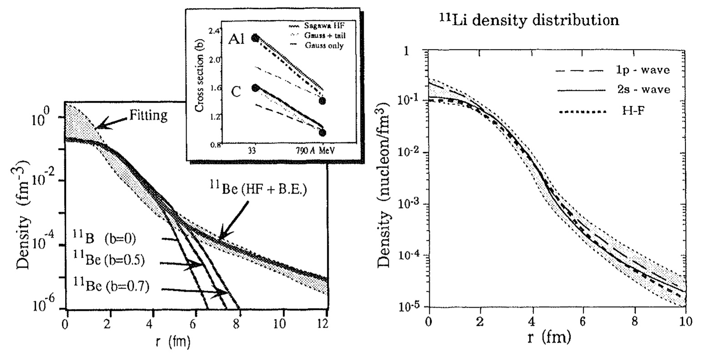

**Fig. 11.** Nuclear density distributions of neutron halo nuclei $^{11}\text{Be}$ and $^{11}\text{Li}$ determined by the energy and the target dependence of the interaction cross sections. Both nuclei show the long tail associated with halos. Deformed density distributions for $^{11}\text{Be}$ with deformation parameter $b = 0.5$ can reproduce the cross section at $800A\text{ MeV}$. However it fails to reproduce the energy dependence of the cross section.

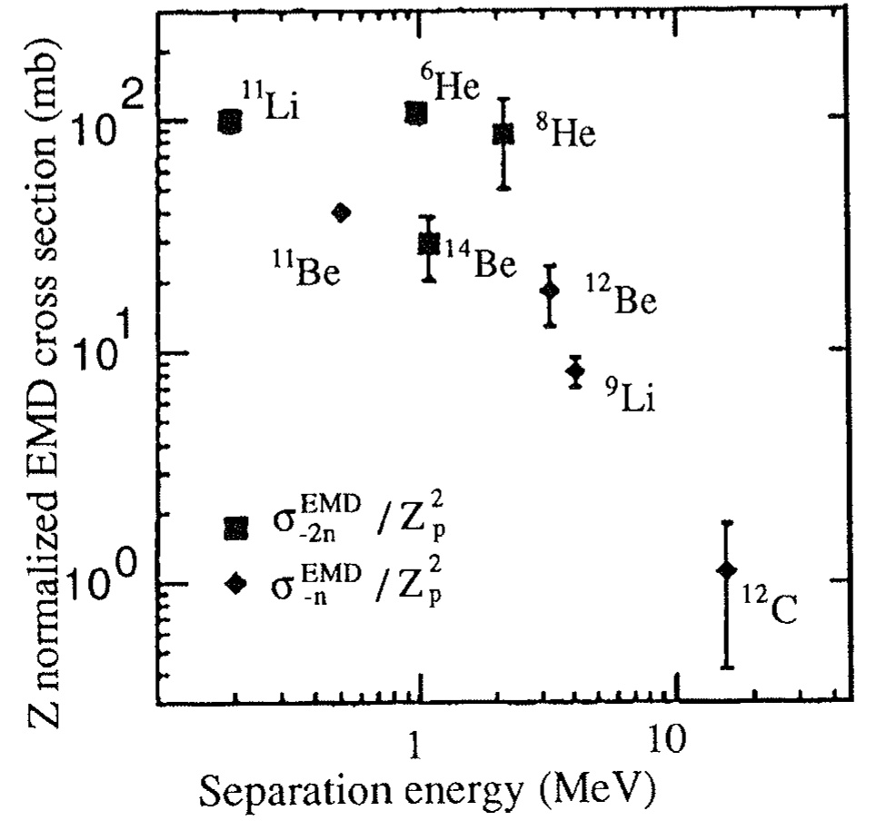

**Fig. 12.** The electromagnetic dissociation cross sections of neutron rich nuclei show large enhancements.

##### 2. Thick neutron skin

Neutron skin has been studied in detail for stable nuclei with many more neutrons than protons such as $^{48}\text{Ca}$ and $^{208}\text{Pb}$. However no large difference of radii between proton and neutron distributions has been observed in stable nuclei. Most of the mean field nuclear models, however, predict a large difference of the radii for neutron (or proton) rich nuclei [33, 34]. "Does thick neutron skin exist?" is an old but still a challenging question.

An analysis of the data has been reported recently for $^{6,8}\text{He}$ nuclei [38]. Combining the interaction cross sections $\sigma_{\text{I}}$, two-neutron removal cross sections $\sigma_{-2\text{n}}$, and a four-neutron removal cross section $\sigma_{-4\text{n}}$ of $^{4}\text{He}$, $^{6}\text{He}$, $^{8}\text{He}$ beams on carbon target, it was confirmed that $^{4}\text{He}$ (which is not modified very much from the free $^{4}\text{He}$ nucleus) forms a good core both in $^{6}\text{He}$ and in $^{8}\text{He}$ nucleus. Using this fact as an assumption, neutron and proton density distributions were determined from experimental data of $\sigma_{\text{I}}$'s. Figure 13 shows thus determined density distribution of $^{8}\text{He}$. A very thick neutron skin is formed. The rms radii difference between neutron and proton density distribution $\Delta R^{\text{rms}} \,(=\langle R_{\text{n}}^{2}\rangle^{1/2} - \langle R_{\text{p}}^{2}\rangle^{1/2})$ is $\sim 0.9\text{ fm}$. In $^{11}\text{Li}$ nucleus, the separation energy of last neutrons is only $300\text{ keV}$ but it is much larger ($2.1\text{ MeV}$) for $^{8}\text{He}$. Therefore a halo tail as long as that of $^{11}\text{Li}$ is not expected in $^{8}\text{He}$. The difference $\Delta R^{\text{rms}}$ is thus not due to a neutron halo as seen in $^{11}\text{Li}$.

Similarly a large $\Delta R^{\text{rms}}$ is observed in $^{6}\text{He}$. However it is more arbitrary to say whether it is due to a neutron halo or due to a skin because the separation energy of the last two neutrons is 0.97 MeV. The large enhancement of EMD cross sections were also observed for these nuclei (see Fig. 12) also a candidate for soft giant resonance study.

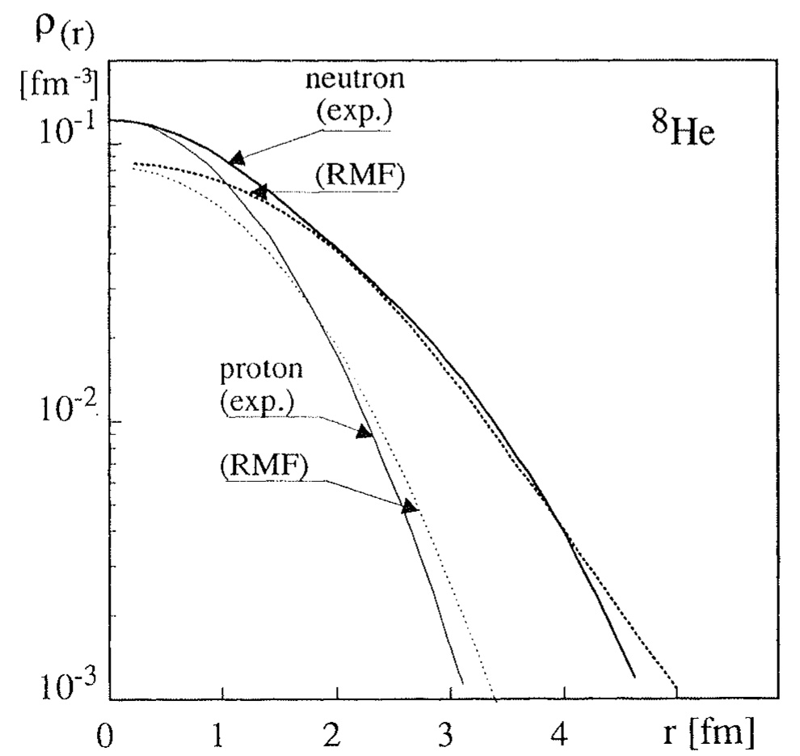

**Fig. 13.** Density distribution of $^{8}\text{He}$ determined from the interaction cross section and two- and four-neutron removal cross sections. It shows a thick neutron skin. Dotted curves show the result of the relativistic mean field calculation. It reproduces the empirical distribution well.

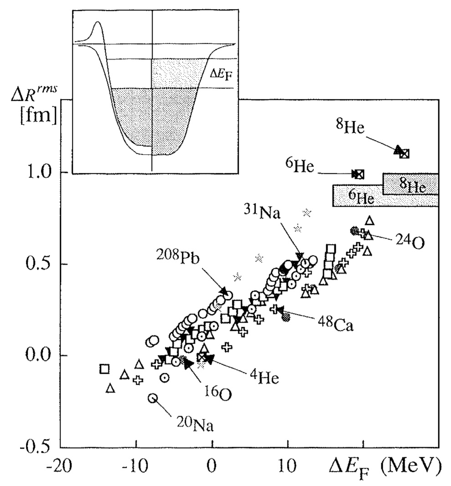

**Fig. 14.** A relativistic mean field calculation show the correlation between the Fermi energy difference ($\Delta E_\text{f}$) and the skin thickness. Thick neutron skin is expected in unstable neutron rich nuclei in general.

Recent relativistic mean field calculations reproduce the $\Delta R^{\mathrm{rms}}$ qualitatively as seen in Fig. 14 [34, 35]. This calculation shows that the $\Delta R^{\mathrm{rms}}$ difference is strongly correlated to the difference $\Delta E_{\mathrm{F}}$ between a neutron and a proton Fermi energies. On the other hand the dependence of $\Delta R$ on the neutron and the proton number difference for fixed $\Delta E_{\mathrm{F}}$ is relatively small. It seems that nature provides us with a lot of samples of neutron matter within our reach of study.

##### 3. Exclusive reactions

Recent improvement of radioactive beam intensity provides us with possibilities of studying exclusive receptions of $\beta$ unstable nuclei. Figure 15 as an example shows the results of proton elastic scattering of Li isotopes [36]. Although the angular distribution follows a systematic trend up to $^{9}\text{Li}$, the cross section is considerably smaller for $^{11}\text{Li}$. The halo or the small binding energy is considered to be responsible for the reduction of the cross section. The neutron halo also provides a challenge for the applicability of an optical potential model to an extremely low density matter.

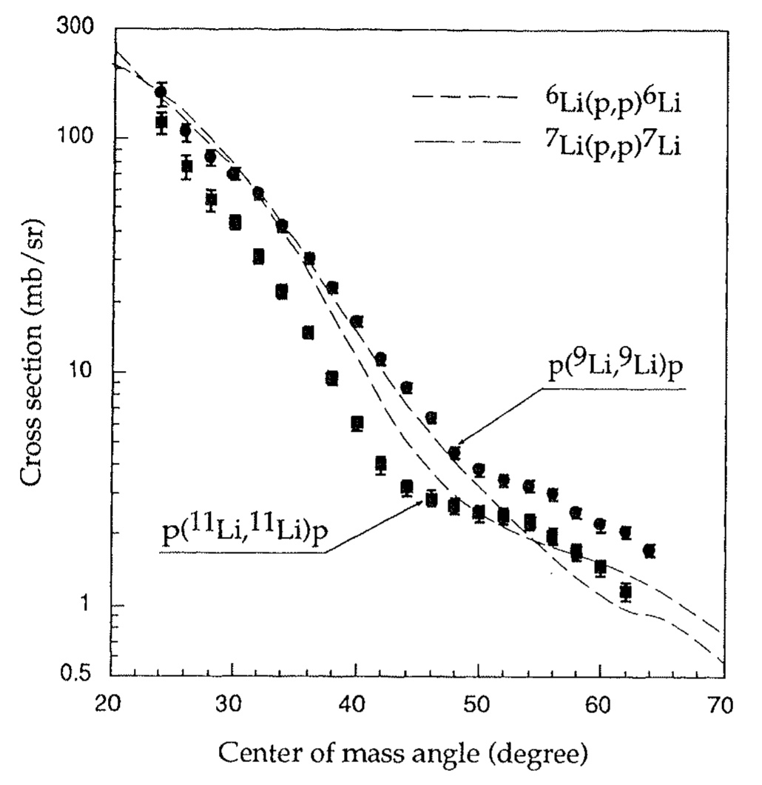

**Fig. 15.** Angular distribution of proton elastic scattering of Li isotopes at 65 MeV. The cross section of $^{11}\text{Li} + \text{p}$ is $\sim 30\%$ smaller than those of other isotopes. This reduction is considered to be due to the fragileness of the neutron halo.

Other measurements such as the elastic scattering of $^{13}\text{N} + {^{12}\text{C}}$, $^{13}\text{N} + {^{12}\text{C}}$ (7.8 MeV) [37], and $^{9}\text{Li} + {^{208}\text{Pb}}$ (86 MeV) [38] were also recently reported.

The high intensity $^{8}\text{Li}$ beam in Notre Dame University provides several possibilities of low energy reaction study such as elastic scattering, (d,t), (d,n), and Coulomb excitation. Figure 16 shows the result of the Coulomb excitation of $^{8}\text{Li}$ by the Ni target [39]. The $B(\text{E}2)$ value obtained, $45 \pm 10\text{ e}^2\text{fm}^4$ for the first excited state, is extremely large. It is about four times larger than the transition in $^{7}\text{Li}$ and much larger than predicted by shell model calculations. No explanation has been given so far but it is potentially an interesting phenomenon. Coulomb excitation would be an extremely interesting method of studying excited levels of unstable nuclei.

##### 4. Isospin dependence of nuclear radii

The isospin dependence of nuclear radii provides a new systematics which could not be studied without radioactive nuclear beams [40]. The observed rms radii of nucleon distributions are plotted for isobars of mass number $A$ from 6 to 12 in Fig. 17. Mirror pairs of isospin, $^{7}\text{Li} - {^{7}\text{Be}}$, $\text{Li} - {^{8}\text{B}}$, $^{10}\text{Be} - {^{10}\text{C}}$, show equal radii within the experimental errors, suggesting that the Coulomb effect on the radii is small for these light nuclei. On the other hand, nuclei with larger isospin show larger radii except for $^{9}\text{Be}$ in $A = 9$ isobars.

The observed isospin dependence of isobar radii was compared with predictions of Hartree–Fock calculations using the Skirme potential by Sato and Okuhara [41], as shown in Fig. 17. Here two kinds of potential parameters sets, SIII and SV, were employed; SIII includes a strong density-dependent interaction, while SV includes no such interaction. Both predictions gave fair agreements within 0.2 fm to the data in most cases. While the SV only represented a much weaker isospin dependence than observed, the SIII reproduced the observed isospin dependence well except for $A = 9$ isobars. The comparison therefore indicates the necessity of a strong density-dependent interaction to understand the observed behaviour. Fine selection of the density dependent interaction would be possible with a systematic study of isospin dependence in wide range.

The irregularity seen in $A = 9$ isobars is considered to be due to a special cluster structure in $^{9}\text{Be}$, i.e., $^{9}\text{Be}$ has the strong $2\alpha + \text{n}$ configuration, and two $\alpha$ clusters are weakly bound by a neutron. Therefore the density distribution is extended more than in a usual nucleus.

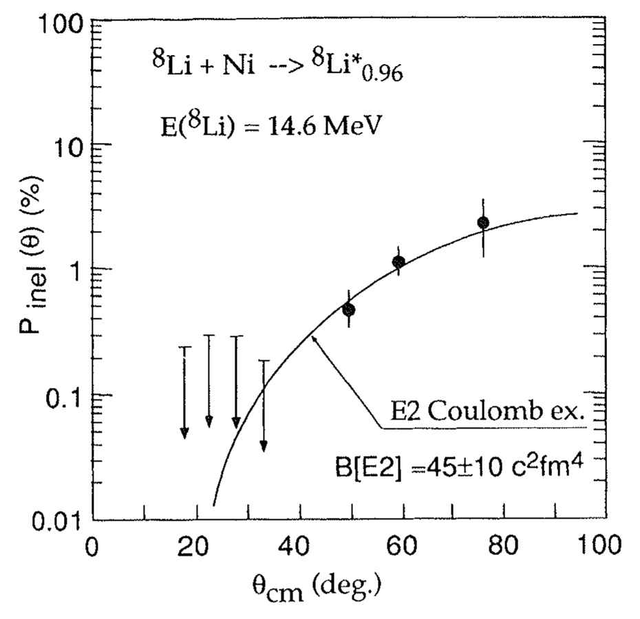

**Fig. 16.** Angular distribution of E2 Coulomb excitation of $^{8}\text{Li}$ nucleus. Extremely large $B(\text{E}2)$ value is observed.

#### B. Nucleosynthesis

The study of nucleosynthesis is essentially important because it is to answer the origin of ourselves. There are two sites of nucleosynthesis; one, which is considered to be the main site for most of the elements, is the stellar environment and the other is the Big Bang. In either case, reactions of $\beta$ unstable nuclei play an important role for synthesizing a new class of heavy elements. It is impossible to cover all the important reactions here in this limited space. Instead, I show here several important results obtained recently. More details of the reactions of interest are seen in refs. 1 and 2.

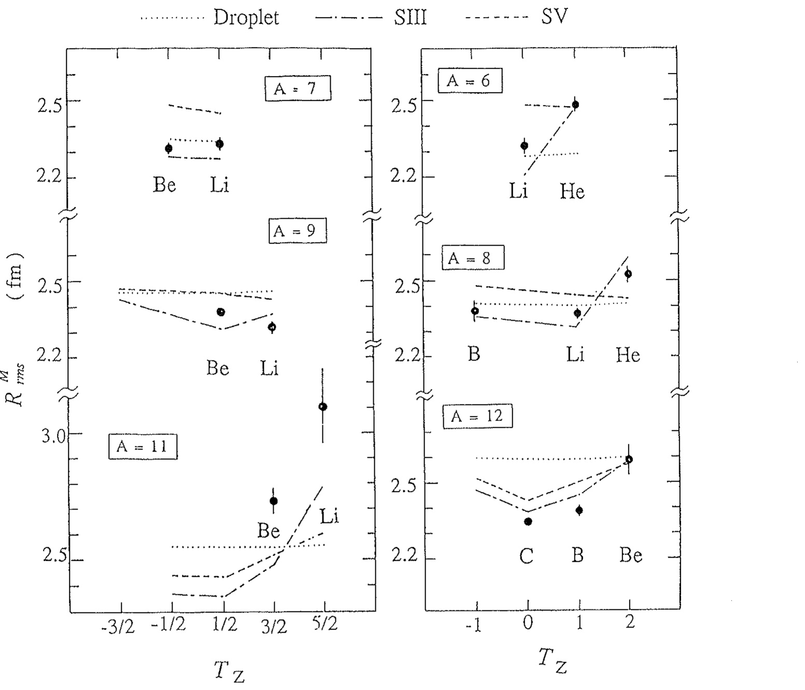

**Fig. 17.** Isospin dependence of rms matter radii. Experimental values are shown by solid circles. Hartree–Fock calculations with Skirme potential are shown for SIII by dash-dotted lines.

##### 1. Reactions in the hot CNO cycle

A number of extreme astrophysical environments with a temperature as high as several hundred million K have the capacity to undergo a rapid proton burning (rp) process. Under such conditions, proton capture becomes more important than $\beta$ decays in many proton rich radioactive nuclei. Different burning processes such as the CNO cycle and the Ne–Na cycle are connected by the reactions of $\beta$ unstable nuclei [42]. One of the most important reactions among them is the $^{13}\text{N}(\text{p}, \gamma)^{14}\text{O}$ reaction that breaks the CNO cycle and initiates the hot CNO cycle and is then followed by the breakout of the Ne–Na hydrogen burning cycle. In Louvain-la-Neuve, $\gamma$ rays from $^{13}\text{N}(\text{p}, \gamma)^{14}\text{O}$ reactions were measured using $^{13}\text{N}$ ions of $8.8\text{ MeV}$ [43]. The results in Fig. 18 clearly show three peaks which correspond to the full energy, the single escape, and the double escape peaks of $\gamma$ rays from $1^-$ state of $^{14}\text{O}$ indicating the detection of the reaction.

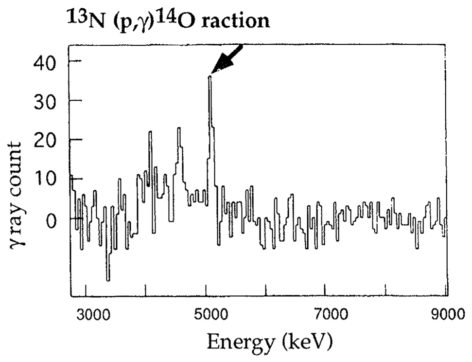

**Fig. 18.** Gamma ray spectrum from $^{13}\text{N}(\text{p}, \gamma)$ reaction. Three peaks corresponding to the full energy, the single escape, and the double escape peaks of $\gamma$ rays from $1^-$ state of $^{14}\text{C}$ are seen.

In GANIL and RIKEN, they used the inverse reaction to determine the cross section. In these experiments a high $Z$ target nucleus was used to provide the virtual photon and $^{18}\text{O} + \gamma \rightarrow {^{14}\text{O}^*(1^-)} \rightarrow {^{13}\text{N}} + \text{p}$ reaction was observed by detecting $^{13}\text{N}$ and protons in their final state [44, 45]. Figure 19 shows an example of the measured angular distribution of the reaction. Although the $^{13}\text{N}(\text{p}, \gamma)^{14}\text{O}$ reaction energy of interest is low, the best beam energy for this inverse reaction is $\sim 90A\text{ MeV}$. Therefore one can use a thick target ($350\text{ mg}$ in ref. 44) to increase the detection yield drastically. Moreover the statistical factor of the final state favors the inverse reaction.

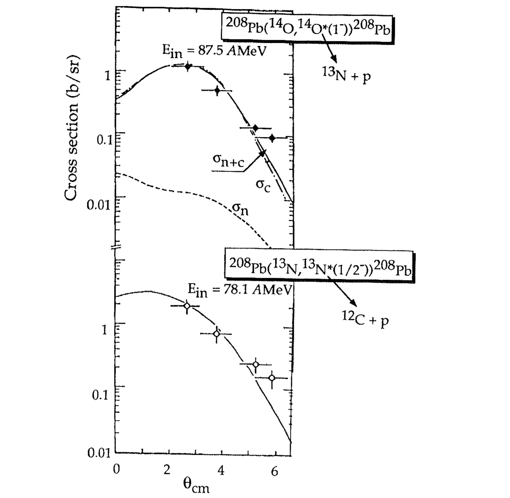

**Fig. 19.** Angular distribution of $\gamma$ capture process determined from $^{14}\text{O} + \text{Pb} \rightarrow {^{13}\text{N}} + \text{p} + \text{x}$ reaction. The same measurement was made for $^{13}\text{N} + \text{Pb} \rightarrow {^{12}\text{C}} + \text{p} + \text{x}$ reaction. Agreement of the measured capture width with the inverse reaction $^{12}\text{C} + \text{p} \rightarrow {^{13}\text{N}} + \gamma$ which had been measured in good accuracy, provided a verification of the method.

Results of the capture width of the $^{13}\text{N}(\text{p}, \gamma)^{14}\text{O}$ reaction are summarized in Fig. 20. The results obtained by the different methods agree well with each other.

For rapid neutron capture processes (n, $\gamma$) reactions play an important role. It is extremely difficult, if not impossible, to observe neutron scattering of a $\beta$ unstable nuclei. However inverse reactions with radioactive beams (virtual $\gamma$, n), the same technique shown above, could possibly be studied.

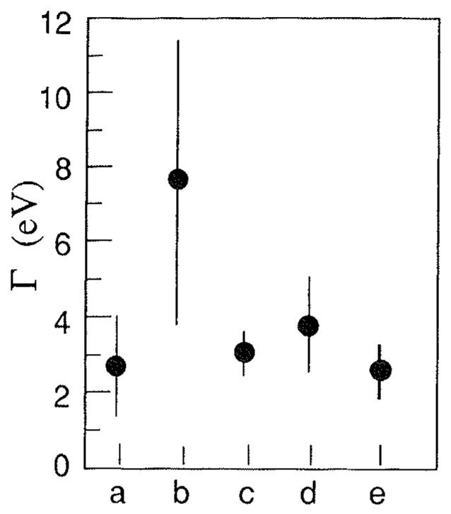

**Fig. 20.** Gamma width of $^{13}\text{N}(\text{p}, \gamma)^{14}\text{O}$, reaction measured by various methods. a and b are indirect determinations by the measurements of the branching ratio, c and d are from the inverse reaction method, and e is the direct measurement. They agree well within error bars.

##### 2. Big Bang nucleosynthesis

Although standard Big Bang nucleosynthesis involves virtually no reaction of short-lived nuclei, recent investigations have forced on nonstandard models, one class of which is the inhomogenous model [46, 47]. In this model, proton rich regions and neutron rich regions are produced a few moments after the quark-hadron phase transition. Reaction network calculation for the neutron rich region suggests that all the nuclides, although they are in small amounts compared with the solar abundance, of the periodic table would be synthesized in the first few minutes of the universe. Figure 21 shows a network for synthesis of some of the light nuclides. It shows that several reactions involving $^{8}\text{Li}$ are important. All nuclides heavier than $A = 11$ are funneled through $^{11}\text{B}$ on their nucleosynthesis paths and $^{11}\text{B}$ is formed predominantly via the $^{8}\text{Li} + {^{4}\text{He}} \rightarrow {^{11}\text{B}} + \text{n}$ reaction. Thus this reaction rate as well as the reaction rates to destroy $^{8}\text{Li}$ are crucial to making accurate predictions with inhomogeneous models.

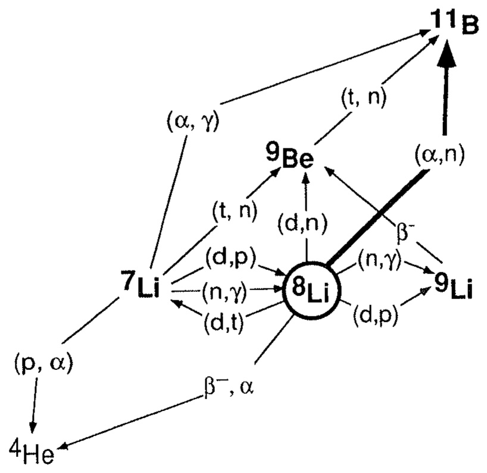

**Fig. 21.** Partial reaction network for Big Bang nucleosynthesis of $\text{Z} = 3\text{--}5$ nuclides. Reactions that either produce or destroy $^{8}\text{Li}$ are crucial because $^{8}\text{Li}$ appears to be central to the formation of heavier nuclides in the inhomogeneous models.

The cross section of the $^{8}\text{Li} + {^{4}\text{He}} \rightarrow {^{11}\text{B}} + \text{n}$ reaction was first determined by Paradellis *et al.* [48] using the inverse reaction ($^{11}\text{B} + \text{n} \rightarrow {^{8}\text{Li}} + {^{4}\text{He}}$). However the inverse reaction method restricts the measurement of the transition only to the ground state of $^{11}\text{B}$. On the other hand the reaction rate of interest includes all the transitions which go to the excited state of $^{11}\text{B}$ and reach the ground state. A direct measurement of this reaction using a beam of $^{8}\text{Li}$ was recently reported [49]. Figure 22 shows the determined cross section. It was found that the cross sections are about four to five times larger than that of ground state transition. Also other related reactions [$^{8}\text{Li}(\text{d}, \text{t})^{7}\text{Li}$, $^{8}\text{Li}(\text{d}, \text{p})^{9}\text{Li}$, $^{8}\text{Li}(\text{d}, \text{n})^{9}\text{Be}$] were recently measured [50]. The results of the recent calculation of the primordial abundance using these data are shown in Fig. 23 [51]. Considerable enhancements of the atomic abundance are seen for elements heavier than boron.

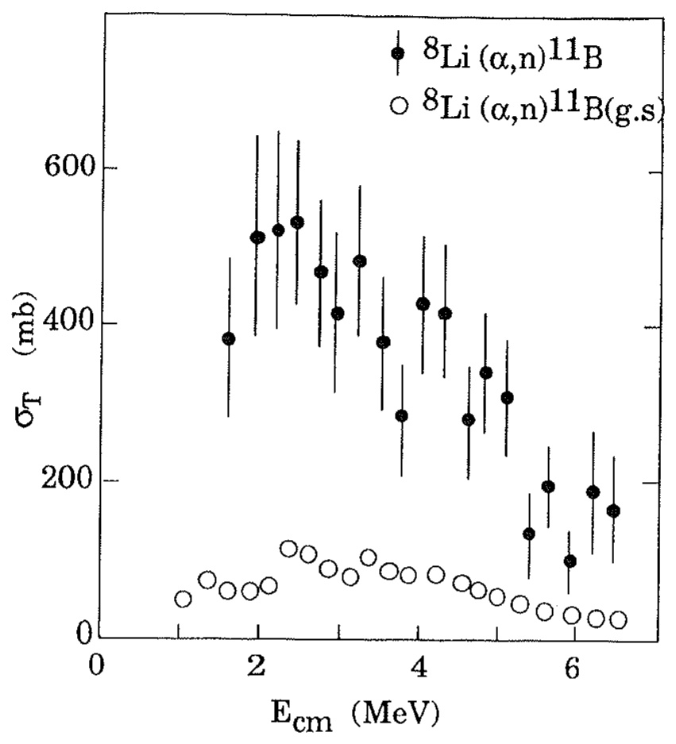

**Fig. 22.** Cross section of $^{8}\text{Li}(\alpha, \text{n})^{11}\text{B}$ reaction. Open circles show the one obtained by the inverse reaction $^{11}\text{B}(\text{n}, \gamma)^{8}\text{Li}$ that include the transition only to the $^{11}\text{B}_{\text{g.s.}}$. Reaction cross section is about 4–5 times larger than those of ground state transition.

#### C. Radioactive beams for other fields of study

Low energy radioactive beams have been used for many studies of different disciplines. The high-energy radioactive beams are new and have not yet been used in other fields of research than nuclear physics, astrophysics and cancer therapy [52]. However they are considered to be extremely powerful tools for studies in many disciplines. Here, I show the important properties of radioactive nuclei beams for possible applications below:

1. *Elemental selection:* Any element may be delivered independent of its chemical properties and therefore the best element can be used for a specific problem. A wide variety of elements is possible for appropriate uses. For example, interstitial sites of crystals can be studied selectively by many available elements.
2. *High energy:* Because the energy is high, the beam is easily controlled by magnetic system. Also implantation depth can be adjusted by changing the beam energy. Therefore, it provides for example, the first opportunity to start a tracer from any depth independent of an elemental composition of the sample material.

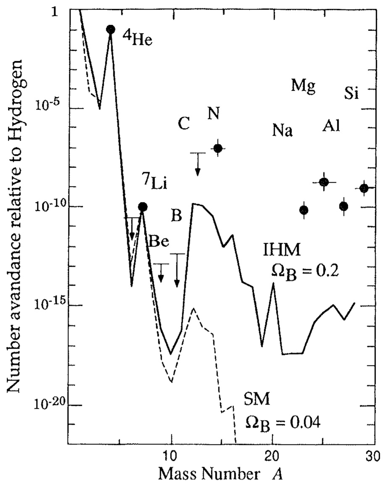

**Fig. 23.** Result of model calculations of atomic abundance. Inhomogeneous model predict more production of heavier elements.

3. *Radioactivity:* By definition, a radioactive ion decays in the material where it stopped. Emissions of $\alpha$, $\beta$, and/or $\gamma$ rays can be used for probing the stopped position and the surrounding electric and magnetic fields with extremely high sensitivity.
4. *Wide range of lifetime and spin:* A selection of a lifetime enables the application to phenomena of various time range ($1\text{ }\mu\text{s--years}$). A selection of nuclear spin is also possible within an element.
5. *Polarized beam:* Polarized beams of radioactive nuclei can also be produced by studying the magnetic and electric structure of the material.

Probes which have some of the advantages listed above existed before but none of them had them all. The RNB has all of these advantages and large possibilities of application.

### References

[1] Radioactive Beams, Proc. of the First Int. Conf. on Radioactive Nuclear. Beams, Berkeley, Ca 1989, Myers, W. D., Nitschke, J. M., Norman, E. B. Eds., World Scientific, 1990. Proc. of the second Int. Conf. on Raidoactive Nuclear Beams, Louvain-la-Neuve 1991, Delbar, Th., Eds., Adam Hilger 1992. Proc. of the Workshop on the Science of Intense Radioactive Ion Beams, Los Alamos, 1990, LA-11964-C UC-413.

[2] Proc. of Int. Symp. on Structure and Reactions of Unstable Nuclei, Niigata, Japan 1991, Ikeda, K. and Suzuki, Y., Eds., World Scientific. Proc. of the Int. Workshop on Unstable Nuclei in Astrophysics, Tokio, Japan 1991, Kubono, S. and Kajino, T., Eds., World Scientific. Nucleus–Nucleus Collision IV, Toki, H., Tanihata, I., and Kamitsubo, H., Eds., Special Issue of Nuclear Physics, North-Holland, Nucl. Phys. A538 1992.

[3] Tanihata, I., On the Possible Use of Secondary Radioactive Beams, Treatise on Heavy-Ion Science, Vol. 8, Bromley, D. A., Eds. (Plenum, New York 1989) p. 443. Detraz, C., Vierira, D. J., Exotic Light Nuclei, Ann. Rev. of Nuclear and Particle Science (1989) p407.

[4] Heckman, H. H., Greiner, D. E., Lindstrom, P. J., Shwe, H., Fragmentation of $^4\text{He}$, $^{12}\text{C}$, $^{14}\text{N}$, and $^{16}\text{O}$ Nuclei in Nuclear Emulsion at $2.1\text{ GeV/nucleon}$, Phys. Rev. C 17 (1978) 1735. Greiner, D. E., Lindstrom, P. J., Heckmann, H. H., Cork, B., Bieser, F. S., Momentum Distributions of Isotopes Produced by Relativistic $^{12}\text{C}$ and $^{16}\text{O}$ projectiles, Phys. Rev. Lett. 35 (1975) 152.

[5] Goldhaber, A. S., Heckmann, H. H., High Energy Interactions of Nuclei, Ann. Rev. Nucl. Sci. 28 (1978) 161.

[6] Gelbke, C. K., et al., Similarity of Cross Sections for Peripheral Collisions at $20\text{ MeV/A}$ and $2.1\text{ GeV/A}$, Phys. Rev. Lett. 37 (1976) 1191.

[7] Van Biber, K. et al., Evidence for Orbital Dispersion in the Fragmentation of $^{16}\text{O}$ at 90 and $120\text{ MeV/nucleon}$, Phys. Rev. Lett. 43 (1979) 840.

[8] Alonso, J. R., Chatterjee, A., Tobias, C. A., IEEE Trans. Nucl. Sci. 26 (1979) 3003.

[9] Tanihata, I., Nuclear Physics Using Unstable Beam, Hyperfine Interactions, 21 (1985) 251. Tanihata, I. et al., Measurement of Interaction Cross Sections and Radii of He Isotopes, Phys. Lett. 160B (1985) 380.

[10] Dufour, J. P. et al., Projectile Fragment Separation: Application to the LISE Spectrometer at GANIL, Nucl. Instr. Meth. in Phys. Res. A56 (1986) 34.

[11] Geissel, H. et al., The GSI Projectile Fragment Separator (FRS): a versatile magnetic system for relativistic heavy ions, Nucl. Instr. Meth. in Phys. Res. B70 (1992) 286.

[12] Müller, A. C., Anne, R., LISE 3: A magnetic spectrometer - Wien filter combination for secondary radioactive beam production, Nucl. Instr. Meth. in Phys. Res. B70 (1992) 276.

[13] Kubo, T. et al., The RIKEN radioactive beam facility, Nucl. Instr. Meth. in Phys. Res. B70 (1992) 309.

[14] Asahi, K. et al., Hyperfine Interaction in press 1992.

[15] Smith, R. J., et al., Production and Use of Radioactive $^7\text{Be}$ Beams, Phys. Rev. C43 (1991) 761. Smith, R. J., et al., Scattering of $^6\text{He}$ from $^{197}\text{Au}$, $^{\text{nat}}\text{Ti}$, $^{27}\text{Al}$, $^{\text{nat}}\text{C}$, and $^9\text{Be}$ at $\text{E} = 8\text{--}9\text{ MeV}$, Nucl. Instr. Meth. A294 (1990) 26.

[16] Sawicki, J. A. et al., The Isospin Laboratory proposal, LALP 91–51, 1991.

[17] Darquennes, D. et al., Production of intense radioactive ion beams using two accelerators, Phys. Rev. C42 (1990) R804. Darquennes, D. et al., A high temperature graphite target for the production of $^{13}\text{K}$, Nucl. Instr. Meth. Res. B47 (1990) 311. Decrock, P. et al., On electron cyclotron resonance ion source for efficient production of radioactive ion beams, Nucl. Instr. Meth. Phys. Res. B58 (1991) 252. Decrock, P. et al., Production and acceleration of radioactive ion beams at energies of astrophysical interest with the Louvain-la-Neuve cyclotrons, Proc. of the Second Int. Conf. on Radioactive Beams, Louvian-la-Neuve, Belgium, August, 1991, Adam Hilger Delbar, Th. Ed., p. 121.

[18] Ravn, H. L., Radioactive nuclear beam facilities on ISOL-post accelerator schemes, Proc. of the Second Int. Conf. on Radioactive Nuclear Beams, Louvain-la-Neuve 1991, Delbar, Th. Ed., Adam Hilger 1991, p. 85.

[19] Takigawa N., Sagawa, H., Interaction potential and fusion of a halo nucleus, Phys. Lett. B 265 (1991) 23.

[20] Kobayashi, T., Proc. of Int. Symp. on Structure and Reactions of Unstable Nuclei, Niigata, Japan 1991. Ikeda, K., Suzuki, Y., Eds., World Scientific, p187.

[21] Tanihata, I. et al., Measurement of Interaction Cross Sections and Radii of p-Shell Nuclei, Phys. Rev. Lett. 55 (1985) 2676. Tanihata, I., Structure of Neutron Rich Nuclei Studied by Radioactive Beams, Nucl. Phys. A522 (1991) 275c.

[22] Kobayashi, T. et al., Projectile Fragmentation of the Extremely Neutron Rich Nuclei $^{11}\text{Li}$ at 0.79 GeV/nucleon, Phys. Rev. Lett 60 (1988) 2599.

[23] Hansen P. G., Johnson, B., The Neutron Halo of Extremely Neutron-Rich Nuclei, Europhysics Lett. 4 (1987) 409.

[24] Fukuda, M. et al., Neutron Halo in $^{11}\text{Be}$ Studied Via Reaction Cross Sections, Phys. Lett. B 268 (1991) 339.

[25] Tanihata, I. et al., Determination of the Density Distribution and the Correlation of Halo Neutrons in $^{11}\text{Li}$, Phys. Lett. B 287 (1992) 307.

[26] Shimoura, S., Proc. of Int. Symp. on Structure and Reactions of Unstable Nuclei, Niigata, Japan 1991, Ikeda, K. and Suzuki, Y., Eds., World Scientific, p. 132.

[27] Kobayashi, T. et al., Electromagnetic Dissociation and Soft Giant Dipole Resonance on Neutron Dripline Nuclei $^{11}\text{Li}$, Phys. Lett. B 232 (1989) 51. Kobayashi, T., Proc. of the First Int. Conf. on Radioaxtive Nuclear Beams, Myers, W. D., Nitschke, J. M. and Norman, E. B., Eds., World Scientific Pub. 1990, p. 325.

[28] Warner, D. D., Nuclear Physics with Radioactive Beams, Proc of the Second Int Conf. on Radioactive Nuclear Beams, Louvain-la-Neuve 1991, Delbar, Th., Ed., Adam Hilger 1991 p. 139.

[29] Ikeda, K., Structure of Neutron Rich Nuclei, Nucleus-Nuclues Collision IV, Toki, H., Tanihata, I., Kamitsubo, H., Eds., Special Issue of Nuclear Physcis, North-Holland, Nucl. Phys. A538 (1992) 355c.

[30] Esbensen, H., Correlated Dipole Response of Neutron Rich Nuclei, Proc. of Int. Symp. on Structure and Reactions of Unstable Nuclei, Niigata, Japan 1991, Ikeda, K. and Suzuki, Y., Eds., World Scientific p. 178 and references therein.

[31] Hoshino, T. et al., Giant Resonances of Light Neutron Rich Nuclei, Nucl. Phys. A523 (1991) 228.

[32] Tosaka, Y., Suzuki, Y., Structure of $^{11}\text{Li}$ in the cluster orbital shell model for the $^{9}\text{Li} + \text{n} + \text{n}$ system, Nucl. Phys. A512 (1990) 46.

[33] Beiner, M., Lombard, R., Mas, D., Self-Consistent Calculations of Ground State Properties for Unstable Nuclei, Nucl. Phys. A249 (1975) 1.

[34] Hirata, D. et al., Relativistic Hartree Theory for Nuclei far from Stability Line, Phys. Rev. C44 (1991) 1467.

[35] Tanihata, I. et al., Revelation of Thick Neutron Skin, Phys. Lett. B289 (1992) 261.

[36] Moon, C. B. et al., Measurement of $^{11}\text{Li} + \text{p}$ and $^{9}\text{Li} + \text{p}$ Ellastic Scattering at 60 MeV, Phys. Lett. B in press.

[37] Baye, D., Measurement of the $^{13}\text{N} + {^{12,13}\text{C}}$ elastic scattering, Proc. of the Seocnd Int. Conf. on Radioactive Nuclear Beams, Louvain-la-Neuve 1991, Delbar, Th. Ed., Adam Hilger 1992, p. 173.

[38] Terenetski, K. O. et al., 86 MeV $^{9}\text{Li}$ elastic scattering by $^{208}\text{Pb}$, Proc. of the Second Int. conf. on Radioactive Nuclear Beams, Louvain-la-Neuve 1991, Delbar, Th. Ed., Adam Hilger 1992, p. 231.

[39] Kolata, J. J., Experiments with radioactive nuclear beams at the University of Notre Dame, Proc. of Int. Symp. on Structure and Reactions of Unstable Nuclei, Niigata, Japan 1991, Ikeda, K. and Suzuki, Y., Eds., World scientific, p. 252.

[40] Tanihata, I., Kobayashi, T. Yamakawa, O., Shimoura, S., Ekuni, K., Sugimoto, K., Takahashi, N., Shimoda, T., Sato, H. Measurement of Interaction Cross Sections using Isotope Beams of Be and B and Isospin Dependence of the Nuclear Radii, Phys. Lett. B206 (1988) 592.

[41] Sato, H., Okuhara, Y., Nucleus-Nucleus Scattering and Interaction Radii of Stable and Unstable Nuclei, Phys. Rev. C34 (1986) 2127.

[42] Barnes, C. A., Nuclear astrophysics with radioactive nuclear beams, Proc. of the Second Int. Conf. on Radioactive Nuclear Beams, Louvain-la-Neuve 1991, Delbar, Th. Ed., Adam Hilger 1992, p251 and references therein.

[43] Decrock, P. et al. Measurement of the $^{1}\text{H}({}^{13}\text{N}, \gamma)^{14}\text{O}$ Cross Section and Determination of $^{14}\text{O} \, (1^-, \, T = 1, \, E_{\text{exc}} = 5.17\text{ MeV}) \, \gamma\text{-width}$, Proc. of the Int. Workshop on Unstable Nuclei in Astrophysics, Tokio, Japan 1991, Kubono, S., Kajino, T., Eds., World Scientific, p. 75. Benjelloun, M. et al., Precise measurement of $1^-$ resonance state of $^{14}\text{N}$ by the $^{13}\text{C} + p$ reaction, Proc. of the Second Int. Conf. on Radioactive Nuclear Beams, Louvain-la-Neuve 1991, Delbar, Th. Ed., Adam Hilger 1992, p265 and references therein. Decrock, P. et al., Determination of the $^{13}\text{N}(p, \, \gamma)^{14}\text{O}$ Reaction Cross Section using a $^{13}\text{N}$ Radioactive Ion Beam, Phys. Rev. Lett. 67 (1991) 808.

[44] Motobayashi, T. et al., Determination of the astrophysical $^{13}\text{N}(p, \, \gamma)^{14}\text{O}$ cross section through the Coulomb dissociation method, Phys. Lett. B264 (1991) 259.

[45] Kiener, J., Determination of the $^{13}\text{N}(p, \, \gamma)$ reaction rate through Coulomb break-up of a radioactive beam, proc. of the Second Int. Conf. on Radioactive Nuclear Beams, Louvain-la-Neuve 1991, Delbar, Th. Ed., Adam Hilger 1992, p. 311.

[46] Applegate, J. H., Hogan, C. J., Scerrer, R. J., Cosmological Quantum Chromodynamics, neutron diffusion, and the production of primordial heavy elements, Astrophysics J. 329 (1988) 592. Mathews, G. J., Meyer, B. M., Alcock, C., Fuller, G. M., Coupled Baryon Diffusion and Nucleosynthesis in the early Universe, Astrophys J. 358 (1990) 36.

[47] Kajino, T., Boyd, R. N., Production of the light elements in primordial nucleosynthesis, Astrophys. J. 359 (1990) 267.

[48] Paradellis, T. et al., Astrophysical $S(E)$ factor of $^8\text{Li}(\alpha, \, No)^{11}\text{B}$ and inhomogeneous Big Bang nucleosynthesis, Z. Phys. A337 (1990) 211.

[49] Boyd, R. N. et al., Measurement of $^8\text{Li}(\alpha, \, n)^{11}\text{B}$ reaction cross section at energies of astrophysical interest, Phys. Rev. Lett. 68 (1992) 1283.

[50] Farrel, M. M., et al., $^2\text{H}$ induced reactions on $^8\text{Li}$ and primordial nucleosynthesis, Proc. of the Second Int. Conf. on Radioactive Nuclear Beams, Louvain-la-Neuve 1991, Delbar, Th. Ed., Adam Hilger 1992, p. 287.

[51] Kajino, T., private communication.

[52] Chatterjee, A. and Llacer, J., Proc. of the First Int. Conf. on Radioactive Nuclear Beams, Berkeley, Ca 1989, Myers, W. D., Nitschke, J. M., Norman, E. B. Eds., World Scientific 1990, p. 403.

# 11 In-Flight Separation of Heavy Ion Beams

*Gottfried Münzenberg*

## Table of Contents

| | | page |
|---|---|---:|
| I. | Introduction | 375 |
| | A. Sources of energetic secondary beams | 377 |
| | B. Reaction kinematics | 378 |
| | C. Luminosity | 382 |
| II. | Separation techniques | 383 |
| | A. Ion optics for in-flight separators | 384 |
| | B. Liouvillean ion optics | 387 |
| | C. Design principles | 389 |
| III. | Examples of in-flight separators | 391 |
| | A. Recoil mass separators | 391 |
| | B. Velocity filters | 396 |
| | C. RF separators | 399 |
| | D. Parabola spectrographs | 401 |
| | E. Gasfilled separators | 402 |
| IV. | Separation of relativistic heavy ions | 404 |
| | A. The energy loss separators for projectile fragments | 404 |
| | B. The energy degrader as an ion-optical element | 408 |
| | C. Separators for projectile fragments | 411 |
| | D. Secondary beam facilities | 413 |
| | E. Cooling of in-flight separated secondary beams | 418 |
| V. | Conclusion | 420 |
| | References | 420 |

---

### I. Introduction

In this review the separation techniques for ions produced in nuclear reactions will be discussed with the restriction to in-flight separation where the reaction products pass an electromagnetic separator almost unretarded with their kinetic energy from the nuclear reaction process leading to their creation. Consequently these separators are kinematic separators – part of them even uses the reaction kinematics to select the desired nuclear species – hence the quality of the separated particle beams, such as kinetic energy or phasespace population are determined by the kinematics of the production process. Recently storage rings with beam cooling are used to improve the phasespace density and to allow for de- or acceleration of the stored beams of in-flight separated heavy ions, which for the first time allows the preparation of in-flight separated beams with a quality independent of their reaction kinematics.

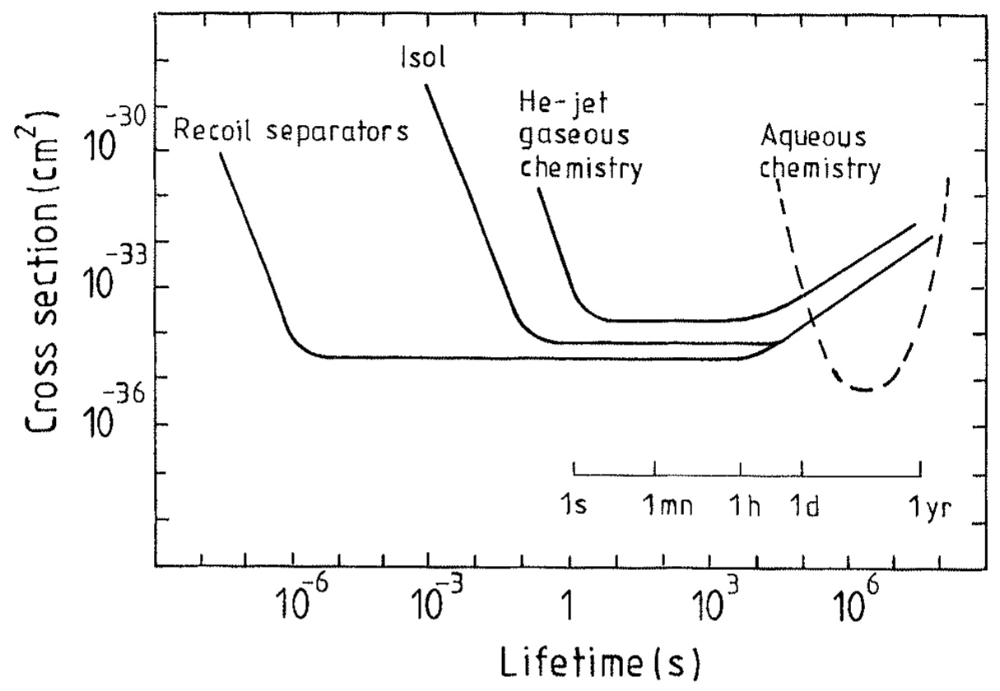
**Fig. 1.** Halflife domains accessible with in-flight separation compared to on-line separation (Isol), heliumjet gas transport system and chemical methods.

The advantage of in-flight separation is the short separation time, which essentially is determined by the flight time through the separator. It is of the order of milliseconds. Figure 1 shows a comparison of the halflife ranges covered with the various separation techniques for the detection of instable nuclei. The in-flight separation combined with appropriate detector systems covers the largest span of about twelve orders in magnitude.

In-flight separated particles keep their full kinetic energy from the nuclear reaction, sufficient for energy loss, time-of-flight or total kinetic energy measurement which permits a high redundancy in their identification and is helpful for the application of delayed-coincidence techniques. Consequently in-flight separation could be developed to ultimate sensitivity, the lowest rate for an isotope to be identified was as low as one atom per week [1].

The first recoil separators have been applied to the separation of fission fragments. They were installed at nuclear reactors as for example the Munich separator, a classic Mattauch–Herzog spectrometer [2], or various types of gas filled separators [3, 4]. Later, after powerful heavy-ion accelerators went into operation, instruments for the separataion of heavy-ion fusion products were developed either as velocity filters [5] or recoil mass separators [6]. The most recent instruments are used for relativistic projectile fragments [7–10].

The separators especially for fission products and recoils from heavy-ion fusion have been reviewed in a number of papers [11, 12], fragment separators are described in [9]. This paper will emphasize the recent developments of separators for recoils from heavy-ion fusion and the separation of relativistic nuclei created by projectile fragmentation. After a general and short overview on the production processes and the reaction kinematics the various separation techniques and their limitations will be discussed. Together with a brief introcuction into the ion optics and basic design principles some characteristic examples of in-flight separators and their principal applications will be described. Finally an outlook on new techniques applied to in-flight separated particles such as storage and cooling in a storage ring will be given.

#### A. Sources of energetic secondary beams

As already mentioned, the historic source of energetic nuclei to which in-flight separation has been applied was neutron induced fission of heavy targets like uranium placed in high-flux reactors. Accelerator based sources for in-flight separated nuclei are proton induced uranium spallation and complete fusion of heavy-ions, respectively. With the development of accelerators for relativistic heavy-ions, nuclear fragmentation became a new tool for the production of energetic beams of instable heavy nuclei with energies far above the Coulomb barrier. Secondary beams of that kind can be directly used for nuclear reactions without further accelearation [9].

The regions of the chart of nuclei accessed by the various production methods are shown in Fig. 2. In neutron induced uranium fission a light and a heavy group of nuclides, around krypton and xenon are pronounced. This reaction leads to neutron rich isotopes because of the neutron excess of the fissioning heavy nucleus. Proton induced uranium fission creates symmetric fragments with a peak cross section near the neutron rich palladium isotopes.

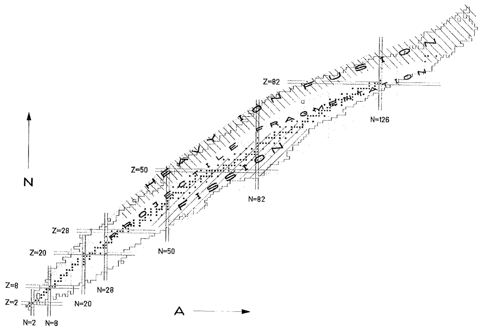
**Fig. 2.** Regions of the chart of nuclei which can be accessed by induced fission, complete fusion of heavy ions, and fragmentation.

Heavy-ion fusion, the amalgamation of two nuclei, generally leads to the region of neutron deficient isotopes, as a heavy nucleus in a region of large neutron excess is made from the constituents of two light nuclei. This is the only type of reaction discussed here which leads to products heavier than either of the initial nuclei. Consequently the heaviest known elements have been produced by heavy-ion fusion.

The projectile fragmentation is in principle the spallation in inverse kinematics: a heavy relativistic projectile hits a light target. The heavy fragments emerging from peripheral collisions generally are exotic nuclei, so the stable projectile beam is converted into a beam of predominantly instable constituents, isotopes which are lighter than the projectile are produced [10]. The fragmentation reaction is a hot process leading to the evaporation of a great number of neutrons. Therefore the cross sections peak along the neutron deficient side of the chart of nuclides. For the production of relativistic neutron rich nuclei another process recently has been considered, the electromagnetic dissociation of fissile projectiles, which in principle is photodisintegration by the equivalent photons created in the electromagnetic field which a relativistic nucleus experiences when passing by a highly charged target [13]. For relativistic energies and targets with high nuclear charges such as lead the cross sections become of the order of the geometric cross section or even larger.

In general for all reactions described above the cross sections and the production rates, respectively, decrease rapidly towards the limits of nuclear stability, e.g. the drip-lines or, in the heavy-element region, when the limits of nuclear fissility are reached.

All reactions discussed here lead to broad isotopic distributions, with exception of the complete fusion, where only few isotopes close to the compound nucleus are formed by particle evaporation from the nucleus amalgamated from projectile and target. Sophisticated techniques are needed to achieve a really clean isotopic separation. In addition to the classical mass-separator designs such as the Mattauch Herzog separator or the parabola spectrograph, velocity filters in combination with magnetic spectrometers or time-of-flight separators have been developed. Non-Liouvillean separators, such as gas filled separators or the separators for relativistic ions take advantage of the nuclear-charge dependence of the interaction of fast particles with matter.

#### B. Reaction kinematics

The kinematic properties of the reaction products such as average energy, energy spread, and angular distribution are determined by the mechanism of the nuclear reaction. Except for the projectile fragmentation where the reaction products simply have a velocity close to that of the projectile, the intrinsic nuclear forces, predominantly the Coulomb energy, determine the reaction kinematics. Figure 3 gives an overview over the energy domains of the various production processes discussed here.

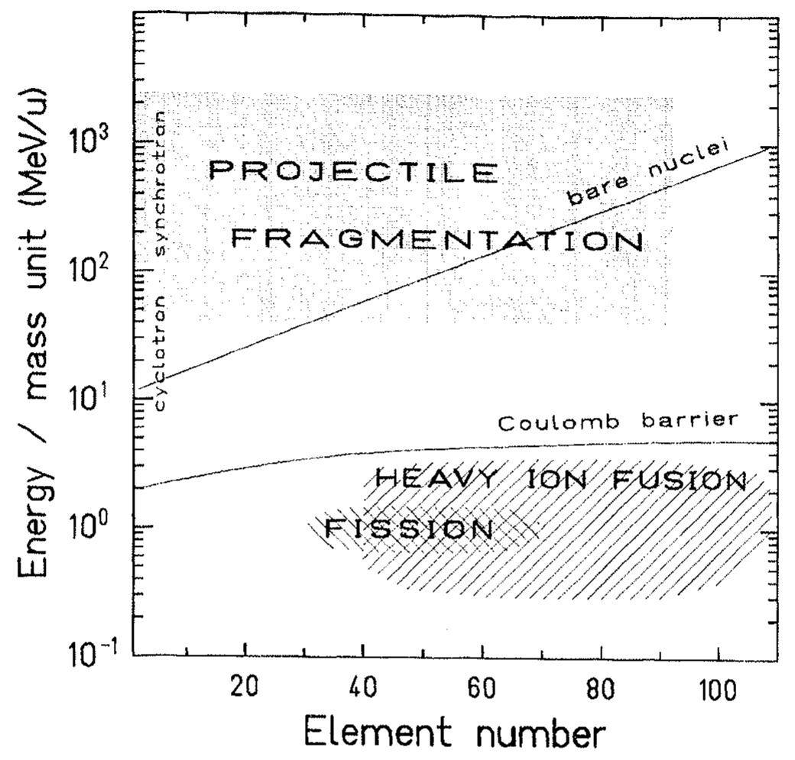
**Fig. 3.** Domains of kinetic energies of the reactions products from various nuclear reactions.

Fission fragments gain their energy from the Coulomb repulsion of the fragments in the phase of their separation. The recoil energy of a fragment with mass $A_{\mathrm{fr}}$ from the mother nucleus with mass $A$ is obtained with the help of the Viola systematics [14]:

$$E_{\mathrm{fr}} = 0.12 \frac{Z^2}{A^{4/3}} (A - A_{\mathrm{fr}})\text{ MeV.} \tag{1}$$

Heavy-ion fusion is the complete amalgamation of target and projectile nuclei, hence the newly created compound nucleus suffers the full momentum transfer from the projectile. It recoils from the target with center of mass velocity. The energy is:

$$E_{\mathrm{r}} = \frac{A_{\mathrm{p}}}{A_{\mathrm{c}}} E_{\mathrm{p}} \tag{2}$$

with $A_{\mathrm{p}}$ and $E_{\mathrm{p}}$ denoting projectile mass and energy, respectively, $A_{\mathrm{c}}$ standing for the mass of the compound nucleus. For the production of exotic species the projectile energy is chosen as low as possible, e.g. close to the Coulomb barrier to produce the fragile compound nuclei with the lowest possible excitation energy. With a Coulomb barrier near $E_{\mathrm{p}} \approx 5\text{ MeV}/A$ the recoil energy is:

$$E_{\mathrm{r}} = 5 \frac{A_{\mathrm{p}}^2}{A_{\mathrm{c}}}\text{ MeV.} \tag{3}$$

The velocity of projectile fragments is essentially determined by the velocity of the projectile. The energy is:

$$E_{\mathrm{fr}} = \frac{A_{\mathrm{fr}}}{A_{\mathrm{p}}} \cdot E_{\mathrm{p}} . \tag{4}$$

These considerations prove that all sources of secondary beams have energies below the Coulomb barrier (Fig. 3) and cannot be used for secondary reactions without further acceleration except for projectile fragments, which may have energies up to the $\text{GeV}/u$ range. The energy of projectile fragments is determined by the energy of the projectiles, e.g. by the accelerator to produce the projectile beam. Cyclotrons typically deliver beams up to $0.1\text{ GeV}/u$, higher energies are available at synchrotrons. The figure also shows the energy where 50% of the ions are bare which is an important limit for efficient and clean ion optical separation.

The separation efficiency, transmission as well as the purity of the separated beams, depend on the phase-space population of the reaction products such as angular distribution and relative momentum spread. Figure 4 compares the acceptances of typical separator types to the typical widths of the particle distributions. Acceptances of spectrographs range up to several tens of millisteradians and several tens of percent in angle and relative momentum spread, respectively. Spectrometers typically accept less than 10 millisteradians and less than about 5% in relative momentum spread.

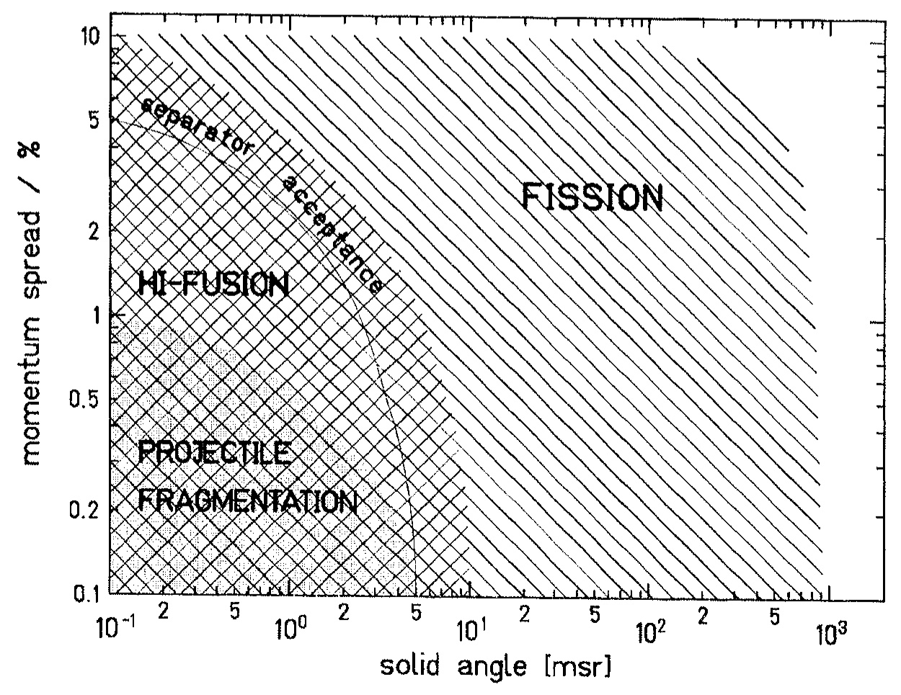
**Fig. 4.** Solid angle and momentum spread of the reaction products compared to the acceptances of spectrographs and spectrometers.

As most of the nuclear reaction products are created at large excitation energies they cool down to the groundstate predominantly by evaporation of nucleons and alphas. The widths of the energy distributions are determined by the recoil from these particles. Fission products are an exception, they are emitted into the full solid angle and their energy spread in the laboratory frame is essentially determined by the total kinetic energy of the fragments. Similar considerations hold for spallation products. The efficiency for the in-flight separated fission products is as small as $10^{-6}$ [12].

Evaporation residues from heavy-ion fusion are kicked out of the target by the momentum transfer they suffer from the projectile. They are emitted into a narrow cone in beam direction and with a small velocity spread. The phase-space population of the recoils is determined by the ratio of the sum of the recoil momenta from the particles evaporated from the hot compound nucleus related to the projectile momentum. With increasing momentum e.g. mass of the projectile the kinematic focusing of the evaporation residues increases. If a number of $n$ particles is evaporated, the relative momentum spread of the recoils is [5]:

$$\frac{\sigma_{\mathrm{r}}}{p_{\mathrm{r}}} = \frac{\sqrt{\sum_n p_i^2 / 3}}{p_{\mathrm{p}}} \tag{5}$$

where $p_{\mathrm{p}}$ and $p_i$ are mass and momentum of the projectile and of the $i$-th evaporated particle, respectively. Typical for fusion-evaporation products created with sufficiently heavy beams ($A > 40$) and with beam energies close to the Coulomb barrier are solid angles of less than $5\text{ msr}$ and velocity spreads of few percent in the case of neutron evaporation only. Consequently the separation efficiencies are $10\%$ to $100\%$.

The momentum distribution of projectile fragments reflects the Fermi momenta of the nucleons abraded in the nuclear collision and the momenta of the evaporated nucleons. The relative momentum spread in beam direction can be obtained with the systematics from Morrissey which nicely reproduces the momentum distributions of relativistic projectile fragments. The longitudinal momentum spread is:

$$\sigma = \sigma_0 \sqrt{A_{\mathrm{p}} - A_{\mathrm{fr}}}, \tag{6}$$

with the empirical constant $\sigma_0 = 87\text{ MeV}/c$. Equation (6) shows that the momentum spread of projectile fragments is independent of the projectile energy, hence the kinematic focusing of projectile fragments increases with the projectile energy. From Eq. 6 we obtain with $p_{\mathrm{fr}} = \beta_{\mathrm{fr}} \gamma_{\mathrm{fr}} E_0/c$ :

$$\frac{\sigma_{\mathrm{fr}}}{p_{\mathrm{fr}}} = \frac{\sigma_0 \gamma_{\mathrm{fr}} \sqrt{A_{\mathrm{p}} - A_{\mathrm{fr}}}}{p_{\mathrm{fr}}} \tag{7}$$

$E_0$ is the rest energy of the fragment of $931 A_{\mathrm{fr}}\text{ GeVu}$, $\beta_{\mathrm{fr}} = v_{\mathrm{fr}}/c$, and $\gamma_{\mathrm{fr}} = 1/\sqrt{1 - \beta_{\mathrm{fr}}^2}$.

The relative momentum spread grows with the increase in the number of abraded nucleons and for light projectiles. The most dense phase-space populations are obtained from fragments close to the projectile and in the region of heavy nuclei. Typical values for solid angle and relative momentum spread for heavy and relativistic fragments with $A > 100$ and $E/u = 500\text{ MeV}/u$ are $1\text{ msr}$ and $2\%$, respectively. This fits well into the acceptance of high resolving spectrometers (Fig. 4). For projectile fragments in the energy regime above $100\text{ MeV}/u$ separation efficiencies of $50\%$ to $100\%$ have been achieved.

#### C. Luminosity

The sensitivity of a set-up is determined by the source strength and the separator transmission. The source strength can be described in terms of the luminosity

$$L = \dot{N}_{\mathrm{p}} N_{\mathrm{t}} \tag{8}$$

where $\dot{N}_{\mathrm{p}}$ and $N_{\mathrm{t}}$ are the beam particle current on the target and the target thickness in atoms per square centimeters, respectively. The production rates are calculated from the product of luminosity and cross section. The secondary beam intensity is determined by the neutron flux in the nuclear reactor or the beam current of the accelerator, respectively. High flux reactors provide neutrons with a particle density of $5 \cdot 10^{14}/\text{cm}^2$. The beam currents at modern heavy-ion accelerators of the linac or cyclotron type exceed $10^{13}/\text{s}$, synchrotron beams have by 3 to 4 orders of magnitude lower intensities due to the small duty factor of these periodically accelerating machines. New, pulsed high-current sources are under development to increase synchrotron-beam intensities.

Using in-flight separation the target thickness is generally limited, as the energy loss and the straggling of projectile beam and reaction products due to atomic interactions with the target material spoils the kinematic properties such as energy and angular spread, respectively [15]. The commonly used target thicknesses for the production of fission fragments and heavy-ion fusion products, respectively, are of the order of $\text{mg/cm}^2$ which corresponds to about $10^{18}$ atoms per square centimeter. Projectile fragmentation profits from the high energy of beam and fragments. Depending on the projectile energy, typical target thicknesses range from $0.1\text{ g/cm}^2$ to $10\text{ g/cm}^2$, corresponding to $10^{21}$ to $10^{23}$ atoms per square centimeter. The geometric nuclear cross sections being of the order of barns, the thickness is limited by self-absorption of the reaction products in the target. Consequently the luminosities range from about $10^{31}/(\text{cm}^2\text{s})$ for fission and fusion, respectively and up to the order of $10^{36}/(\text{cm}^2\text{s})$ for projectile fragments. The lower limits of cross sections to be detected with a sensitive separator of a moderate transmission of $10\%$ are $10\text{ pb}$ for one atom per day for heavy ion fusion and $10\text{ pb}$ for one atom per second for fragmentation, respectively.

The production cross sections for a specific nuclear species not too far from stability range from $10\text{ mb}$ to $1000\text{ mb}$, drop to the picobarn region for the most exotic species at the drip-lines or in the heavy-element region. Table 1 summarizes the estimated particle rates for the production methods and related separation techniques. Fission sources, though profiting from the high neutron flux and the high fission cross sections, suffer from the small transmission of the recoil separators, consequently only rates up to $10^5$/s

**Table 1.** Secondary beam intensities from various nuclear reactions

| | Ind. Fission | HI-fussion | Projectile Fragmentation $E/u < 100\text{ MeV}/u$ | Projectile Fragmentation $E/u > 100\text{ MeV}/u$ |
| :--- | :--- | :--- | :--- | :--- |
| Projectiles on target ($\text{s}^{-1}$) | $5 \cdot 10^{14}$ | $10^{13}$ | $10^{13}$ | $10^{10}$ |
| Target atoms ($\text{cm}^{-2}$) | $10^{18}$ | $10^{18}$ | $10^{22}$ | $10^{23}$ |
| Luminosity ($\text{s}^{-1}\text{cm}^{-2}$) | $5 \cdot 10^{32}$ | $10^{31}$ | $10^{35}$ | $10^{33}$ |
| Production cross-section ($\text{cm}^2$) | $< 10^{-23}$ | $< 10^{-25}$ | $< 2 \cdot 10^{-25}$ | $< 2 \cdot 10^{-25}$ |
| Sec. rates ($\text{s}^{-1}$) | $< 5 \cdot 10^9$ | $< 10^6$ | $< 10^{10}$ | $< 10^8$ |
| Separation efficiency | $10^{-4} - 10^{-6}$ | $0.2 - 1$ | $0.1$ | $1$ |
| Intensity of separated beam | $< 5 \cdot 10^5$ | $< 10^6$ | $< 10^9$ | $10^8$ |

are obtained, heavy-ion fusion products may be separated with rates of $10^6/\text{s}$, the rates for projectile fragments presently range up to $10^9/\text{s}$.

### II. Separation techniques

In the following section the ion-optical methods used for the design of in-flight mass separators and the prediction of their properties will be described. They are generally based on matrix formalism. For highest precision raytrace calculations are made where the particle trajectories are obtained by integration along the flight path. Generally the computing programs available for most of the ion optical instrumentation such as accelerators, beamlines, magnetic spectrographs or ion-source based on-line separators consider magnetic deflection only and calculate in terms of momentum:

$$p = q B\varrho, \tag{9}$$

$B$ is the component of the magnetic field strength perpendicular to the trajectory, the bending radius of the trajectory is $\varrho$, $q$ is the ionic charge of the particle.

Momentum analysis is of course insufficient for mass separation, here a second analysis, generally of the particle energy using electrostatic deflection, is necessary. The relation between kinetic energy $T$ and the field strength $E$ of the deflection field is:

$$T = \frac{1}{2} q E\varrho. \tag{10}$$

Equations (9) and (10) show immediately that electromagnetic separators suffer from the limitation that they can only separate according to the mass over charge ratio of the ions. This drawback has partly been eliminated by including the analysis of energy-loss in matter, which provides a separation according to nuclear charge. The terms $B\varrho$ and $E\varrho$ are called magnetic and electric rigidity, respectively.

General references for the ion optics of magnetic systems are the books [16, 17, 18] and some internal reports [19], which are the basis for the commonly used TRANSPORT code, which calculates magnetic systems up to the third order and the related program TURTLE, which traces single particles by matrix methods. The GIOS family of codes [21] also includes electric fields and can be used for the design of mass separators, velocity separators etc. Recently the code MOCADI has been developed, which includes the interaction with matter in complex ion optical systems [22]. For raytracing calculations the computing program RAYTRACE is used [23]. The current development of separation techniques is reviewed in the conference series: "Electromagnetic Separators and Techniques Related to their Applications", published as Volumes of Nuclear Instruments and Methods.

#### A. Ion optics for in-flight separators

The motion of ions in electric fields of the strength $\vec{E}$ and magnetic fields of the strength $\vec{B}$ is:

$$\frac{\text{d}\vec{p}}{\text{d}t} = \{\vec{E} + \vec{v} \times \vec{B}\} \tag{11}$$

where $\vec{p}$, $\vec{v}$ and $q$ are momentum, velocity and ionic charge of the particles, respectively. From this equation of motion the trajectories of moving particles can be calculated, if the initial conditions such as positions and momenta are known. For practical reasons the time variable is replaced by the path-length and all coordinates refer to a central trajectory, momenta and energies are expressed in relative units and the whole equation of motion is expanded in Taylor series, the order of where the series is cut off, defines the order of the ion-optical calculation. The field components are expanded in multipole strengths. Again the calculations include multipoles to a certain order only, the first-order calculations contain dipole and quadrupole fields. All higher order terms are considered as image aberrations. Second-order correction lenses are sextupoles. Practically electric and magnetic fields are separated in space. As an example the first-order equation of motion in magnetic field shall be given here. The coordinate $x$ is taken generally in the direction of deflection (Fig. 5), $y$ is the transversal component [19]:

$$x'' + (1 - n)h^2 x = h\delta \quad y'' + nh^2 y = 0 \tag{12}$$

where $n$ is the field index characterizing the field inhomogeneity $n = -\frac{1}{hB_y} \frac{\partial B_y}{\partial x}$, $h$ is related to the curvature of the central trajectory $h = 1/\varrho_0$, and $\delta$ stands for the relative momentum or energy deviation $\delta p = \Delta p/p_0$ and $\delta T = \Delta T/T_0$, respectively. Equation 12 describes the particle trajectories in inhomogeneous deflection fields with a curved central trajectory, such as inhomogeneous dipole magnets or cylindric condensers. The constants $k_x^2 = (1 - n)h^2$ and $k_y^2 = nh^2$ represent the restoring forces.

Homogeneous fields are used for beam bending. We obtain for $n = 0$ and $h^2 = 0$:

$$x'' - \frac{x}{\varrho_0^2} = \frac{1}{\varrho_0} \frac{\Delta p}{p_0} \quad y'' = 0. \tag{13}$$

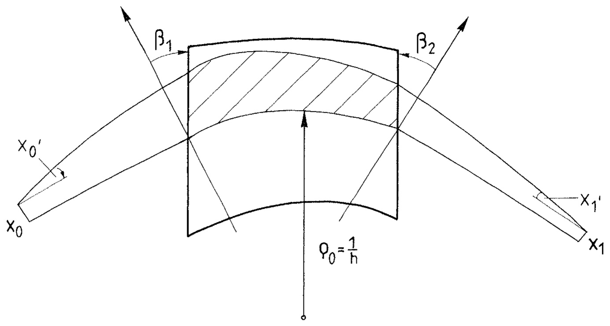
**Fig. 5.** The definition of the coordinates for a sector field, the angle definitions for non-perpendicular entrance and exit of the central ray are also given. The area covered by the beam envelope inside the bending field for the positive coordinates is hatched.

Homogeneous dipole magnets without a vertical restoring force do not focus in $y$ direction. For strong focusing, quadrupole magnets are used, the restoring forces in $x$ and $y$ directions respectively are: $k_x^2 = k_y^2 = n h^2$. For the non-bent field with $h = 0$ the equations become:

$$x'' + k_x^2 x = 0 \quad y'' - k_y^2 y = 0 \tag{14}$$

with

$$k_x = k_y = \frac{B_0}{a} \frac{q}{p_0}, \tag{15}$$

$a$ determining the radius of the quadrupole aperture. The constant $k^2$ characterizes the focusing strength of the quadrupole.

The general solutions of the particle trajectories to the first order are

$$\begin{aligned}
x(s) &= c_x(s) \, x_0 + s_x(s) \, x_0' + d_x(s) \, \delta p \\
x'(s) &= c_x'(s) \, x_0 + s_x'(s) \, x_0' + d_x'(s) \, \delta p \\
y(s) &= c_y(s) \, y_0 + s_y(s) \, y_0' \\
y'(s) &= c_y'(s) \, y_0 + s_y'(s) \, y_0'
\end{aligned} \tag{16}$$

where $c_x$, $c_y$ and $d_x$ are the magnifications in $x$ and $y$ and the dispersion in $x$, respectively. The coefficients $c$ and $s$ are sine and cosine functions and the analogs of the two solutions of the harmonic oscillator. Equation (16) written in matrix form can now easily be used to calculate particle trajectories through complex ion optical systems.

In the following we will use the full 6-dimensional phase-space: position coordinates, angles, momentum and path-length $x$, $x'$, $y$, $y'$, $p$ and $s$.

The transformation of the entrance vector of the particle coordinates along the separator can be written as:

$$\begin{pmatrix} x \\ x' \\ y \\ y' \\ s \\ \delta p \end{pmatrix} = \text{R} \begin{pmatrix} x_0 \\ x'_0 \\ y_0 \\ y'_0 \\ s_0 \\ \delta p_0 \end{pmatrix} = \begin{pmatrix} c_x & s_x & 0 & 0 & 0 & d_x \\ c'_x & s'_x & 0 & 0 & 0 & d'_x \\ 0 & 0 & c_y & s_y & 0 & 0 \\ 0 & 0 & c'_y & s'_y & 0 & 0 \\ (s/x) & (s/x') & 0 & 0 & 1 & (s/\delta p) \\ 0 & 0 & 0 & 0 & 0 & 1 \end{pmatrix} \begin{pmatrix} x_0 \\ x'_0 \\ y_0 \\ y'_0 \\ s_0 \\ \delta p_0 \end{pmatrix} \tag{17}$$

The path-length coordinates are written in the notation of Brown [19], where the entrance and exit coordinate of the transformed vector are given in brackets as e.g. $(s/x)$ gives the path-length as function of the entrance coordinate $x$.

**Table 2.** Nonzero matrix coefficients for magnetic and electrostatic deflection fields. Bending angle $\phi$, included field boundary angle: $\beta$, length: $l$.

| | | Drift length | Bending* field | Wedge | Quadrupole** |
| :--- | :--- | :--- | :--- | :--- | :--- |
| $(x/x)$ | $c_x$ | $1$ | $\cos k\,\Phi$ | $1$ | $\cos \omega l$ |
| $(x/x')$ | $s_x$ | $l$ | $\frac{\varrho_0}{k} \sin k\,\Phi$ | $0$ | $\omega^{-1} \sin \omega l$ |
| $(x'/x)$ | $c'_x$ | $0$ | $-\frac{k}{\varrho_0} \sin k\,\Phi$ | $-\frac{\tan \beta}{\varrho_0}$ | $-\omega \sin \omega l$ |
| $(x'/x')$ | $s'_x$ | $1$ | $\cos k\,\Phi$ | $1$ | $\cos \omega l$ |
| $(y, y)$ | $c_y$ | $1$ | $1$ | $1$ | $\cosh \omega l$ |
| $(y/y')$ | $s_y$ | $l$ | $\Phi\varrho_0$ | $0$ | $\omega^{-1} \sinh \omega l$ |
| $(y'/y)$ | $c'_y$ | $0$ | $0$ | $\frac{\tan \beta}{\varrho_0}$ | $\omega \sinh \omega l$ |
| $(y'/y')$ | $s'_y$ | $1$ | $1$ | $1$ | $\cosh \omega l$ |
| $(x/\delta p)$ | $d_x$ | $0$ | $\frac{\varrho_0}{k^2}(1 - \cos k\,\Phi)$ | $0$ | $0$ |
| $(x', \delta p)$ | $d'_x$ | $0$ | $\frac{1}{k} \sin k\,\Phi$ | $0$ | $0$ |
| $(s/x)$ | | $0$ | | $0$ | $0$ |
| $(s/x')$ | | $0$ | | $0$ | $0$ |
| $(s/\delta p)$ | | $0$ | | $0$ | $0$ |

\* Magnetic field: $k^2 = 1 - n$; $n = 0$ homogeneous field. Electric field: $k^2 = 3 - N - (v_0/c)^2$; cylindric fields $N = 1$, concentric spheres $N = 2$.  
\*\* Quadrupole focusing in $x$-direction. For quadrupoles focusing in $y$-direction the $x$ and $y$-coefficients must be exchanged; $\omega^2 = g/B\varrho$, $g$ is the field gradient of the quadrupole.

Equation (17) shows that to the first order the $x$ and $y$ coordinates are not coupled. The focusing conditions in $x$ and $y$, respectively, where the image size becomes independent of the emission angles, are given by $s_x = 0$ and $s_y = 0$, non dispersive systems have $d_x = 0$ if only the exit coordinate $x$ is nondispersive.e.g. independent of the particle momentum. For a completely achromatic system, additionally the exit angle $x'$ is nondispersive and $d'_x = 0$ is required.

To calculate mass resolving spectrometers or velocity filters the eletric field has to be included, the matrix has to be extended for instance by splitting the momentum vector in mass and velocity. Other notations are also used. The first order matrix coefficients for dipole magnets, cylindric condensors and magnetic quadrupoles are given in Table 2. It should be noted that an inclination of the field boundary of a dipole magnet can also provide beam focusing similar to a quadrupole, which is also included in the table.

#### B. Liouvillean ion optics

For a general description of particle motion in phase-space which is useful for the calculation of the trajectories of ensembles of particles as well as for the finding of conservation laws the Hamiltonian must be used. The Hamiltonian including the vector and scalar potentials $\vec{A}$ and $\phi$ of the magnetic and electric field, respectively, is:

$$H = q\phi + c\{m_0^2c^2 + (\vec{p} - q\vec{A})^2\}^{1/2} \tag{18}$$

with $m_0c^2$ denoting the rest mass of the ion.

The canonical equations of motion in generalized co-ordinates for positions and momenta, $q_i$ and $p_i$, respectively, are:

$$\frac{\text{d}q_i}{\text{d}t} = \frac{\partial H}{\partial p_i} \qquad \frac{\text{d}p_i}{\text{d}t} = -\frac{\partial H}{\partial q_i}. \tag{19}$$

It can be shown that for conservative forces, as for the motion in electromagnetic fields the phase-space density remains constant (e.g. [16]). As a consequence the beam transfer materices have unit determinants.

A very useful description of the motion of ensembles of particles is possible with the transformation of the six-dimensional phase-space ellipsoid. As $x$ and $y$ are not coupled in first order and the beam momentum is a constant in most cases, the two-dimensional projections of this ellipsoid in $x$, $x'$ or $y$, $y'$ space, are ellipses of constant area, characterizing the beam emittances.  
The ellipse matrix is [19]:

$$\sigma = \begin{pmatrix} \sigma_{11} & \sigma_{12} \\ \sigma_{21} & \sigma_{22} \end{pmatrix} \tag{20}$$

where for a uniform density distribution inside the ellipse and zero density outside

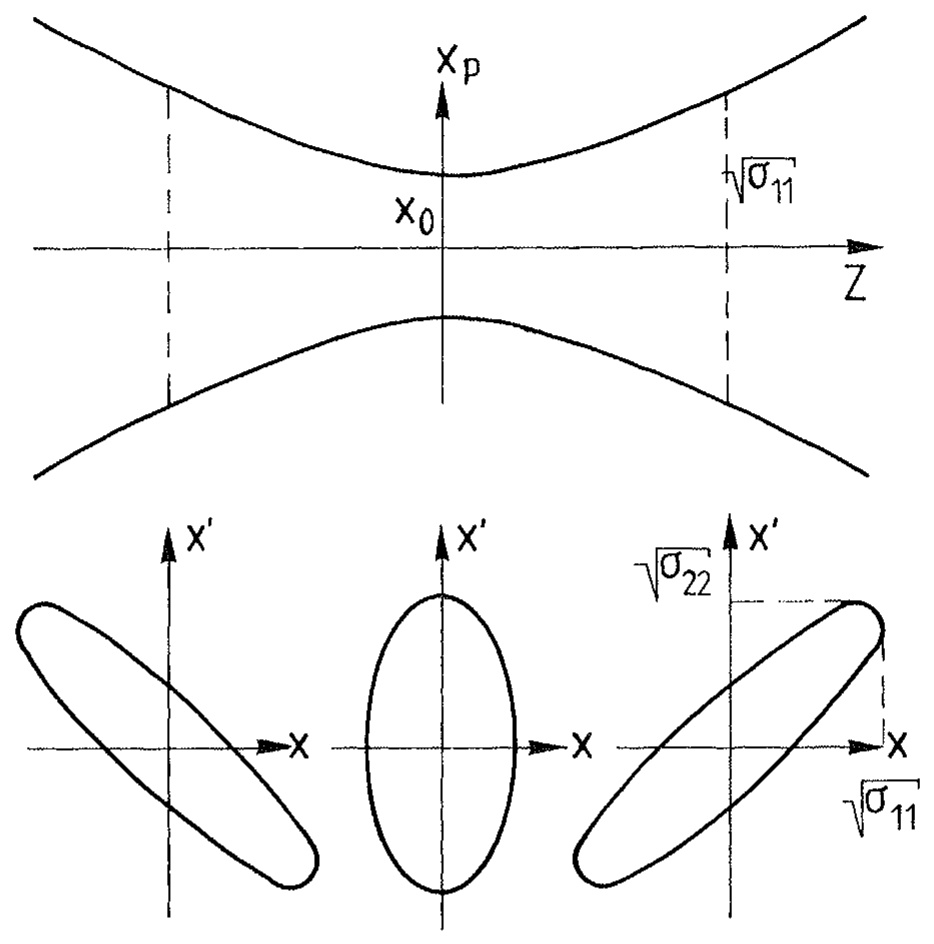
**Fig. 6.** Emittances (lower panel) and beam profile (upper panel) near a beam waist, the projection of the emittance ellipse on the respective axes characterizes the beam profile in position x and angle x' along the beamline.

we have:

$$\sigma_{11} = x^2 \tag{21}$$

$$\sigma_{22} = x'^2 \tag{22}$$

The beam ellipse can be easily transformed through any ion optical system by use of the beam transfer matrix $\text{R}$:

$$\sigma = \text{R}\,\sigma_0\text{R}^t \tag{23}$$

As an example Fig. 6 shows the beam ellipses near the narrowest part of the beam called waist. The projections of the ellipse onto the position coordinate $x$ gives the extension of the beam in $x$, the projection onto the $x'$ coordinate gives the angular spread of the beam.

If e.g. matter is included in the ion optical system we have to deal with non-Liuovillean systems [24]. Including non-conservative forces the Hamiltonian equations of motion become:

$$\frac{\text{d}p_i}{\text{d}t} = -\frac{\partial H}{\partial q_i} + Q_i \qquad \frac{\text{d}q_i}{\text{d}t} = \frac{\partial H}{\partial p_i} \tag{24}$$

the phase-space density $\varrho_{\text{p}}$ is not conserved any more, we obtain:

$$\frac{\text{d}\varrho_{\text{p}}}{\text{d}t} = -\varrho_{\text{p}}\sum_{i=1}^{3}\frac{\partial Q_{i}}{\partial p_{i}}, \tag{25}$$

where

$$\begin{aligned}
\frac{\partial|Q_{i}|}{\partial p_{i}} &> 0 \quad\text{causes an increase} \\
\frac{\partial|Q_{i}|}{\partial p_{i}} &< 0 \quad\text{causes a decrease}
\end{aligned} \tag{26}$$

of phase-space density.

For the interaction of particles with matter both cases are possible. In the low energy region as for fission fragments up to $1\text{ MeV}/u$ the energy-loss increases with energy, and the phase-space density increases, if we can neglect the expansion of phase-space by energy straggling. For relativistic particles in the Bethe-Bloch regime, the energy-loss decreases with increasing energy and phase-space density increases when those particles pass through matter [24].

#### C. Design principles

The first order momentum resolution of a magnet for a particle beam of the emittance $2x_{0}2x'_{0}$ and the rigidity $B\varrho$ is determined by the area $S$ covered by the beam (Fig. 5):

$$R_{B\varrho} = \frac{BS}{2x_{0}2x'_{0}B\varrho} \tag{27}$$

A similar equation can be derived for electric fields:

$$R_{E\varrho} = \frac{ES}{2x_{0}2x'_{0}E\varrho} = \frac{VL}{2x_{0}2x'_{0}dE\varrho} \tag{28}$$

Equation (28) gives a relation between the theoretical limit of energy resolution for a beam of the rigidity $E\varrho$ and total voltage across the gap $d$ of a deflection condensor with the length $L$. It is evident that the application of electric separation to relativistic ions is rather limited due to the maximum voltages applicable in high vacuum. If we apply $1\text{ MV}$ to a condenser of $20\text{ m}$ length, the energy resolution for ions of $500\text{ MeV}/u$ is $50$.

The resolution of combined systems is obtained by adding the contributions from all fields [25]. From equations (27), (28) two simple rules can be derived immediately: fields or field combinations with a cross-over in the symmetry plane are achromatic as the sign of the area covered by the beam changes at the cross-over, the dispersions of field combinations with alternating deflections can be added if beam foci are placed in between. It has been shown that this method nicely allows resolutions of mass separators and velocity filters to be determined in an easy way [25]. It is noteworthy to mention that it is unimportant whether the deflection fields are superimposed or separated in space, and also the sequence of the fields does not affect the resolution from first principles.

To really achieve the theoretical limit of resolution it is mostly necessary to correct for aberrations. Generally systems of high symmetry and with smooth beam envelopes have small aberrations. It can be shown that the chromatic aberrations increase with the focusing strength of the ion optical system. Evidently it is of importance to place correction elements at those locations of the ion optical system where they are most effective and have the weakest interaction with aberrations not to be corrected. Chromatic aberrations for instance will be corrected where there are large dispersions, aperture corrections however should be corrected where there are wide beams and no dispersion.

With the formalism of coupling coefficients the optimum positions for correction elements can be determined [20], and it can be predicted which elements have to be tuned in practice while operating the separator to correct a specific aberration independently of others. Figure 7 shows an example of coupling coefficients to correct the chromatic aberrations for two sections of the GSI fragment separator (see also Fig. 29).

In practice mostly second order corrections are made. Either curved field boundaries or sextupole magnets are used, the latter have the advantage of adjustable strength. After the correction elements have been determined by calculation, it is necessary to check the result with a 3rd order calculation, as it often turns out that second order corrections rise third order aberrations, especially when strong multipoles are used. For general considerations of the practical design of complex ion optical systems [19] and references therein are recommended.

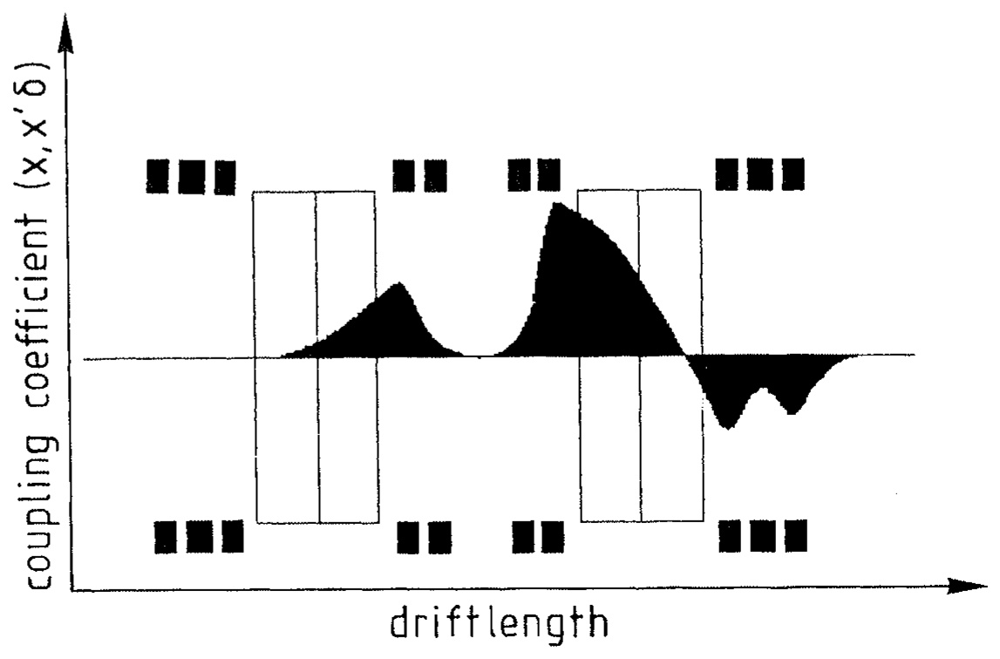
**Fig. 7.** Coupling coefficient for the aberration, calculated for two sections of the GSI fragment separator.

### III. Examples of in-flight separators

In the practical realization of in-flight separation in contrast to ion source based separators the main difficulty is that the separator has to be adapted to the reaction kinematics. Moreover the energetic reaction products emerge from the target with an ionic charge distribution which is determined by the nuclear charge and the velocity as well. To resolve the charge multiplets for each mass, the resolving power of the separator has to exceed the mass resolution which would be necessary if only one charge-state would exist, a difficulty which does not arise for relativistic ions, being generally bare (Fig. 3).

To match these conditions recoil separators generally include magnetic quadrupoles. They match the acceptance of the separator and the emittance of the nuclei to separate and simultaneously shape the beam so that the dispersive fields are illuminated nicely as to achieve an optimum resolution. Technical requirements are the practicable sizes and shapes of the deflection fields such as the gap-width for electric deflectors to match field-strength and the technically applicable maximum voltage. These design principles are nicely demonstrated at the recoil mass separator at RCNP Osaka CARP [26], which can be considered as the continued development of the Mattauch Herzog energy refocusing separator.

#### A. Recoil mass separators

The layout of the CARP [26] is displayed in Fig. 8. A quadrupole Q1 close to the target to achieve a large solid angle provides beam matching and vertical beam fosusing. The sequance of a $55^\circ$ dipole-magnet D followed by a $32^\circ$ electrostatic cylindric condenser F provides mass dispersion, the deflection fields of opposite bending direction are matched to cancel energy dispersion. Therefore high mass resolution is achieved for recoils with large energy spreads such as heavy ion fusion products. Hexapoles H1, H2, and H3 in-between both fields permit correction of chromatic aberrations coupled to the momentum spread of the beam. The quadrupole Q2 downstream of the dispersive fields creates the stigmatic focus at the exit of the separator. The focal plane can be shifted along the beam axis, dependent on experimental requirements e.g. the installation of a flight path for addtional time-of-flight measurement. Due to chromatic aberrations of dipoles and quadrupoles the focal length of the whole system is momentum dependent, e.g. the focal points for particles of different masses are shifted along the beam axis dependent on mass-over-charge ratio. The practical consequence is that the focal plane in the dispersive location is not perpendicular to the beam. The sextupoles correct this aberration and rotate the dispersion line as indicated in the figure. The mass-over-charge resolution obtained with CARP is 1000 for a solid angle of 10 msr and a momentum acceptance of several percent. The technical data of CARP are shown in Table 3 together with the specifications of other recoil separators.

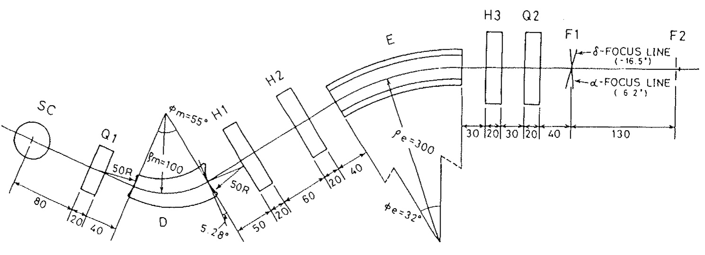

**Fig. 8.** The recoil mass separator CARP.

**Table 3.** Recoil mass separators. The abbreviations are: Q: quadrupole, D: magnetic dipole, E: electric dipole, cross-field velocity filter

| | Configuration | Solid Angle [msr] | $m/\Delta m$ [msr] | Length [m] | $B\varrho_{\text{max}}$ [Tm] | $E\varrho_{\text{max}}$ [MV] | Energy acceptance |
| :--- | :--- | :--- | :--- | :--- | :--- | :--- | :--- |
| Osaka (CARP) | QDEQ | 10 | 1000 | 8 | 1 | 7.5 | 20% |
| Rochester | QQQEDEQQQ | 1–5 | 100–1000 | 10 | 0.8 | 11 | 20% |
| Legnaro | QQEDE | 10 | 280 | 7.5 | 1 | 12 | 40% |
| Argonne (FMA) | QQEDEQQ | 8 | 300 | 8.2 | 1.1 | 20 | 40% |
| Oak Ridge | QQDQDQQEDEQQ | 0.6 | 1000 | 2 | 1.4 | 30 | 30% |
| Daresbury | QQQWWQQQDQQQ | 8 | 300 | 13 | 0.8 | $\sim 10$ | 8% |
| Darmstadt | QQQEDDDDEQQQ DQQ | 3 | 130 | 14 | 1.2 | 20 | 20% |

It has been shown that the separation of recoils from heavy-ion fusion is not possible by using magnetic deflection fields only. The magnetic rigidity of recoils from heavy ion fusion is approximately the same as that of the projectiles (Fig. 9). Consequently recoil mass separators devoted to the investigation of heavy-ion fusion are slightly modified. The electric deflection field is split and the magnetic dipole is placed in-between. Figure 10 shows the mechanical layout of the Rochester Recoil Mass spectrometer [28]. The first electrostatic field separates the recoil products from the primary beam as the energy-over-charge ratio of recoils and projectiles differs considerably, so that the primary beam is stopped in the first electrostatic deflector. The beam particles scattered at a condenser plate are an undesired source of particle background with continuous energy and ionic charge-state spectra. The dipole magnet in combination with the second condensor selects the heavy recoils and compensates the energy dispersion, while the scattered beam particles are suppressed. Thus a primary beam suppression of typically $10^{13}$ is achieved. Quadrupole triplets placed at the entrance and exit of the separator, respectively, act like zoom lenses and give a high flexibility in matching beam conditions and separator performance.

A whole family of that type of separator has followed, they are installed at Legnaro [29], Oak Ridge [30] and Argonne [31], or are under construction as in Bombay [32]. The arrangements differ by variations in the number of quadrupoles used and by the way how second-ordered corrections are introduced.

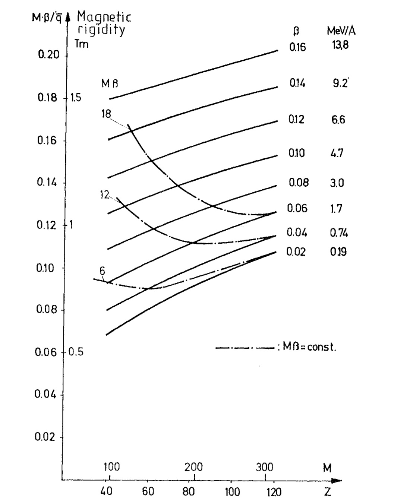

**Fig. 9.** Magnetic rigidities of particles with constant momentum in the energy regime close to the Coulomb barrier as applicable for recoils from heavy-ion fusion [27], plotted versus the recoil mass.

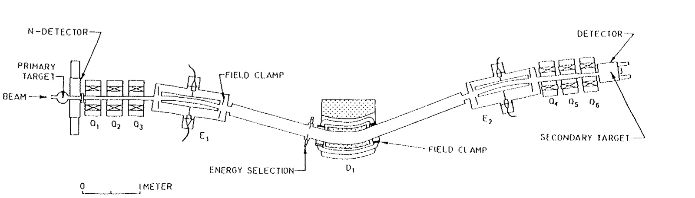

**Fig. 10.** The mechanical layout of the Rochestor recoil mass spectrometer, Q, D, and E label quadrupoles, electrostatic deflecting fields, and the magnetic dipole, respectively. The total length of the separator is 10 m [28].

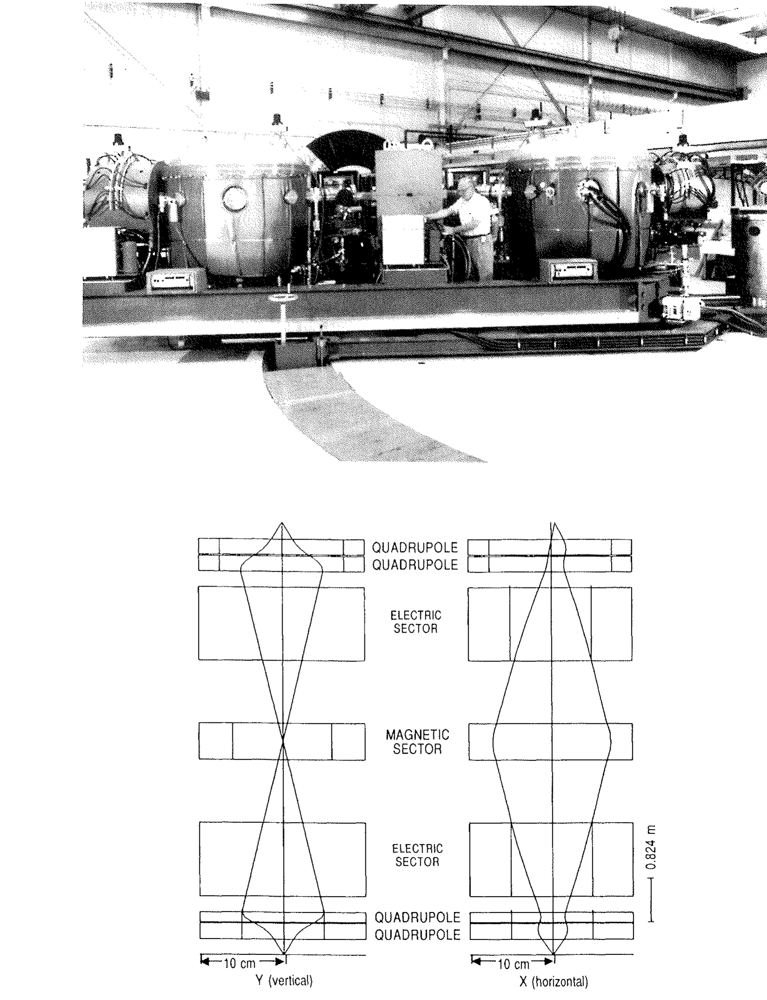

**Fig. 11a.** The ATLAS mass analyser FMA. From top to bottom: photographic view, vertical, and horizontal beam envelopes [31].

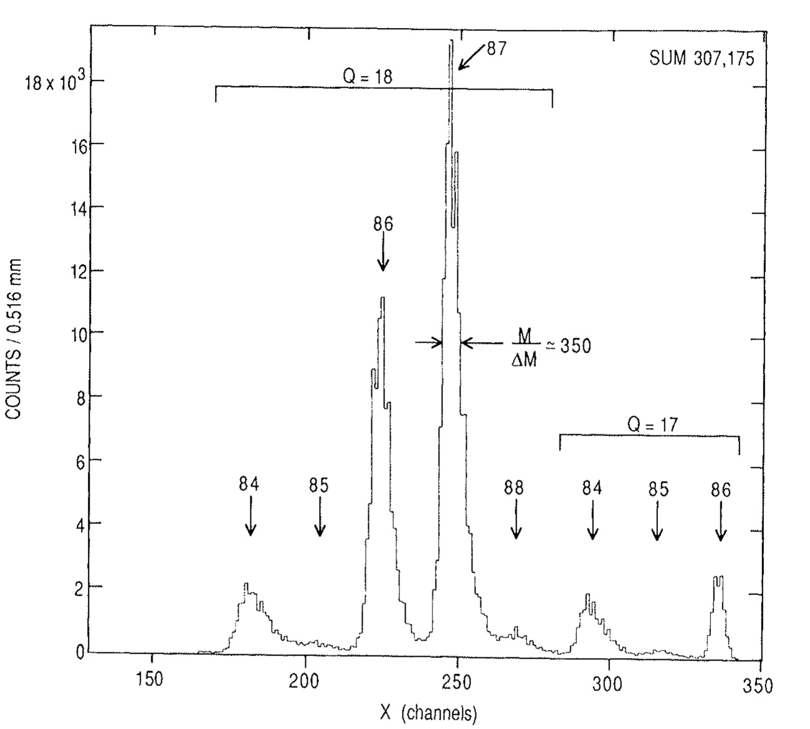

**Fig. 11b.** Measured recoil spectrum from the ATLAS FMA for two ionic chargestates.

Figure 11a summarizes the ionoptics of the Argonne separator. The uppermost panel shows a photography of the separator with the dipole magnet and the vacuum tanks for the two electric fields. The panels below show the imaging of the entrance beam-spot for a considerably large beam angle of $\pm 46\text{ mrad}$. Horizontally the entrance quadrupoles collect the whole intensity and focus it to the exit plane, assisted by a contribution from the dipole magnet. The field area of central dipole is nicely illuminated with a broad beam envelope so the dipole can be rather short and nevertheless create high resolution.

It is noteworthy to mention a drawback of the recoil mass separators: as they separate according to mass-over-charge, a charge dispersion of the same size as the mass dispersion is created. The ionic charges of heavy recoils are of the order of 20 units and the intensity is distributed over about five chargestates, which reduces the transmission. Figure 11b shows the recoil masses from the complete fusion reaction ${}^{32}\text{S} + {}^{58}\text{Ni} \rightarrow {}^{90}\text{Ru}^*$ for two ionic chargestates. The mass resolution is 350. For very exotic species, e.g. very heavy nuclei another problem arises: to achieve optimum transmission, the average chargestate has to be known, which is not guaranteed by the current predictions [33, 34].

#### B. Velocity filters

Velocity filters are recoil separators adapted to the very special kinematics of heavy-ion fusion products. According to Eq. (2) the velocity of evaporation residues is well separated from that of the projectiles, the velocity difference depends on the mass ratio between projectile and compound nucleus. As the complete fusion of heavy ions is an inelastic collision, the evaporation residues move with center of mass velocity, all other binary reaction products for instance from fission after fusion or from nuclear transfer reactions move with different velocities as they leave the center of mass when they separate after interaction. Moreover velocity filters have no charge and consequently no mass-dispersion, hence all ionic charge states and all isotopes are collected, provided they originate from complete fusion. This is advantageous especially for the investigation of exotic species near the driplines or in the region of the heaviest elements where reaction channels or ionic chargestates are unknown. Consequently velocity filters are the most sensitive separators, the detection limit is below 10 picobarn [1].

The velocity filter SHIP [5] at GSI, specifically designed for the investigation of the heaviest elements, is a two stage filter with spatially separated electric and magnetic fields (Fig. 12). Each filter stage consists of a plate condenser and two dipole magnets to create doubly charged achromatic velocity dispersion. The separated-field design starting with a plate condenser ensures that the projectile beam can never hit the plates and create a background of scattered projectiles or damage the plates in case of the high beam currents of up to particle microamperes used at SHIP. The two filter stages of comparatively low velocity dispersion guarantee high transmission and optimum separation. In the second stage scattered projectiles are suppressed. This arrangement reaches a suppression of scattered projectiles of up to $10^{12}$ integrated over the whole energy spectrum and suppresses unretarded projectiles by more than $10^{16}$. Quadrupole triplets at entrance and exit, respectively, focus the separated recoils.

As SHIP does not identify nuclear masses, the assignment of the separated nuclei has to be made by nuclear spectroscopic methods. Two typical examples for isotope identification by nuclear decay spectroscopy will be given. Figure 13 shows the first identification of a groundstate proton emitter [35] in the complete fusion reaction $^{96}\text{Ru}(^{58}\text{Ni},\text{p2n})^{151}\text{Lu}$. The energy spectrum collected from the decays of nuclei implanted in a surface barrier detector shows the $\alpha$ spectra of dysprosium, holmium, erbium and lutetium in the vicinity of mass 150. The bump in the spectrum is due to alphas escaping the detector into the backward hemisphere, of which only an energy loss signal is measured as their depth of implantation is less than their range in the detector material. At an energy of 1.23 MeV a single peak originating from the proton decay of $^{151}\text{Lu}$ is observed. As the implantation of the mother nuclei is also measured the halflife could be determined on an event by event basis to 0.08 s.

As an example to demonstrate the separation quality achievable with kinematic in-flight separation Fig. 14 shows the $\alpha$ spectra collected in the experiment on the discovery of element 108 by the identification of the isotope $^{265}108$ on the basis of parent-daughter correlated $\alpha$ decays [36] observing the decay of only three atoms. The figure shows $\alpha$ spectra obtained with a surface barrier detector, from top to bottom: the free running $\alpha$ spectrum, the mass correlated spectrum, the same spectrum with a condition on heavy masses obtained from time-of-flight and implantation energy, and the correlated daughter decays up to the third generation, respectively. Due to the correlation condition only two of the three element-108-atoms observed show up in the spectra. The isotope $^{265}108$ was produced in an irradiation of $^{208}\text{Pb}$ with $^{58}\text{Fe}$. The time for the accumulation of the spectrum was $240\text{ h}$, the corresponding projectile dose $0.6.10^{18}$. The halflife of the observed $10.35\text{ MeV}$ $\alpha$ decay is $1.8\text{ ms}$.

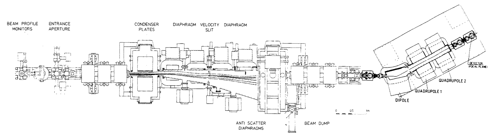

**Fig. 12.** The velocity filter SHIP, partly opened to show the separation of the evaporation residues from the projectile beam and the separator NASE

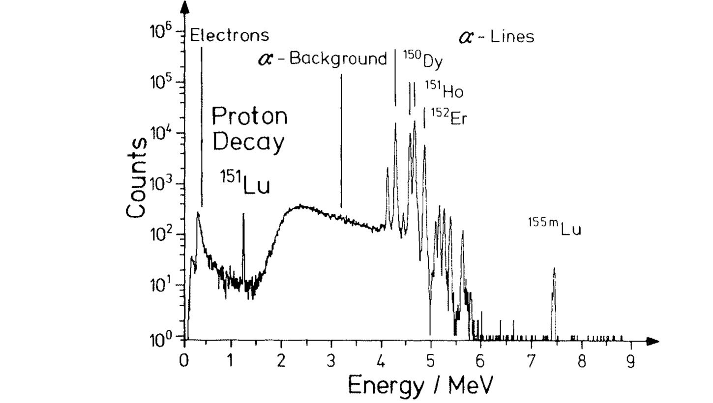

**Fig. 13.** Decay energy spectrum of in-flight separated nuclei implanted in a silicon surface detector showing the proton decay line of the first groundstate proton emitter [151]Lu.

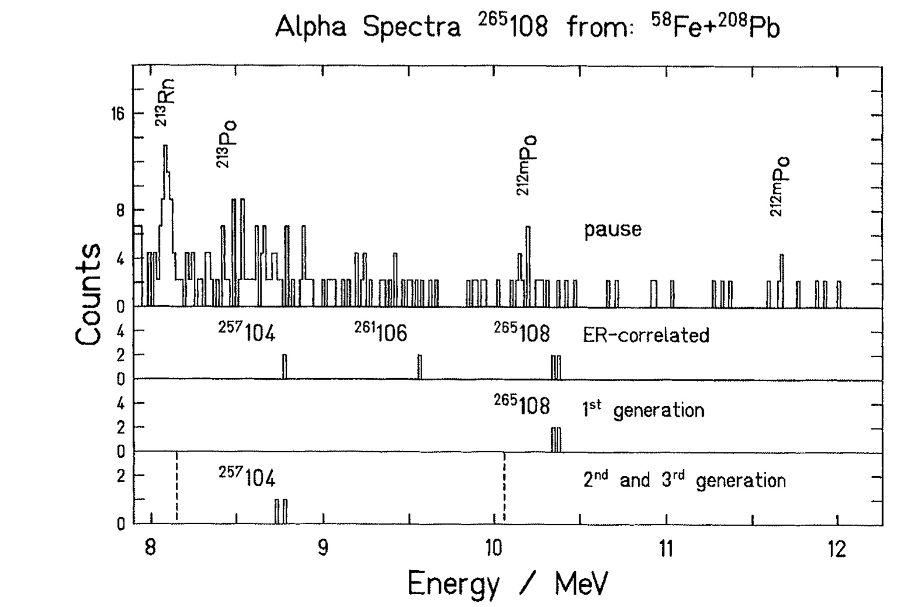

**Fig. 14.** Decay spectra collected in an experiment on the discovery of element 108. Uppermost spectrum: ungated decay spectra collected between the accelerator beam pulses; below: decays measured in delayed coincidence to the implantation of a heavy nucleus; next spectrum: the same spectrum with a window on the mass of the correlated residue; the two bottom spectra show later generations of correlated decays.

To achieve a mass separation the DQQ separator HECK can be combined with SHIP in a way that the velocity dispersion of SHIP is cancelled out, and a mass and charge dispersion is obtained. Separators of the latter type operate at MSU [37] and Daresbury [38].

Figure 15 shows the Daresbury recoil separator which in contrast to SHIP has crossed field velocity filters. It involves a magnetic spectrometer of the DQQQ-type to achieve energy refocusing. The $\gamma$-detector surrounding the target is displayed at the right hand side. The separator contains sextupoles to correct the most important aberrations. An example of how to compensate first order dispersions and to correct second order aberrations for this separator is displayed in Fig. 16. Nuclei of the masses 130 and 131 have been created in an irradiation of $^{54}\text{Cr}$ with $^{80}\text{Se}$ at $275\text{ MeV}$. In the two-dimensional cluster plot the recoil energy is plotted versus the position at the final focus. The coefficient $(x,\delta v)$ is the dispersion coefficient, an upright line indicates the absence of a velocity dispersion, the aberration $(x/x'\delta v)$ is the chromatic aberration; if it is present only one energy is focused nicely, as seen in the figure, the term $(x/\delta v\ \delta v)$ creates a curvature of the lines in the position-energy diagram. With this separator pioneering experiments using recoil-$\gamma$ coincidences have been made. Figure 17 shows an example of a particle-coincident $\gamma$-spectrum of $^{49}\text{Mn}$, observed in the reaction $^{12}\text{C}$ ($^{40}\text{Ca}$, $\text{p}2\text{n}$) $^{49}\text{Mn}$ [39].

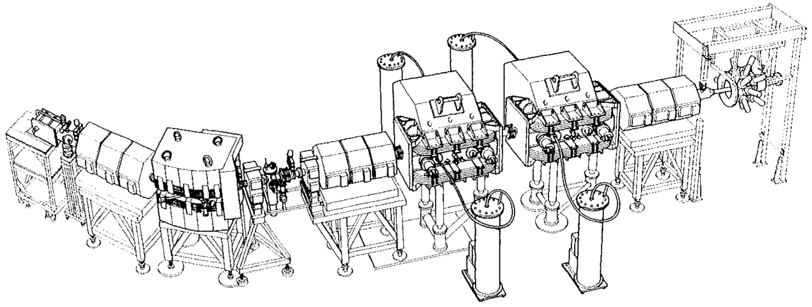
**Fig. 15.** The Daresbury separator, a combination of two crossed-field velocity filters and a magnetic spectrometer. The $\gamma$-detector array near the target is also shown at the left hand side (courtesy of A.N. James).

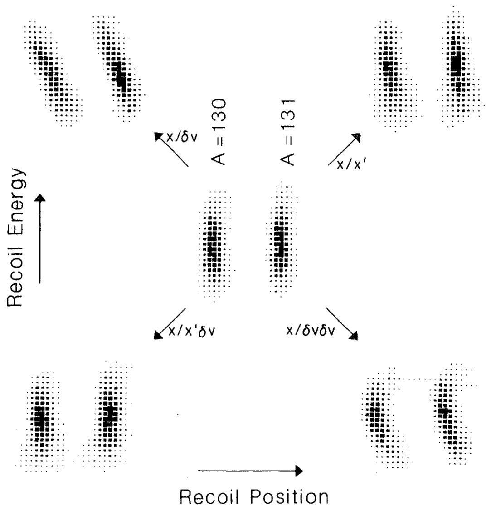
**Fig. 16.** Display of various matrix coefficients such as velocity dispersion $(x, \delta v)$, focus $(x,/x')$ and chromatic aberrations.

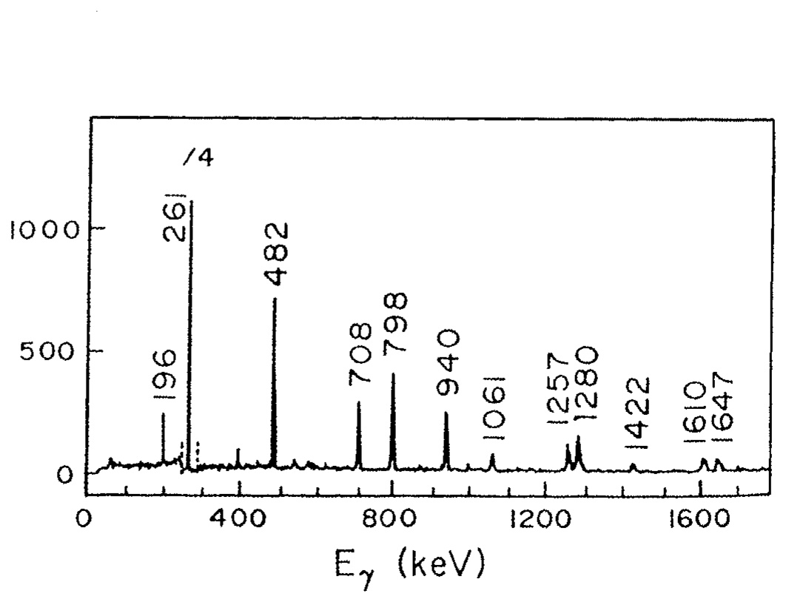
**Fig. 17.** Recoil correlated $\gamma$-spectrum of $^{49}\text{Mn}$ [39].

#### C. RF separators

The combination of time-of-flight measurement and magnetic momentum analysis is a well known technique for mass identification. A modern device of that type is the TOFI spectrometer at LAMPF, Los Alamos [40]. The most advanced time-of-flight separation will be possible with storage rings [41].

To separate masses spatially on the basis of their time-of-flight, radio frequency (RF) separators have been developed. The Munich RF separator is ion optically a velocity filter combined with time-of-flight analysis using an electric RF deflection field, to achieve mass separation [42]. The RF condenser is placed between two magnetic dipoles (Fig. 18). The RF phase and amplitude are chosen in such a way that only particles with the proper velocity can pass the selector, they pass the electric RF field at the maximum amplitude where field strength fulfills the velocity filter condition. To achieve optimum resolution the accelerator pulses must be sufficiently short in comparison to the RF applied to the separator. The RF operates in the $10\text{ MHz}$ region and achieves a time resolution of the order of $10^{-3}$.

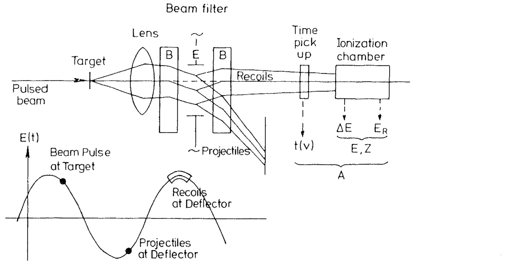
**Fig. 18.** The Munich RF separator, schematic.

#### D. Parabola spectrographs

Double-focusing spectrometers achieve the energy-refocused mass resolution by balancing the velocity dispersions of electric and magnetic fields. As a consequence the velocity or energy information, respectively, is lost. For the measurement of kinematic effects however this information is important and can be measured with parabola spectrometers. They consist of an electric and a magnetic field combined in a way that the direction of their deflection is perpendicular. As a consequence for each mass and ionic charge state a line is created, along which the energy is dispersed. The inclination is determined by the ratio of the dispersions of the two deflection fields. A disadvantage of the parabola spectrograph is that the mass lines become rather long for large energy spreads of the recoils, which requires large detector systems.

The LOHENGRIN separator installed at the Grenoble high flux reactor is used for the investigation of fission fragments [43, 12]. It consists of spatially separated fields, a dipole magnet and an electrostatic condenser rotated by $90^\circ$. Recently a small dipole magnet has been installed behind, the deflection direction of which coincides with the extension of the mass lines. The magnet reduces the velocity dispersion along the mass line and focuses the fission fragments additionally, so a short parabola can be created.

#### E. Gasfilled separators

Fission fragments as well as heavy ion fusion products created with light beams $A_{\mathrm{p}} \leqslant 40$ are emitted into large solid angles and with larage momentum spreads and wide ionic charge distributions. The relative abundance of a specific ionic charge state close to the maximum of the distribution in the low energy domain discussed here is only 10% to 15%. An efficient collection of those reaction products suffers from the transportation problems in ion optical systems where the dispersion in the deflecting fields create large beamspreads and the chromatic aberrations $(x/x'\delta p)$ of the strong-focusing quadrupoles blow up the particle beams. Consequently the practically achievable apertures of the ion-optical systems restrict the transmission. To overcome this problem gasfilled separators have been developed. Gasfilled separators have been used for the investigation of fission fragments [12]. Recently this type of separator has been used for the investigation of heavy ion fusion products, as SASSY at LBL, Berkeley [44], GARIS at RIKEN, Tokio [45], the Dubna gas filled separator [46], the NASE Separator at GSI, Darmstadt [47], and the RITU separator at JYFL, Jyvaskyla [48].

Fast ions moving in a gas environment experience charge exchange collisions, their charge-state fluctuates around the average value:

$$\bar{q} = \frac{v}{v_0} Z^{1/3}, \tag{29}$$

$v_0$ denoting the Bohr velocity. After elimination of ionic charge state and recoil velocity the average magnetic rigidity is only dependent on nuclear mass and charge [4]:

$$\bar{B}\varrho \sim \frac{A}{Z^{1/3}} \, v_0. \tag{30}$$

Therefore high transmissions can be expected. For this kind of separator Liouville's law of phasespace conservation is not applicable: Angular scattering reduces the phasespace density significantly. The gas pressure has to be chosen to an optimum balance between the number of charge-exchange collisions which must have good statistics to average the ionic charge states and the number of scattering collisions which enhance beam emittance (Fig. 19). An inherent problem in using gasfilled separators is the prediction of the average ionic charge state: For the slow recoils atomic shell effects may play a role [44].

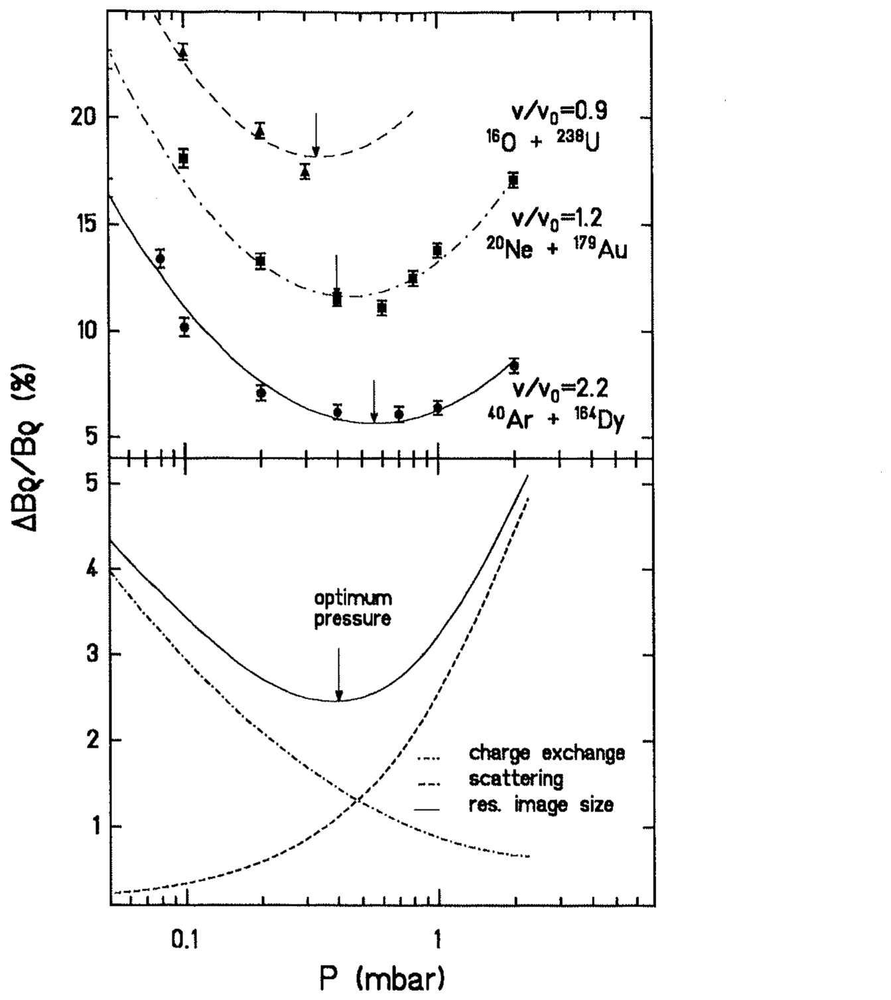
**Fig. 19.** The beamspread in a gasfilled separator in dependence from the gas pressure showing the contributions from charge-exchange collisions and scattering, respectively [47].

In contrast to common magnetic separators, gasfilled separators start with a magnetic dipole. Bringing the target close to the deflection magnet has the advantage that the beam is removed from the reaction products before it is blown up by angular scattering and contributes to background in the particle spectra. An exception is the JYFL separator RITU [48], where a short quadrupole is placed between target and dipole magnet to achieve optimun matching between beam emittance and acceptance of the separator (Fig. 20).

In heavy-ion fusion, gas-filled separators have been used to investigate heavy elements, especially in the kinematically unfavourable case of light projectiles and actinide targets [47].

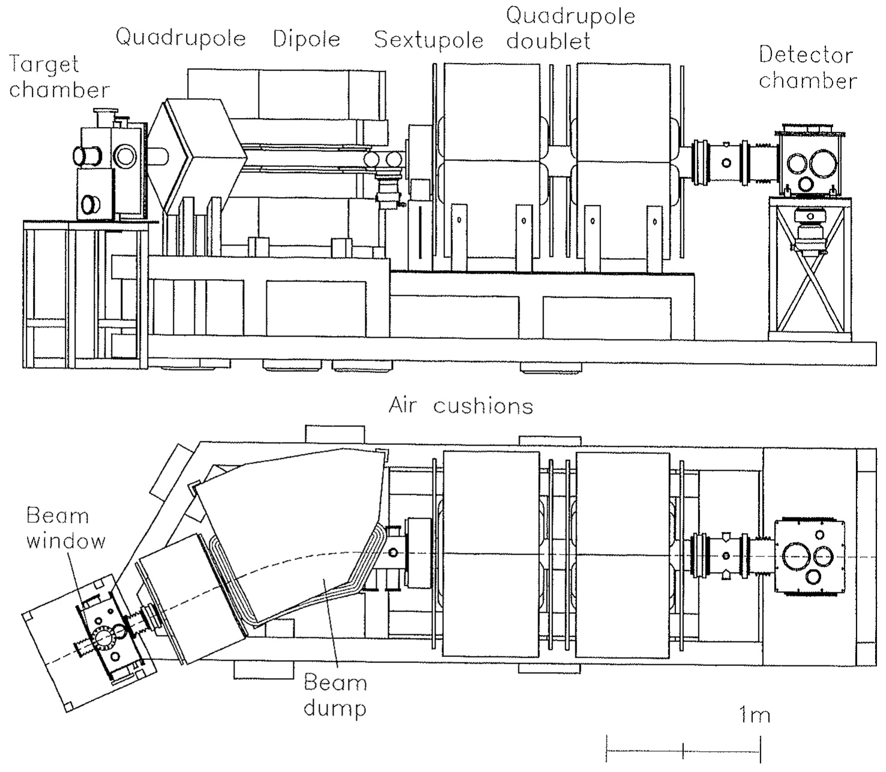
**Fig. 20.** The mechanical layout of the RITU separator at the University of Jyvaskyla (courtesy of M.E. Leino).

### IV. Separation of relativistic heavy ions

#### A. The energy loss separators for projectile fragments

For heavy ions of intermediate and high energies a new separation method has been developed recently: The combination of magnetic analysis and energy loss in solid material. The reason is that on the one hand, energy-refocusing mass separators of sufficient resolution with high voltage deflectors of technical feasibility are limited to below $100\text{ MeV}/u$ (Eq. 28), on the other hand the energy-loss straggling scaled in relative units becomes so small for high energetic ions that energy loss in matter can be used to resolve all elements of the periodic table. A design without degrader which uses RF separation has also been proposed [50]. Figure 21 shows the calculated relative energy straggling for ions from $\text{Ne}$ to $\text{U}$ in aluminium. The thickness of the energy degrader corresponds to $10\%$ range and half range, respectively. The straggling for the half-range degrader spans from $0.5\%$ for light ions at low and intermediate energies to below $0.1\%$ for uranium at high energies.

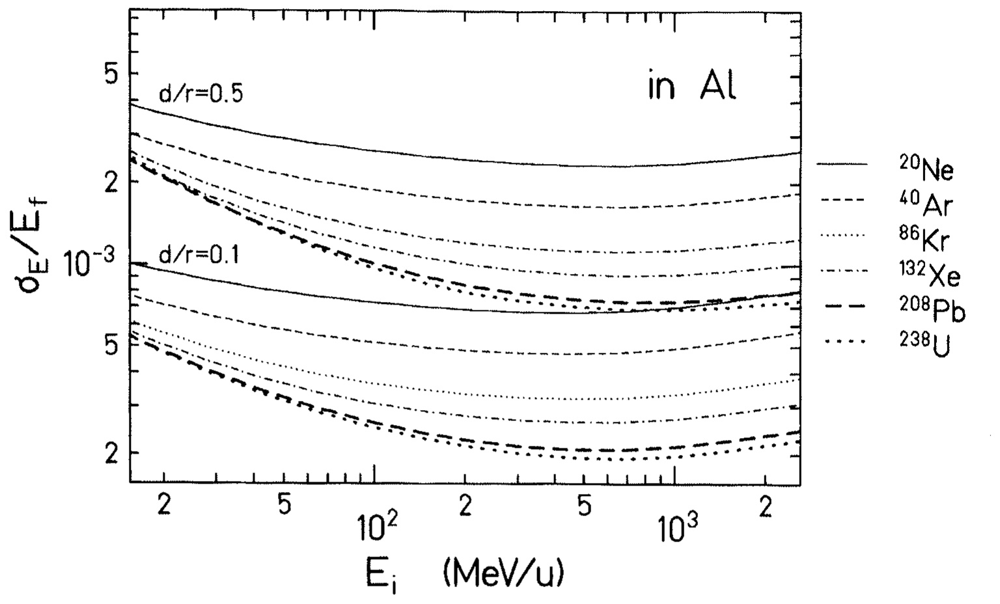
**Fig. 21.** Calculated relative energy straggling for ions of Ne to U at an energy of $1\text{ GeV}/u$ in aluminium of half-range thickness and $10\%$ range thickness, respectively [22].

Isotopic separation using the combination of magnetic achromats and energy degraders is schematically explained in Fig. 22. The fragments emerge from the production target with a velocity close to that of the projectile. The momentum analysis in the first separator stage selects all ions with the same mass-to-charge ratio. For bare fragment ions this is equivalent to a separation in $A/Z$. The resolution of this kinematic separation, the diffuseness of this cut, is determined by the relative momentum spread of the fragments. The $A/Z$ separation is already sufficient for many experiments where particles are identified event-by-event on the basis of time-of-flight and position measurement at the dispersive plane of the separator to obtain the momentum-over-charge ratio, combined with an energy loss measurement in an ionization chamber, scintillator, or silicon solid state detector to determine the nuclear charge. This operation mode allows field studies to investigate fragmentation cross sections and kinematics or nuclear properties, respectively, over large mass regions.

If a spatial isotopic separation is required to obtain isotopically clean fragment beams, the energy-loss in matter, e.g. by inserting a degrader in the beamline of the separator, is analysed by subsequent magnetic analysis. This second analysis puts a second cut in the isotopic chart. The isotope where both lines intersect is the one to be selected (Fig. 22). The quality of this separation is limited by the energy straggling in the degrader. As the energy loss is energy dependent, the inclination of this cut varies with energy.

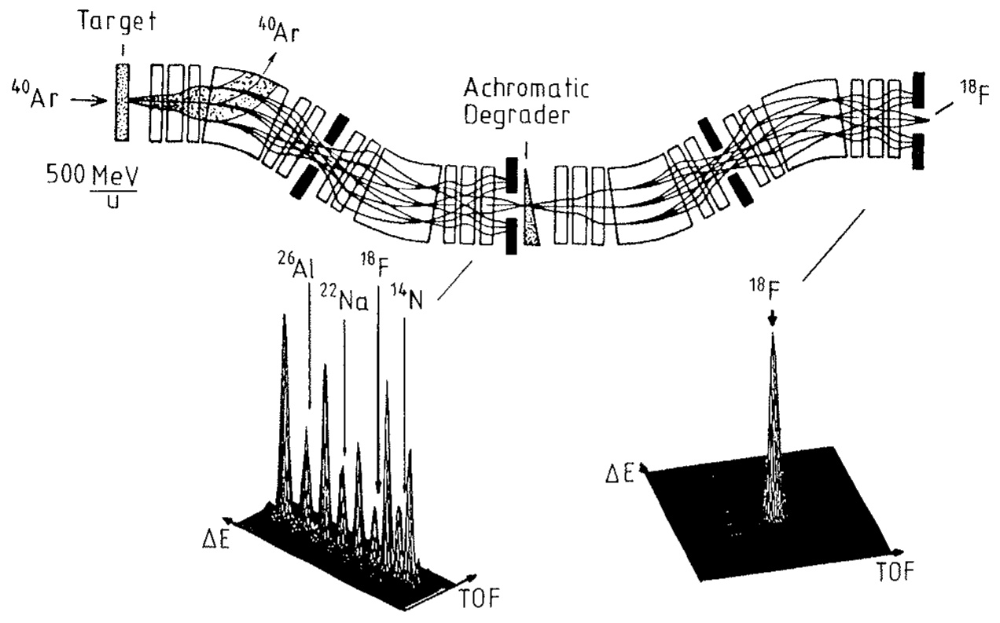
**Fig. 22.** The principle of in-flight isotopic separation for projectile fragments using an achromatic magnetic deflection system and the energy degrader (upper panel). By virtue of the reaction kinematics the first separator stage cuts along constant $A/Z$ (dashed line). The combination of energy loss in the degrader and magnetic analysis in the second separator stage place a second cut (solid line). The intersection of both determines the separated isotope. The bottom panel shows the experimental verification for the separation of $^{18}\text{F}$ produced by $^{20}\text{Ne}$ fragmentation. Experimental data from the GSI fragment separator.

The action of both separations is experimentally nicely demonstrated for the separation of gold fragments with the GSI projectile fragment separator [7] in Fig. 23. The contour plot shows the position at the dispersive focus plotted versus the exit coordinate of the achromat for fragments of $^{197}\text{Au}$ with $1\text{ GeV}/u$. Isotopes with similar $A/Z$ ratio as $^{183}\text{Os}$, $^{185}\text{Ir}$, $^{188}\text{Pt}$ and $^{190}\text{Au}$ have the same position at the dispersive plane; they would be selected in an appropriate diaphragm located at this position. The exit coordinate reflects the atomic energy loss in the degrader resulting in a dispersion to the nuclear charge. It nicely separates the isotopic chains of osmium, iridium, platinum, and gold, respectively. The key to this separation is that an achromatic separator with a target at the dispersive plane operates as a energy loss spectrometer, sensitively detecting the energy loss of the fragments, resp. Their nuclear charge independently of the momentum spread at the dispersive plane which creates the element separation. The isotopic spectrum which would be obtained at the exit of the separator with an appropriate diaphragm located at the dispersive plane is displayed in the bottom panel. Recently uranium fragments were separated isotopically [51].

As a rather thick degrader is chosen—mostly it corresponds to half the range of the fragment to separate—the large energy loss creates a mismatch in the dispersions of both separator stages: The deceleration in the degrader creates a change of the average momentum, while the momentum spread remains unaltered. As the ion optical dispersion scales in the relative units $D\Delta p/p$, this leads to a dispersion mismatch which can be compensated if the momentum spread is compressed correspondingly. This can be achieved by placing a wedge at a dispersive focus, a well known technique in earlier times applied e.g. to pion channels for medical treatment [52]. The dispersion mismatch can also be compensated by an appropriate change of the dispersion coefficient $D$, however at the expense of the ion optical symmetry.

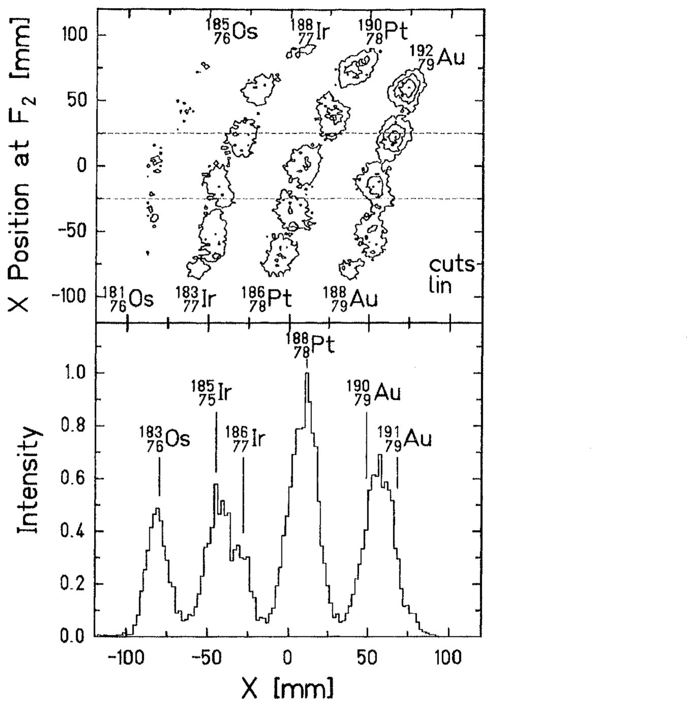
**Fig. 23.** Isotopic distributions from gold fragmentation measured at the GSI fragment separator. The contour plots of fragment positions at the dispersive focal plane versus the position at the final focus (upper panel) and the corresponding isotopic spectrum (lower panel).

The action of the degrader angle to match the dispersion is nicely demonstrated with a Monte Carlo calculation [22] for the separation of $^{19}\text{Ne}$ produced by $^{20}\text{Ne}$ fragmentation displayed in Fig. 24 where three examples of degrader shapes have been calculated (from top to bottom): The homogeneous degrader, with parallel surfaces, the achromatic degrader shaped to match the dispersions, and the degrader shaped to bunch the energy of the separated ions. The left row displays the isotopic spectra, the central one with the achromatic degrader has the best resolution. The middle row shows the energy spread of the fragments plotted versus the position. The central picture shows that the achromatic degrader removes the energy dispersion as expected to obtain the optimum isotopic resolution. The energy-bunching degrader however gives narrow energy distributions at the expense of a large beamspread, the width of this distribution being determined by the resolution of the separator. The panels displayed in the right row display the range distribution of fragments stopped in carbon which is relevant for decay spectroscopy demanding thin detectors. The width of the distribution obtained with the monoenergetic degrader is as narrow as $0.1\text{ mm}$ FWHM. Note that with this method an additional range separation, advantageous for the application of detector telescopes, is achieved.

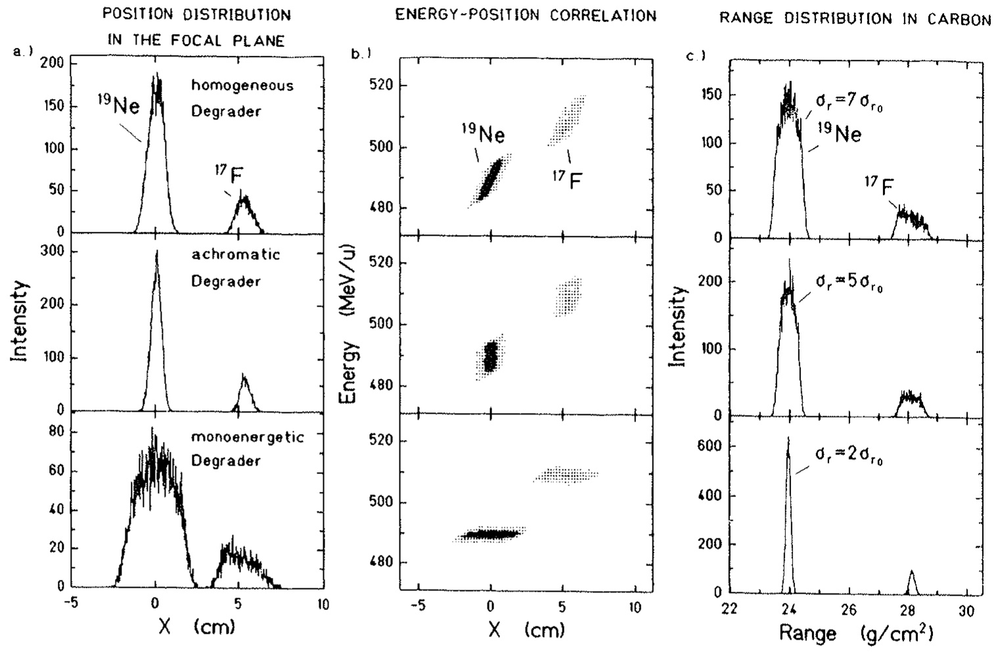
**Fig. 24.** Monte Carlo calcualtion for $^{19}\text{Ne}$ produced by fragmentation of $^{20}\text{Ne}$ at $600\text{ MeV}/u$, for the homogeneous, achromatic, and monoenergetic degrader, respectively, (from top to bottom), the figures from left to right display the isotope spectra, contour plots of energy versus position, and the range distributions [24].

#### B. The energy degrader as an ion-optical element

The ions trespassing the degrader dissipate energy, therefore Liouvillean optics is no longer applicable. Nevertheless it is possible to find a beam transfer matrix for the degrader, however with a $\text{determinant} \neq 1$ (see sect. 11.B). The energy degrader can be treated as a conventional ion optical element [53]. This is convenient for finding general rules for its general application in the design of separators for energetic charged particles. Analogously to the electromagnetic elements a degrader can induce higher order aberrations if the energy loss in the degrader is energy dependent or if it is nonlinear along its surface, e.g. if the degrader shape is curved. The order of the curvature determines the order of the induced aberration. Here only the first order contributions from the ideal wedge shaped degrader will be treated.

To calculate charge, mass, and energy resolution, respectively, the degrader matrix is given conveniently in these coordinates:

$$\begin{pmatrix} x \\ x' \\ \delta \\ A \\ Z \end{pmatrix} = \begin{pmatrix} 1 & 0 & 0 & 0 & 0 \\ 1 & 0 & 0 & 0 & 0 \\ (\delta/x) & (\delta/x') & (\delta/\delta) & (\delta/A) & (\delta/Z) \\ 0 & 0 & 0 & 1 & 0 \\ 0 & 0 & 0 & 0 & 1 \end{pmatrix} \cdot \begin{pmatrix} x_0 \\ x_0' \\ \delta_0 \\ A_0 \\ Z_0 \end{pmatrix} \tag{31}$$

The coefficient $(\delta/x)$ gives the $x$ depenndence of the energy loss, which is determined by the wedge angle, $(\delta/x')$ gives the dependence on the beam angle, $(\delta/\delta)$ relates the exit energy to the entrance energy, and $(\delta/A)$, $(\delta/Z)$ relate the energy dependence of the energy loss on mass and nuclear charge, respectively.

As the energy loss varies with energy a general evaluation of the coefficients is not possible. The coefficients for intermediate energies are given in Ref. [54]. For the application of degraders in magnetic separators, the matrix elements for the magnetic elements have to be decomposed correspondingly.

The achromatic wedge angle to restore achromaticity is obtained on the condition that the dispersion before and behind the degrader does not change. From Eq. (31) after replacing $x_0$ by $D_1\delta_0$ where $D_1$ is the energy dispersion coefficient of the system before the degrader, we obtain.

$$D_1(\delta/x) + (\delta/\delta) = 1. \tag{32}$$

For intermediate energies the degrader angles are of the order of one millirad [24]. These small angles have been practically realized by bending a homogeneous degrader appropriately [8].

In the Bethe-Bloch region of energy loss the degrader will increase phase space [24]. Moreover the wedged degrader shuffles momentum space into the $x$, $x'$ space, leading to an additional increase of beam emittance. The beam spot at the exit of the system is determined by:

$$x_1^2 = V_1^2 (V_2 + D_2(\delta/x))^2 x_0^2 + (D_1 V_2 + D_2 (D_1(\delta/x) + (\delta/\delta)))^2 \delta_0^2 \tag{33}$$

where $V_1$ and $V_2$ determine the magnifications of the system at the degrader and at the exit of the separator, respectively, and $D$ refers to the corresponding dispersions. The spot size is enlarged as the degrader shuffles momentum space into $x$ space.

Note that the emittance is governed by the target spot size, hence a small focus will minimize the emittance of the fragment beams. As the emittances of the primary beams are generally small, the corresponding increase of the beam aperture will be much smaller than the fragment-beam apertures and can be neglected.

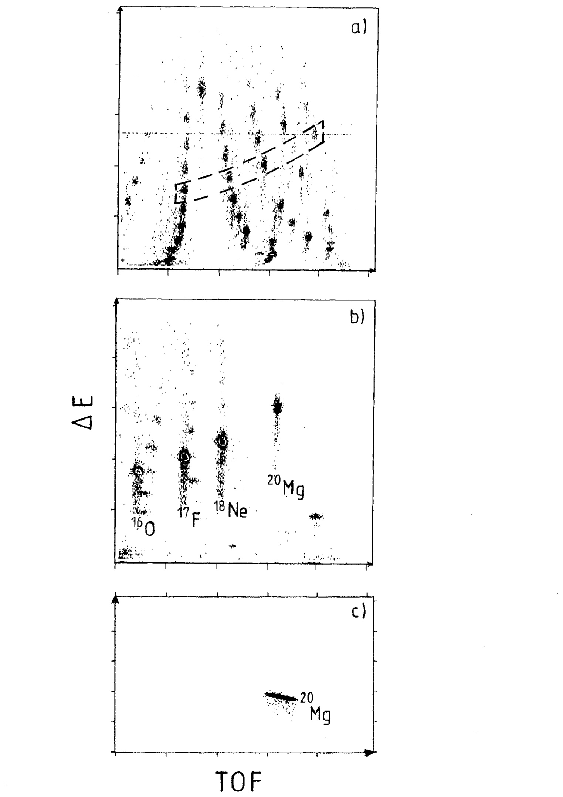
**Fig. 25.** Isotopic separation of $^{20}\text{Mg}$ at LISE. From top to bottom: no degrader, including the degrader, and with velocity selection (Courtesy of D. Guillemaud-Muller.)

Of practical importance is the enlargement of the beam spot in achromatic mode, obtained from Eqs. (31, 32) and the achromatic condition $D_1 V_2 + D_2 = 0$:

$$x_1^2 = V_1^2(V_2 + D_2(\delta/x))^2 x_0^2. \tag{34}$$

Typical spot sizes are of the order of $2\text{ cm}$ to $3\text{ cm}$ FWHM for the achromatic mode, for the mono-energetic mode where large momentum space is shuffled into the emittance, the enlargement of the spotsize is still larger (Figs. 22, 23, 24, 29). Hence the application of the degrader itself, its thickness and angle, have to be carefully reconsidered under the special conditions of the experiment. The increase of phase-space density by beam cooling in a storage ring will be discussed in a later section.

#### C. Separators for projectile fragments

Projectile fragments were first separated at the Berkeley BEVALAC. Dispersive parts of the beamline were used preferably to separate light isotopes, as the resolution was rather limited. With these relativistic beams of exotic nuclei, pioneering secondary-beam experiments on nuclear structure preferably at the neutron drip-line as for example of $^{11}\text{Li}$ were performed [9]. Later with the LISE separator at GANIL [8], [49] projectile fragments with intermediate energies were separated isotopically.

The LISE (see Chap. 13, Fig. 1) is a large magnetic forward spectrometer of high resolution. It consists of two stages with the configuration QQDQQ. The magnetic dipoles have a deflection angle of $45^\circ$ each. The first separator stage creates a momentum dispersion which is cancelled out in the second stage by virtue of symmetry. Between both stages the energy degrader is placed. In the recent upgraded version a crossed-field velocity filter creating a velocity dispersion perpendicular to the dispersion of the LISE spectrometer has been added [55]. For technical reasons the crossed-field velocity filter has been sub-divided in two sections. Magnetic quadrupole triplets at the entrance and exit, respectively, create a parallel beam to provide optimum illumination of the filter section. The crossed-field sections have a length of $2.5\text{ m}$ each and can be operated with a voltage of up to $\pm 250\text{ KV}$ across a gap of $10\text{ cm}$, the overlayed magnetic fields operate at $0.05\text{ T}$ to $0.1\text{ T}$. An achromatic section with $15^\circ$ deflection angle in between the achromat and the velocity filter sections is necessary to implement the velocity filter in the environment of the experimental hall.

The improvement in the purification of isotopic beams after the upgrade is shown in Fig. 25. The experimental work at LISE concentrated on the mapping of the drip-lines, investigation of groundstate properties of exotic nuclei, especially near the drip-lines and of astrophysical interest. Recently secondary beam experiments at intermediatae energies have been started.

The ion-optical design of the fragment separator RIPS [56] installed at RIKEN, Tokyo and of the planned secondary beam line at RCNP [54] is similar to that of the LISE. Figure 26 shows the ion-optical configuration together with the evaluation of various matrix elements along the central trajectory. For comparison of configurations and beam parameters see Table 4. The new and intersting feature of the RIPS facility is the addition of a dipole magnet for secondary-beam experiments to the separator. The isotopic beams separated with RIPS hit a secondary target, the emerging reaction products can be analyzed eventwise in $A$ and $Z$. Secondary beam experiments at intermediate energies involving total reaction cross sections, Coulomb dissociation, elastic scattering and complete fusion with secondary beams have been carried out [10].

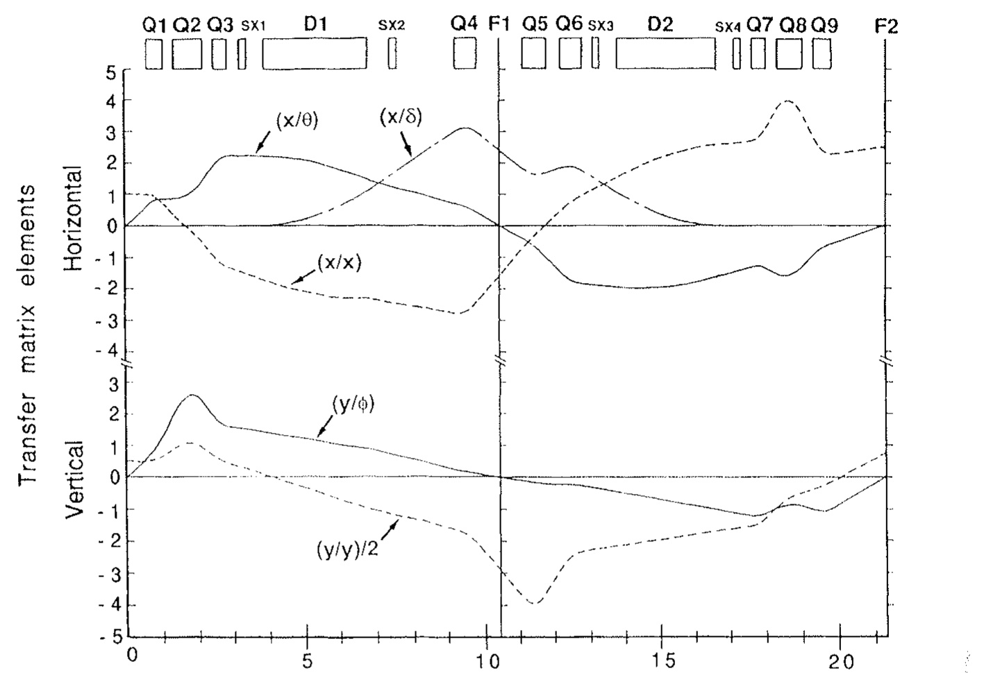
**Fig. 26.** The RIPS. Upper part: magnet configuration. Below: matrix coefficients plotted versus the path length.

**Table 4.** Separators for projectile fragments, courtesy of A. Artukh. F$d$ and F$a$ stand for dispersive and achromatic focus, respectively

| | LISE | SPEG* | SPEG + $\alpha$* | RIKEN | GSI | NSCL | LNR |
| :--- | :--- | :--- | :--- | :--- | :--- | :--- | :--- |
| | France | France | France | Japan | FRG | USA | Dubna |
| | 1984 | 1985 | 1986 | 1989 | 1990 | 1991 | 1992 |
| Configuration | 2QD2Q F*d*2QD 2QF*a*(2Q) | 2QS2D QF*d* | $\alpha$-channel + SPEG | 3QSDSQ F*d*2QSD S3QF*a* 3QF*a*2QF*a* | 3QD2QF*d* 2QD3QF*d* 3QD2QF*d* 2QD3QF*a* | 3QDSD2Q F*d*3QF*d*2 QSDSD 3QF*a* | 2D2C*d* F*d*2C*d* 2DF*a*(2Q) |
| $\Delta\Omega\text{ [msr]}$ | 1.0 | 4.9 | 1.0 | 5.0 | 0.7–2.5 | 0.3–4.3 | 6.4 |
| $\Delta p/p\text{ [\%]}$ | $\pm 2.5$ | $\pm 2.5$ | $\pm 0.5$ | $\pm 3.0$ | $\pm 1.0$ | $\pm 1.5$ | $\pm 10$ |
| $Rp/\Delta p$ | 800 | 10000 | 2000 | 2000 | 8000 | 3400 | 4360 (8720) |
| $B\rho\text{ [Tm]}$ | 3.2 | 2.8 | 2.8 | 5.76 | 5–18 | 5.4–7.2 | 4.5 |
| $\text{Targ. [g/cm}^2\text{]}$ | $\sim 0.2$ | $\sim 0.2$ | $\sim 0.2$ | $\sim 1.0$ | 0.1–10 | $\sim 1.5$ | $< 10$ |
| $\text{Length [m]}$ | 18(24) | 13.8 | 82 | 21(27) | 74 | 19(22) | 14.5(18) |
| Mode | achrom. | disp. | disp. | achrom. | achrom. | achrom. | achrom. |

\* not described in this review, see Ref.$^{56}$.

An interesting ion-optical design is the COMBAS separator, now being installed at Dubna. It uses inhomogeneous sector fields of alternating gradient for a large solid angle and a large momentum range [58].

#### D. Secondary beam facilities

The new experimental possibilities of energetic exotic nuclear beams for the investigation of nuclear reactions make it desirable to have the full experimental equipment of an accelerator facility available for secondary beam experiments. The beamlines at the BEVALAC used for secondary beam production and separation to perform secondary beam experiments e.g. with the HISS magnet were the first step in this direction [9]. Dedicated facilities of that kind are the NSCL beam facility at Michigan State University for intermediate energies [59] and the GSI facility at GSI Darmstadt for the high-energy domain [7].

The NSCL radioactive beam facility is shown in Fig. 27. The A1200 analysing device is a fragment separator for beams of up to $5.4\text{ Tm}$ beam rigidity [60]. With a production target placed downstream from the cyclotron, it serves as an in-flight isotopic separator for secondary beams of intermediate energy, and can provide all experimental areas in the NSCL research facility with secondary beams. Due to spacial restrictions of the accelerator building, the separator must be S-shaped, i.e. with opposite deflection direction of the two stages. Achromasy can only be achieved if the beam coordinates are not reversed at the symmetry plane, e.g. with no image between the two dispersive sections.

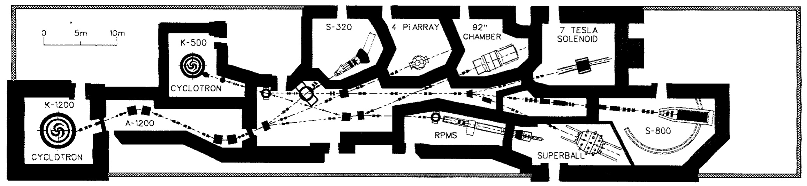
**Fig. 27.** The NSCL Radioactive Beam Facility, the fragment separator at the entrance of the beamlines (analysis) supplies the experimental areas via a switching magnet. Special instruments are the recoil mass separator RPMS and the 4$\pi$ array (Courtesy of B.M. Sherrill).

The configuration of the separator is QQQDDQQ QQ QQ QQDDQQQ (Fig. 28). To compensate for losses due to angular scattering the degrader has to be placed at a stigmatic focus. Consequently an intermediate focus is required at the exit of the first dispersive stage. A quadrupole dublet downstream from the first separator stage creates a telescopic beam at the symmetry plane of the separator to achieve achromasy at the exit of the separator. Another way of explanation is that the two foci between the dispersive stages of the A1200 (Fig. 28) reverse the beam coordinates between the dispersive twice to obtain achromasy. The separator is corrected to second order. As a high resolving energy-loss spectrometer the separator itself has been used to perform secondary beam experiments. Generally it can provide all experimental devices of the NSCL laboratory with instable nuclear beams such as the RPMS, Si/NaI detector arrays or the magnetic spectrometer S800. An interesting technical feature of the separator is that all magnetic elements are superconducting.

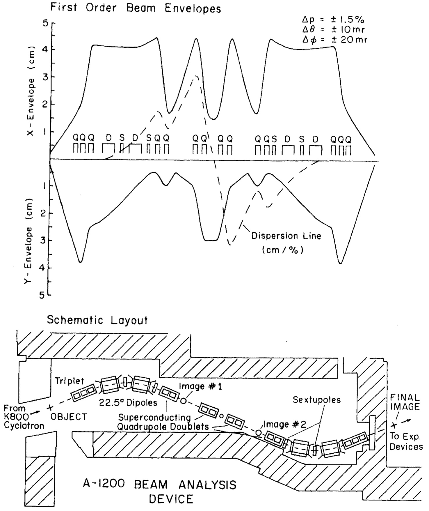
**Fig. 28.** The ion optical layout of the A1200 separation channel for secondary beams. The upper panel shows the beam envelopes in $x$ and $y$ (solid lines) and the dispersion line (dashed line), respectively the lower panel shows the schematic layout of the separator.

The projectile fragment separator at GSI Darmstadt is a high resolving zero degree achromatic spectrometer. The ion-optical layout is shown in Fig. 29. The fragment separator is composed of four stages. Each of it has the magnet configuration: quadrupole triplet-$30^\circ$ dipole-quadrupole doublet. Due to the high symmetry the system has small aberrations [6]. Sextupoles at the entrance and exit of each dipole, respectively, can be used to correct second-order aberrations. In its common mode as a separator for isotopic beams the FRS is normally operated as an achromatic spectrometer with a resolving power of 1500. Figure 29 displays the beam envelopes in x and y for emittances of $20\,\pi\text{ mm mrad}$ and the emittance enlargement in the degrader.

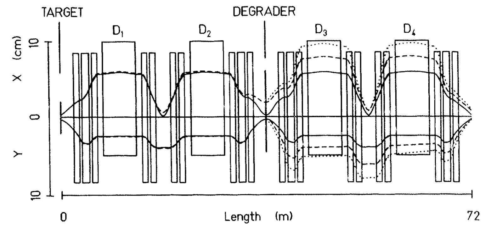
**Fig. 29.** The main components and the ion optical layout of the GSI projectile fragment separator FRS. Solid lines: beam envelopes in $x$ and $y$ direction, respectively, for an emittance of $20\pi\,\text{mm mrad}$. Solid line: no degrader, dashed and dotted lines: degrader thickness corresponding to 30% range and 50% range, respectively.

Each separator stage creates a focus in x, in the central focal plane plane F2 we have a stigmatic focus. A dedicated experimental area for experiments directly behind the separator is located at the final focus F4.
Because of its quadrupole configuration the fragment separator can be operated in various modes [6]. In the operation as a high resolving energy-loss spectrometer the target can be placed at the degrader position. For the high resolution mode the dispersions of all four stages are added by switching the quadrupoles next to the degrader for parallel beam. If cross-overs are made inside the dipole magnets, the separator behaves as a beam guide without dispersion at each of the focal planes, which results in a high transmission, primarily of the momentum bite.

With the GSI projectile fragment separator isotopic beams for projectile fragments from $^{18}\text{O}$ to $^{238}\text{U}$ with energies between $0.1\text{ GeV}/u$ and $1\text{ GeV}/u$ have been separated. There had been no prior experience of separating heavy fragments above krypton and for energies above $0.1\text{ GeV}/u$. As an example Fig. 23 (lowest panel) shows the isotopic separation of $^{178}\text{Pt}$ produced by fragmentation of $^{197}\text{Au}$ at $1\text{ GeV}/u$. For these high energies a production target with a thickness of $1.4\text{ g/cm}^2$ aluminum and an achromatic aluminum degrader with a thickness of $5.6\text{ g/cm}^2$ corresponding to the half-range of the fragments were used.

The fragment separator can be used as a separation channel for secondary beams. Figure 30 shows the facilities for relativistic heavy ion research at GSI, with the heavy ion-synchrotron SIS, the fragment separator, the experimental heavy-ion storage and cooler ring ESR and the experimental areas. Fragment beams can be transported directly via the beam-line from the heavy-ion synchrotron to the experimental areas equipped for instance with the ALADIN large angle particle identification system, the neutron wall LAND, or the kaon spectrometer KAOS [61]. The essentially new feature however is the possibility of injecting the exotic nuclear beams from the fragment separator into the storage ring for experiments with stored and cooled beams, or to extract them from the ESR to all the other experimental set-ups in the target hall. The possibility of electron cooling in the ring will provide beams of high brilliance with small emittances and momentum spreads [62].

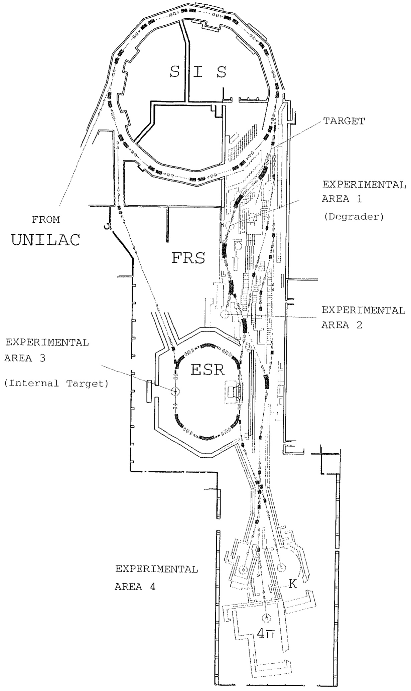
**Fig. 30.** The GSI fragment separator FRS with a dedicated experimental area and the beam line to the experimental storage and cooler ring ESR. ESR is equipped with an electron cooler and an internal gas target. After passing ESR radioactive beams can be transported to the experimental area for relativistic-beam experiments. The $4\pi$-cave houses a large dipole with a multisampling ionization chamber for particle identification and a large area neutron detector for relativistic neutrons, the K-cave houses a broad range high-resolving magnetic spectrometer.

#### E. Cooling of in-flight separated secondary beams

As in-flight separators generally preserve the reaction kinematics of the separated particles the phase-space density of the secondary beams is generally low, which may however be decisive for the feasibility of secondary beam experiments. Figure 31 shows an example of the emittance in the $x$, $x'$ space for a projectile beam, in this case $^{40}\text{Ar}$ of $1\text{ GeV}/u$, and the fragment beam $^{36}\text{P}$ created by its fragmentation. The corresponding emittances are $1.8\ \pi\text{ mm mrad}$ [63] and $44\ \pi\text{ mm mrad}$, respectively [64].

Phase-space density can be increased by beam cooling. To apply electron cooling a cold electron beam from a strong electron gun and accelerated to the beam velocity is merged with the heavy-ion beam. By electrostatic interaction the velocity distribution of the heavy ions adjusts to that of the electrons. The interaction of heavy ions with free electrons is governed by the Bethe-Bloch energy-loss formula. The cooling force decreases with the square of the velocity differences between cooling electrons and the heavy ions and increases with the square of the ionic charge of the heavy ion. The cooling time in a storage ring is governed by the fraction of the length of the cooling section related to the circumference of the ring, $\eta$, and by the electron density $j$ in the cooler. The cooling time is [65]:

$$t = 3 \cdot 10^7\ \beta^4\ \gamma^8 \frac{A}{j \eta Z^2} \left(\frac{\Delta p}{p}\right)^2 \frac{\text{s} A}{\text{cm}^2}. \tag{35}$$

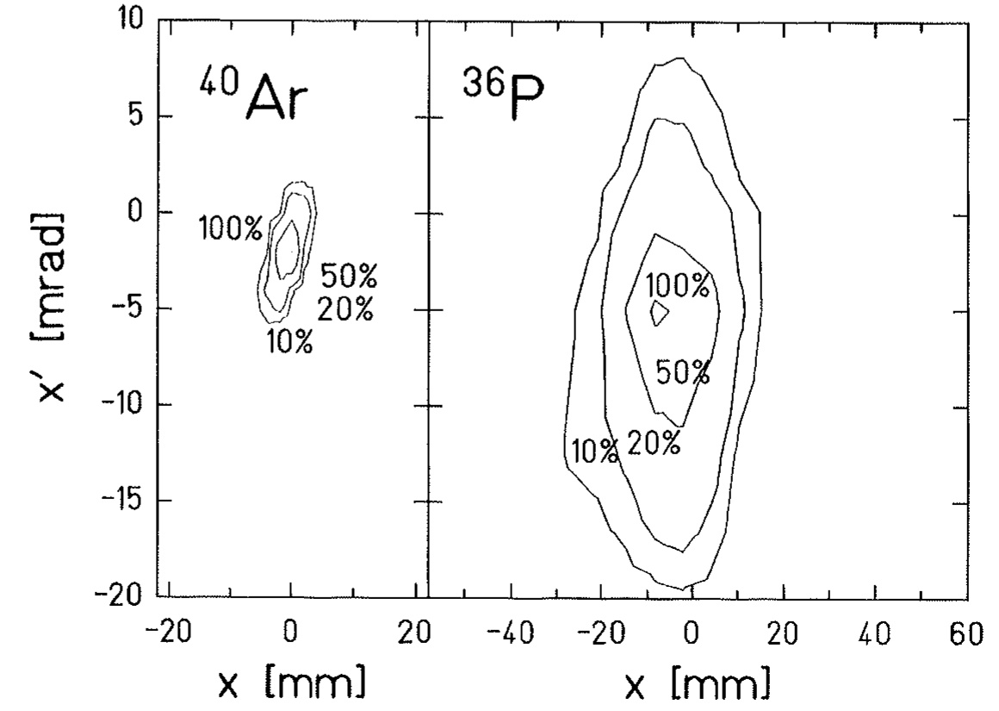
**Fig. 31.** The measured emittance of a fragment beam compared to a projectile beam. The left hand panel shows the contour plot of a $1\text{ GeV}/u\ ^{40}\text{Ar}$ beam, the right hand panel the corresponding fragments of $^{36}\text{P}$.

Cooling times scale with $A/Z^2$ and range from $0.5\text{ s}$ for argon to predicted values of $0.05\text{ s}$ for uranium accelerator beams. For secondary beams they are considerably longer, as the cooling time scales with the third power of the relative momentum spread. Therefore secondary beams will be precooled with stochastic cooling.

Electron cooling experiments have been carried out at the ESR for a variety of projectile beams. The measured momentum spreads were as low as $2\cdot10^{-6}$ for xenon, emittances in $x$ and $y$ space were as small as $0.05\,\pi\text{ mm mrad}$ [62], this corresponds to an increase of phase space density by more than seven orders of magnitude. The first cooled beam of in-flight separated fragments was obtained from neon fragmentation at $310\text{ MeV}/u$. The $^{20}\text{Ne}$ beam and its fragments with the same $A/Z = 2$ were injected into the storage ring. The electron currents in the cooler ranged up to $5\text{ A}$. Figure 32 shows the Schottky noise spectra of the cooled beam and its fragments circulating in the ring. Because of the excellent resolution the mass peaks which just reflect the binding energies are well separated. The precision of the mass determination is better than $5\cdot10^{-6}$. The small side peak assigned to $^4\text{He}$ shows a resolution which is higher by a factor of five compared to the other mass lines which are broadened by intra-beam scattering. Certainly cooling can also be applied to isobaric separation for the preparation of ultra-clean isotopic beams.

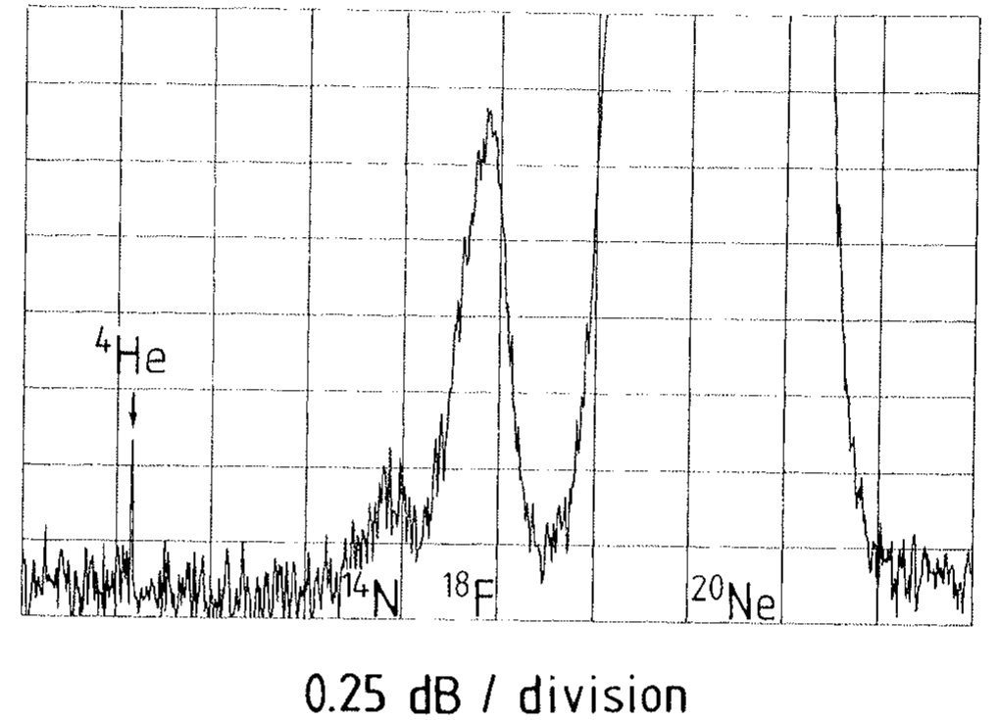
**Fig. 32.** Schottky spectra of a stored and cooled $^{20}\text{Ne}$ beam and its fragments with the same mass to charge ratio.

Cooled beams can be decelerated. Their emittance is not blown up during deceleration in the ESR. Therefore secondary beams may cover the range from $500\text{ MeV}/u$ to $3.5\text{ MeV}/u$. Experiments with coasting beams can be performed inside the storage ring with an internal target. Extracted beams of high brilliance can be directed to all experimental areas. These possibilities will certainly open a new field of experiments with in-flight separated beams of exotic nuclei of optimum ion-optical quality.

### V. Conclusion

In recent years, there has been considerable progress made in the in-flight separation of nuclear reaction products. Recoil separators for heavy ion reaction products in the low energy range, especially for recoils from heavy-ion fusion were developed to high-resolving separators with large solid angle and high momentum acceptance. Second order corrections provide high resolution. To increase the transmission even in cases of low phase space densities, gasfilled separators were applied to the separation of fusion products.

A new generation of kinematic separators for projectile fragments of intermediate and high energies has been developed. The use of energy-loss separators with energy degraders allows isotopic resolution. The high energy far above the Coulomb barrier gives the new possibility of investigating nuclear reactions with instable exotic nuclear beams. The forward peaked kinematics allows the injection of these beams into conventional beamlines. While in-flight separated exotic nuclei were previously only used for the investigation of groundstate decay, they now serve as sources for isotopical energetic secondary beams. The full experimental equipment for stable nuclear beams is now available for secondary beam experiments, which opens up a wide field of nuclear physics with in-flight separated exotic beams, which up to now, because of their low energy, were only used for the investigation of groundstate properties predominantly by means of decay spectroscopy.

A new generation of experiments started with the availability of cooled secondary beams, which will be available with energies from below the Coulomb barrier to relativistic energies with ultraclean separation as well as high momentum resolution and brilliance.

#### Acknowledgments

I gratefully acknowledge fruitful discussions with H. Geissel, I thank F. Nickel for reading the manuscript and thank E. Pfeng for bringing the manuscript into its final form.

### References

[1] Münzenberg, G., Reisdorf, W., Hofmann, S., Agarwal, Y. K., Hessberger, F. P., Poppensieker, K., Schneider, J. R. H. Schneider, W. F., Schmidt, K.-H., Schött, H. J., Armbruster, P., Sahm, C. C. and Vermeulen, D., Evidence for Element 109 from One Correlated Decay Sequence Following the Fusion of $^{58}\text{Fe}$ with $^{209}\text{Bi}$, Z. Phys. A315, 145, 1988.

[2] Ewald, H., Konecny, E., Opower, H. and Rösler, H., Z. f. Naturf. 19a, 194, 1964.

[3] Cohen, B. L. and Fulmer, C. B., Fission-Fragment Mass Separator and the Nuclear Charge Distribution of Fission-Fragments at a Single Mass, Nucl. Phys. 6, 547, 1958.

[4] Armbruster, P., Massenseparator für die Massentrennung von Spaltprodukten, Nukleonik 3, 188, 1961.

[5] Münzenberg, G., Faust, W., Hofmann, S., Armbruster, P., Güttner, K., and Ewald, H., The Velocity Filter Ship, a Separator fur Unslowed Heavy Ion Fusion Products, Nucl, Instr. Meth. 161, 65, 1979.

[6] Cormier T. M. and Stwertka, P. M., Nucl. Instr. Meth. 184, 423 1981.

[7] Geissel, H., Armbruster, P., Behr, K. H., Brohm, Th., Brünle, A., Burkard, K. H., Chen, M., Clerc, H. G., Dufour, J. P., Folger, H., Franzcak, B., Fujita, Y., Grewe, A., Hanelt, E., Langenbeck, B., Magel, A., Nickel F., Pfützner, M., Roeckl, E., Rykaczewski, K., Schardt, D., Schmidt, K.-H., Schroeter, A., Stelzer, H., Schwab, Th., Sherrill, B., Steiner, M., Sümmerer, K., Vieira, D. J., Voss, B., Weber, M., Weckenmann, J., Wollnik, H., Ziegler, C. and Münzenberg, G., The Projectile Fragment Separator FRS at GSI-Status and First Experiments, Proc. 12th Int. Conf. on Electromagmetic Isotope Separators and Techniques Related to their Application, Sendai, Japan, 1991, eds.: Fujioka, M., Shinozuka, T., and Kawase, Y., Nucl. Instr. Meth. A70, 286, 1992.

[8] Dufour, J. P., Del Moral, R., Emmermann, H., Hubert, F., Jean, D., Poinot, C., Pravikoff, M. S., Fleury, A., Delagrange, H., and Schmidt, K.-H., Projectile Fragments Isotopic Separation: Application to the LISE Spectrometer at GANIL, Nucl. Instr. Meth. A248, 267, 1986.

[9] Tanihata, I., in Treatise on Heavy Ion Science Vol. 8, Bromley, A., Ed. Plenum Press, New York, 1989, 442.

[10] Tanihata, I., this Volume see sec. IV D.

[11] Enge, H. A., Electromagnetic Separators for Recoiling Reaction Products, in Treatise on Heavy Ion Science Vol. 7, Bromely, A., Ed. Plenum press, New York, 1989, 442.

[12] Armbruster, P., Separation of Fast Nuclear Reaction Products, in Proc. 3rd Int. Conf. on Nuclei far from Stability, Cargese, Corsica, 1976, Int. Rep. CERN 76-13, Geneva, 1976, 3.

[13] Bertulani, C. A. and Baur, G., Coincidence Cross Sections for the Dissociation of Light-Ions in High Energy Collisions, Nucl. Phys. A480, 615, 1988.

[14] Viola, V. E., Kwiatowski, K., and Walker, M., Systematics of Fission Fragment total Kinematic Energy Releases, Phys. Rev. C31, 1550, 1985.

[15] Geissel, H., ATIMA, a computer program for the calculation of atomic interactions with matter, priv. com. 1992.

[16] Banford, A. P., The Transport of Charged Particle Beams, E. & F.N. Spon limited, London, 1966.

[17] Wollnik, H., Optics of Charged Particles, Academic Press Inc., New York, 1987.

[18] Carey, D. C., The Optics of Charged Particle Beams, Harwood Academic Publishers London, 1987.

[19] Brown, K. L., and Servranckx, R., First and Second Order charged Particle Optics, in Proc. 3rd Summer School on High Energy Particle Accelerators, Upton, New York, 1983, Int. Report SLAC-PUB-3381, Stanford. 1984 and references therein.

[20] Brown, K. L., A Systematic Procedure for Designing High Resolving Power Beam Transport Systems or Charge Particle Spectrometers, SLAC-Pub-762, Stanford, Cal., 1970; Proc. Third Int. Magnet Symposium, Hamburg, Germany, 1970.

[21] Wollnik, H., Brezina, J., and Berz, M., GIOS-Beamtrace, a Program Package to Determine Optical Properties of Intense Ion Beams, Nucl. Instrum. Meth. A258, 408, 1987.

[22] Schwab, Th., Transport von Schwerionen durch Materie innerhalb ionenoptische Systeme, Thesis, Univ. Giessen, Int Rep. GSI 91-10, Darmstadt, 1991.

[23] Enge, H. A., and Kowalski, S. B., Proc. Int. Conf. on Magnet Technology, Hamburg, 1970, 366.

[24] Geissel, H., Schwab, Th., Armbruster, P., Dufour, J. P., Hanelt, E., Schmidt, K.-H., Sherrill, B. and Münzenberg, G., Ions Penetrating Through Ion Optical Systems and Matter-Non-Liouvillean Pase Space Modelling, Nucl. Instrum. Meth. A282, 247, 1989.

[25] Wollnik, H., Münzenberg, G., and Ewald, H., Geschwindigkeitsspektrometer mit getrennten Feldern, Nucl. Instrum. Meth. 111, 355, 1979.

[26] Morinobu, S., Performance and Experiments With the Recoil Separator CARP at RNCP, Proc. 12th Int. Conf. on Electromagnetic Isotope Separators and Techniques Related to their Application EMIS-12, Sendai, Japan, 1992 eds.: Fujioka, M., Shinozuka, T., and Kawase, Y., Nucl. Instr. Meth. B70, 331, 1992.

[27] Münzenberg, G., Ein Geschwindigkeitsfilter für die Analyse von Schwerionen-Reaktionsprodukten, Int. J. Mass Spectroscopy and Ion Physics 14, 636, 1974.

[28] Cormier, T.M., Recoil Mass Spectrometers in Low-Energy Physics, Ann. Rev. Nucl. Part. Sci. 37, 537, 1987.

[29] Spolaore, P., Larson, J. D., Signorini, C., Beghini, S., Zhu, X., and Si, H., A Recoil Mass Spectrometer for the XTU Tandem at LNL, Nucl. Instr. Meth. A 238, 381, 1985.

[30] Cole, J. D., Cormier, T. M., Hamilton, J. H., and Ramaya A. V., A Recoil Mass Spectrometer for the HHIRF Facility, Proc. 12th Int. Conf. on Electromagnetic Isotope Separators and Techniques Related to their Application EMIS-12, Sendai, Japan, 1992, eds.: Fujioka, M., Shinozuka, T., and Kawase, Y., Nucl. Instr. Meth. B70, 343, 1992.

[31] Davids, C. N., The fragment Mass Analyzer at Atlas, Proc. 12th Int. Conf. on Electronmagnetic isotope Separators and Techniques Related to their Application EMIS-12, Sendai, Japan, 1992, eds.: Fujioka, M., Shinozuka, T., and Kawase, Y., Nucl. Instr. Meth. B70, 358, 1992.

[32] Jhingan, M. I., Nagaraj, S., Roy, A., Betigeri, M. G., and Singh, P., Spectrometer for Heavy Recoil Ions: SHRI, Ind. Journ. of Pure and Applied Physics, 27, 656, 1989.

[33] Nikolaev V. S. and Dmitriev I. S., Equilibrium Charge Distributions in a Beam of Fast Heavy Ions, Sov. Phys. Tech. Phys. 15, 1383, 1971.

[34] Shima, K., Ishihara, T. and Mikumo T., Empirical Formula for the Average Equilibrium Charge-Stage of Heavy Ions Behind Various Foils, Nucl. Instr. Meth. 200, 105, 1982.

[35] Hofmann, S., Reisdorf, W., Münzenberg, G.,Hessberger, F. P., Schneider, J. R. H., and Armbruster, P., Proton Radioactivity of $^{151}\text{Lu}$, Z. Phys. A305, 111, 1982, and Hofmann, S., this Volume.

[36] Münzenberg, G., Armbruster, P., Berthes, G., Folger, H., Hessberger, F. P., Hofmann, S., Keller, J., Poppensieker, H., Quint, A. B., Reisdorf, W., Schmidt, K.-H., Schött, H. J., Sümmerer, K. and Zychor, I., Observation of the Isotopes $^{264}108\text{ and }108$, Z. Phys. A 328, 49, 1987.

[37] Harwood, J. L. and Nolen J., A Reaction Product Mass Separator for Energetic Particles at MSU, Nucl. Instr. Meth. 186, 435, 1981.

[38] James, A. N., Morrison, T. P., Ying, K. L., Connell, K. A., Price, H. G. and Simpson, J., Microsecond Mass separation of Heavy Compound Nucleus Residues Using the Daresbury Recoil Separator, Nucl. Instr. Meth. A267, 144, 1988.

[39] Cameron, J. A., Bentley, M. A., Bruce, A. M., Cunningham, R. A., Gelletly, W., Price, H. G., Simpson, J., Warner, D. P., and James, A. N., High Spin States in the Mirror Nuclei $^{49}\text{Cr}$ and $^{49}\text{Mn}$, Phys. Lett. B235, 239, 1990.

[40] Vieira, D. J., Wouters, J. M., Vaziri, Kraus, R. H., and Wollnik, H., Direct Mass Measurement of Neutron Rich light Nuclei Near $N = 26$, Phys. Rev. Lett. 57, 3253, 1986.

[41] Trötscher, J., Vieira, D. J., Wollnik, H., Lindemann, K., Schnell, J., Seifert, H., Balog, K., Löbner, K. E. G., Winkelmann, T., Geissel, H., Münzenberg, G., Schwab, Th., Franzcak, B., Franzke, B., Fujita, Y., and Wouters, J., Mass Measurements of Exotic Nuclei at the ESR, Proc. 12th Int. Conf. on Electromagnetic Isotope separators and techniques Related to Their Applications, Sendai, Japan 1991, eds.: Fujioka, M., Shinozuka, T., and Kawase, Y., Nucl. Instr. Meth. B70, 444, 1992.

[42] Rudolph, K., Evers, D., Konrad, P., Löbner, K. E. G., Quade, U., Skorka, S., and Weidl, I., The Munich RF-Recoil Spectrometer for the Observation of Heavy-Ion Reaction Products at Zero Degree, Nucl. Instr. Meth. 204, 497, 1983.

[43] Moll, E., Schrader, H., Siegert, G., Ashgar, M., Bocquet, J. P., Ballieul, G., Gautheron, J. P., Greif, J., Crawford, G. J., Chauvin, C., Ewald, H., Wollnik, H., Armbruster, P., Fiebig, G., Lawin, H., and Sistemich, K., Analysis of $^{236}\text{U}$-Fission Products by the Recoil Separator “LO-HENGRIN”, Nucl. Instr. Meth. 123, 615, 1975.

[44] Ghiorso, A., Yashita, S., Leino, M.F., Frank, L.E, Kalmins, D., Armbruster, P. and Lemmertz, P. K., SASSY, a Gas-Filled Magnetic Separator for the Study of Fusion Reactions Products, Nucl. Instr Meth. A269, 194, 1988.

[45] Morita, K., Yoshida, A., Inamura, T. T., Koizumi, M., Nomura, T., Shinozuka, T., Miyatake, H., Suoki, K., Kudo, H., Nagai, Y., Toriyama, T., Yoshimura, K., and Hasukawa, Y., RIKEN Isotope Separator on-line GARIS/IGISOL Proc 12-th Int. Conf. Sendai, Japan, 1991,eds.: Fujioka, M., Shinozuka, T., and Kawase, Y., Nucl. Instr. Meth. B70, 220, 1992.

[46] Oganessian, Yu. Ts., Lobanov, Yu. U., Popeko, A. G., Abdullin, F. Sh., Gulbekyan, G. G., Kharitonov, Yu. P., Ledovsky, A. D., Tretyakova, S. P., Tsyguanov, Yu. S., and Zhuchko, U. E., An Attempt to Synthesize Element 110 in the Reaction $^{40}\text{Ar} + {}^{236}\text{U}$ and to Identify it Using a Gas-Filled Separator, Proc. Conf. on Nuclei far from Stability, AMCO6, Berkastel, Germany, 1992, Inst. Phys. Conf. Ser. No 132, 1993, 429.

[47] Ninov, V., Der Gasgefüllte Separator als Separationsmethode zum Nachweis von Transuranen, Thesis TH Darmstadt, 1991, int. Rep. GSI, 1992.

[48] Leino, M. E., priv. comm. and Äysto, J., and Leino, M. E., Prospects for Studies of Exotic Nuclei at the New $K = 130\text{ MeV}$ Cyclotron at JYFL, Proc. XXVII Zakopane School of Physics, Zakopane, Poland, 1992, Acta Physica Polonica B24, 173, 1993.

[49] Anne, R., Bazin, D., Mueller, A.C., Jacmart, J. C., and Langevin, M., The Achromatic Spectromenter LISE at GANIL, Nucl. Instr. Meth. A257, 215, 1987.

[50] Hinderer, G., HF-Massenseparator Für Abtrennung von Sekundärstrahlen nach Strahlfragmentation, Arbeitstreffen über Experimente am geplanten Experimentier-Speicherring ESR der GSI, Rauischholzhausen, Int. Rep. Gesellschaft für Schwerionenforschung (GSI), Darmstadt, Germany 197, 1984.

[51] Magel, A, Geissel, H., Voss, B., Armbruster, P., Aumann, T., Bernas, M., Brohm, T., Clerc, H.-G., Czajkowski, S., Folger, H., Grewe, A., Hanelt, E., Heinz, A., Irnich, H., de Jong, M., Junghans, A., Nickel, F., Pfützner, M., Röhl, C., Scheidenberger, C., Schmidt, K.-H., Schwab, W., Steinhäuser, S., Sümmerer, K., Wollnik, H. and Münzenberg, G., First Spatial Isotopic Separation of Relativistic Uranium Projectile Fragments, Nucl. Instr. Meth. B94, 548, 1994.

[52] Fowler, J. F., Nuclear Particles in Cancer Treatment, Medical Physics Handbooks 8, A. Hilger, Bristol, 1981, 69.

[53] Schmidt, K.-H., Hanelt, E., Geissel, H., Münzenberg, G., Dufour, D. P., The Momentum-Loss Achromat – A New Method for the Isotopical Separation of Relativistic Heavy Isotopes, Nucl. Instr. Meth. A260, 287, 1987.

[54] Shimoda, T., Miyatake, H. and Morinobu, S., Design Study of the Secondary-Beam Line at RNCP, Proc. 12 th Int. Conf. on Electromagnetic Isotope Separators and Techniques Related to their Application, Sendai, Japan 1991, eds.: Fujioka, M., Shinozuka, T., and Kawase, Y., Nucl. Instr. Meth., B70, 320, 1992.

[55] Mueller, A. C., Anne, R., LISE, A Recoil-Spectrometer for the Production and Study of Secondary Radioactive Beams. Present Status and Future, Proc. of the First Int. Conf. on Radioactive Nuclear Beams, Berkeley, USA, 1989, eds. Myers, W. P., Nitschke, J. M., and Norman, E. R., World Scientific, Singapore 1990, 132.

[56] Kubo, T., Ishihara, M., Inabe, N., Kumagai. H., Tanihata. I. Yoshida, K., Nakamura, T., Okuno, H., Shimoura, S. and Asahi, K., The Riken Radioactiva Beam Facility, Proc. 12 th Int. Conf. on Electromagmetic Isotope Separators and Techniques Related to their Application, Sendai, Japan 1991, eds.: Fujioka, M., Shinozuka, T., and Kawase, Y., Nucl. Instr. Meth. B70, 309, 1992.

[57] Mittig, W., Gregoire, C., Schutz, Y., Zhan Wen Long, Gillibert, A., Bianchi, L., Dumont, H., Fernandez, B., Gustebois, J., Cunsolo, A., Foti, A., Stephan, C., Morjean, M., and Pranal, Y., Mass Measurements Far From Stability of Neutron Rich Light Nuclei, Proc. 5th Int. Conf. on Nuclei Far From Stability, Rosseau Lake, Canada, 1987, ed. Tourner, S., AIP Conf. Proceedings 164, New York 1988, 11.

[58] Artukh, A. G., Obukhov, Y. L., Stchepunov, V. A., Nagayenko, M. G., Severgin, Y. P., Titov, V. A., Belavenko, V. S. and Vishnievski, I. N., The Magnetic Channel Designed for Separating Beams of Radioactive Nuclei COMBAS, Nucl. Instr. Meth. A306, 133, 1991.

[59] Sherrill, B. M., Morrisey, D. J., Nolen, I. A., Orr, N., and Winger, J. A., Initial Operating Experiments with the A1200 Separator, Proc. 12th Int. Conf. on Electromagnetic Separators and Techniques related to their Application, Sendai, Japan 1991, eds.: Fujioka, Shinozuka, T., and Kawase, Y., Nucl. Instr. Meth. B70, 298, 1992.

[60] Winger, J. A., Sherrill, B. M., Morrisey, D. J., INTENSITY, a Computer Program for the Estimation of Secondary Beam Intensities from a Projectile Fragment Separator, Proc. 12th Int. Conf. on Electromagnetic Separators and Techniques related to their Application, Sendai, Japan 1991, eds.: Fujioka, M., Shinozuka, T., and Kawase, Y., Nucl. Instr. Meth. B70, 380, 1992.

[61] Gross, K. D., Highlights from three years of SIS/ESR Operation at GSI: A Facility Portrait and Progress Report, Nuclear Physics News, 3, 14, 1993.

[62] Franzke, B., Review of Heavy Ion Storage Rings, Proc. 3rd European Particle Accelerator Conference, Berlin, 1992, Editions frontiéres Gif-sur-Yvette, France, 1992, 367, eds.: Henke, H., Homeyer. H., and Petit-Jean. Genaz, Ch.

[63] Steiner, M., Blasche, K., Clerc, H.-G., Eickhoff, H., Franczak, B., Geissel, H., Münzenberg, G., Schmidt, K.-H., Stelzer, H. and Sümmerer, K., Preliminary Measurements of SIS18 Beam Parameters, Nucl. Instr. Meth. A312, 420, 1992.

[64] Weckenmann, J., Hanelt, E. and Schmidt, K.-H., Aufbau und Wirkungsweise einer universellen Abbremseinrichtung für den Fragmentseparator der GSI Darmstadt, Internal Report, GSI-90-13, 1990.

[65] Liesen, D., Electron Cooling of Heavy Ion Beams, Phys. Scripta 36, 723, 1982.

[66] Geissel, H., Beckert, K., Bosch, F., Eickhoff, H., Franczak, B., Franzke, B., Jung, M. Klepper, O., Moshammer, R., Münzenberg, G., Nickel, F., Nolden, F., Schaaf, U., Scheidenberger, C., Spädtke, P., Steck, M., Sümmerer, K., and Magel, A., First Storage and Cooling of Secondary Heavy-Ion Beams at Relativistic Energies, Phys. Rev. Lett., 68, 3412, 1992.
