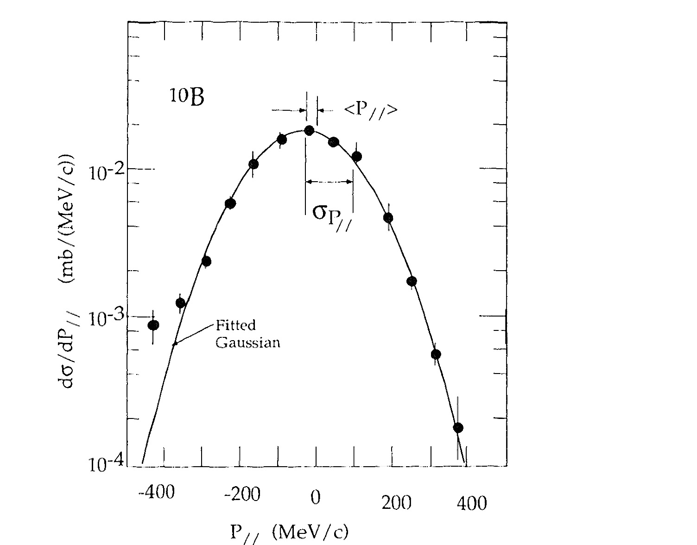
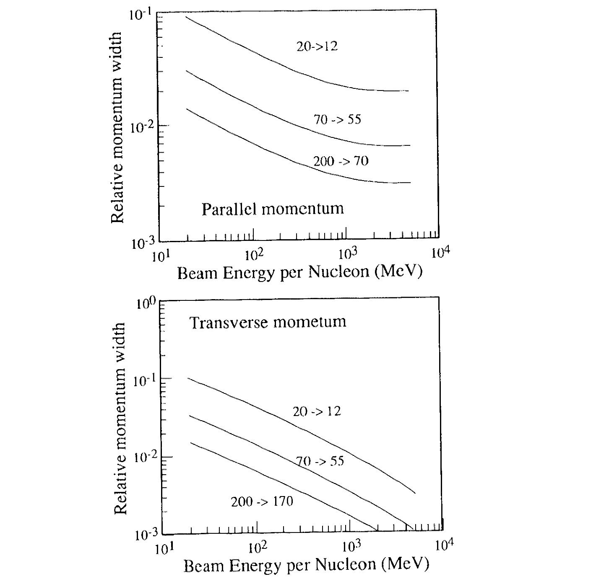

# 10 Production and Use of Radioactive Beams

*Isao Tanihata*

**Source:** `ExperimentTechniquesNP_Chapter10-11.pdf` — book pages 343–347 (PDF pages 1–5). Scanned chapter excerpt; figures cropped from page images.

---

## Table of Contents

| | | page |
|---|---|---:|
| I. | Introduction | 343 |
| II. | Production by secondary beam method | 344 |
| | A. Projectile fragmentation of heavy ions | 344 |
| | B. Principle of separation | 347 |
| | 1. Selection of the target | 347 |
| | 2. Separation methods | 350 |
| | 3. Facilities | 354 |
| III. | Production by reacceleration method | 355 |
| | A. Outline of radioactive beam production | 355 |
| | B. Facilities | 356 |
| IV. | Studies with radioactive beams | 357 |
| | A. Nuclear structure | 359 |
| | 1. Structure near the neutron drip line. Neutron halo | 359 |
| | 2. Thick neutron skin | 361 |
| | 3. Exclusive reactions | 362 |
| | 4. Isospin dependence of nuclear radii | 363 |
| | B. Nucleosynthesis | 364 |
| | 1. Reactions in the hot CNO cycle | 365 |
| | 2. Big Bang nucleosynthesis | 366 |
| | C. Radioactive beams for other fields of study | 369 |
| | References | 370 |

---

### I. Introduction

A principal constraint for studying nuclear physics and other nuclear science was the confinement of both beam and target species to the line of stability, the well-balanced nuclei. The restriction is a fundamental one for nuclear physics, not only because it precludes access to a vast region of bound nuclei, but also because it limits the type and extent of phenomena that can be studied in the nuclei which can be reached. Because of this, it is only for the narrow band of stable nuclei that we have detailed experimental information on radii, magnetic moments, single-particle structures, giant resonance, the entire field of scattering processes, and reaction mechanisms and so on.

Recent development of radioactive beams provided us with new opportunities to extend our study using a wider range of nucleus. Studies using radioactive beams have been remarkably developed in the last few years and new knowledge has been gained in nuclear physics and astrophysics. Here in this chapter, methods of production and some recent usage of the radioactive beams will be reviewed. Two production methods, the secondary beam method and the reacceleration method, are shown in the following Sects. II and III. Both are used for producing energetic beams high enough to study nuclear reactions that involve a $\beta$ radioactive nucleus in the initial state.

Separators, which are used for production of radioactive beams, are also extensively used for other studies such as new isotope searches, mass measurements, measurements of magnetic moment of $\beta$ radioactive nuclei, and others. Several successful use of radioactive beams in nuclear physics as well as astrophysics are presented in Sect. IV.

Many articles have been published on this subject and can be found in recent proceedings of international conferences and in review articles [1, 2, 3]. Readers who need a more detailed description of a specific subject are recommended to consult these references and references therein.

### II. Production by secondary beam method

In principle, any nuclear reaction, which produces radioactive nuclei, can be used for production of secondary radioactive beams. However it only became practical to use radioactive beams for reaction studies after the discovery of "projectile fragmentation" in high-energy heavy-ion collisions. In fact the first systematic study with radioactive beams was made using the secondary beams from the projectile fragmentation. Here in this section we will review the principle of the production of secondary beams of radioactive nuclei.

#### A. Projectile fragmentation of heavy ions

At a beam energy much higher than a binding energy of a nucleon, nuclear fragments are emitted copiously into the narrow forward cone. This phenomenon is called projectile fragmentation and the emitted nuclei are called projectile fragments. The projectile fragmentation has three important characteristics for the production of radioactive beams:

1. Various nuclides including nuclei far from the stability line are produced with large cross sections. In fact many extremely neutron (and proton) rich nuclides were discovered by projectile fragmentation.
2. All projectile fragments are emitted with almost the same velocity as the projectile. Therefore the separation of nuclides is simple and high collection efficiency can be easily obtained. (see `Feynman: Why Momentum Distribution Matters`)
3. A fragmentation cross section is almost independent of the incident energy.

Since it is essential for the radioactive beam production, we see the momentum distribution of the projectile fragments in the following.

> [!Feynman]- Why Momentum Distribution Matters
> **Q:** Why is the momentum distribution of the projectile fragments essential? What role does it play in research on these topics? Follow-ups: (1) Is momentum space phase space? (2) Why an *angle* window, not only momentum? (3) How does cloud *width* control intensity?
> **Language note:** Original: *"essentional" / "fragmentats" / "what kind of role… on such topics"* → natural: *"essential" / "fragments" / "what role does it play in research on these topics?"*
>
> You already know the separator’s main job: select nuclei by magnetic rigidity $B\rho \propto p/q$. That alone needs the **parallel / total momentum** distribution. The text still spends pages on the full momentum cloud because production is not only “pick $p$” — it is “deliver as many of the *right* $A,Z$ as possible with usable beam quality.” Below: three precise points, then the production role.
>
> ---
>
> **(1) Is “momentum space” the same as phase space?**
>
> **No.** They are related but not identical.
>
> - **Momentum space:** only the momentum coordinates of each fragment — $(p_\parallel, p_t)$ or $(p_x,p_y,p_z)$. Fig. 1 is a 1D projection of that: $dN/dp$ in the projectile rest frame. The Goldhaber-style $\sigma(P_\parallel)$ in Eq. (1) lives entirely here.
> - **Phase space (classical mechanics / beam optics):** the full set of conjugate coordinates, typically 6D per particle: $(\mathbf{r},\mathbf{p})$ or, for beams, often $(x,x',y,y',\ell,\delta)$ where $x'=p_x/p_z \approx \theta_x$ is an *angle*, and $\delta=\Delta p/p$ is relative momentum.
>
> So: momentum space is the **$p$-projection** of phase space. When beam people say “phase-space acceptance of the separator,” they mean a **volume cut** in that full space (positions *and* angles *and* $\Delta p/p$), not “momentum distribution” alone. The earlier “cloud in momentum space” was intentionally only the $p$ part that this section measures.
>
> ---
>
> **(2) Why an angle window? (You already get the momentum cut — where does angle come from?)**
>
> Two different physical filters act after the target:
>
> | Filter | What it selects | Hardware |
> |---|---|---|
> | **Momentum (rigidity)** | $p/q$ (and thus $A,Z$ after $B\rho$ + energy loss) | Dipoles, degrader, slits at dispersive focus |
> | **Angle (and position)** | Direction of flight $\theta$; transverse position | Finite apertures: pipe walls, quadrupole bore, collimators, magnet gaps |
>
> After fragmentation, each nucleus has a **transverse** kick $p_t$ as well as a parallel spread $p_\parallel$. In the lab, for a forward-going relativistic fragment,
>
> $$
> \theta \approx \frac{p_t}{p_\parallel} \quad (\text{small-angle}).
> $$
>
> The text already says fragments fill a **narrow forward cone** — that *is* the angular distribution. At high energy, $p_\parallel$ is huge while $\sigma(p_t)$ stays $\sim 100\,\mathrm{MeV}/c$ (Eq. 1–2 scale), so $\theta$ is small — good for collection. But it is still nonzero: a fragment with too large $\theta$ never enters the first dipole cleanly, or hits an aperture later. That is the **angular acceptance** $\Delta\Omega$ (or $\Delta\theta_x\times\Delta\theta_y$).
>
> Geometrically (thin entrance aperture of half-height $r$ at free-flight distance $L$ from the production point): $\theta_{\mathrm{acc}} = \arctan(r/L)\approx r/L$. Only trajectories with $|\theta|<\theta_{\mathrm{acc}}$ clear the opening into the spectrometer; larger angles hit the aperture face. Residual primary ions that punch through the target are rejected mainly by **$B\rho$**, not by this angle cut.
>
> Separators are also optical systems: transport matrices map $(x,\theta)$ through the line; large $\theta$ causes larger beam spots at foci and worse resolution/purity even if $p$ was “right.” So angle is not a second magic selection variable like $B\rho$ — it is the **geometric + optical** window that decides whether a particle with the *correct* $p/q$ actually *survives the line*.
>
> Link to the note: $\sigma(P_t)\approx\sigma(P_\parallel)$ at high energy (isotropic in the moving frame) $\Rightarrow$ once you know $\sigma(P_\parallel)$, you already know the angular width scale via $\theta\sim p_t/p$.
>
> 
>
> *Fig. F1. Angular acceptance — lab side view. **Primary beam** only *before* the target. At the target, projectile fragmentation creates **secondary** fragments; every trajectory shares one production point. Lab angle $\theta \approx p_t/p_\parallel$. Geometric half-acceptance $\theta_{\mathrm{acc}} = \arctan(r/L) \approx r/L$ set by the entrance aperture half-height $r$ and free-flight distance $L$ (production point → aperture face). Rays with $|\theta|<\theta_{\mathrm{acc}}$ (coral) clear the aperture into the **spectrometer** (RIB separator; $B\rho$ selection downstream); $|\theta|>\theta_{\mathrm{acc}}$ hit the aperture face and are rejected.*
>
> ---
>
> **(3) Width of the cloud vs intensity (what maps to what)**
>
> Separate two rates carefully:
>
> 1. **Production rate** (at the target): $R_\mathrm{prod} \propto I_\mathrm{primary}\times N_\mathrm{target}\times\sigma_\mathrm{frag}$. This depends on cross section and target thickness — *not* on how wide the momentum cloud is. A wider cloud does **not** mean more nuclei are created.
> 2. **Delivered secondary intensity** (at the end of the separator):
>
> $$
> I_\mathrm{secondary} = R_\mathrm{prod}\times \varepsilon_\mathrm{collection}\times \varepsilon_\mathrm{transmission}\times\cdots
> $$
>
> Collection efficiency $\varepsilon_\mathrm{collection}$ is essentially the **fraction of the production distribution that falls inside the separator’s acceptance window** $(\Delta p,\,\Delta\Omega)$.
>
> Picture a normalized Gaussian $dN/dp$ with width $\sigma_p$, and a rectangular acceptance $\pm\Delta p$ centered on the peak. Then
>
> $$
> \varepsilon_p \approx \int_{-\Delta p}^{+\Delta p}\! \frac{1}{\sqrt{2\pi}\,\sigma_p}\,e^{-p^2/2\sigma_p^2}\,dp
> $$
>
> (same idea in 2D for angles). Fixed machine $\Rightarrow$ fixed $\Delta p$ and $\Delta\Omega$. **Larger $\sigma_p$ or $\sigma_\theta$ $\Rightarrow$ smaller $\varepsilon$ $\Rightarrow$ lower $I_\mathrm{secondary}$**, even though $R_\mathrm{prod}$ is unchanged. Conversely, a narrow cloud (projectile and fragment $A$ close; high beam energy so $\sigma/p$ drops — Fig. 2) packs more of the yield into the same window.
>
> Here's what trips people up: “wider cloud = more intensity” confuses **spread of kinematics** with **number of events**. Width redistributes a fixed yield over a larger $(p,\theta)$ volume; the separator only keeps a fixed sub-volume.
>
> ---
>
> **Role in RIB research (with that machinery)**
>
> - **Engineering / intensity:** predict $\varepsilon$ from $\sigma(P_\parallel),\sigma(P_t)$; choose $A_p\approx A_F$, energy, and low-$Z$ target (later §B.1) to maximize delivered $I$.
> - **Separator design:** match magnet acceptance and achromatic optics to the known cloud (requirement 2–3 in §B).
> - **Beam quality for secondary reactions:** residual $\Delta p/p$ and emittance set energy resolution and background in the physics run.
> - **Nuclear physics observable:** the same $\sigma(P)$ (Goldhaber / Fermi-motion picture) probes how nucleons moved in the projectile — production tool *and* structure probe.
>
> Bottom line for this sentence in the text: the momentum distribution is “essential” because it fixes **how much of the fragmentation yield is capturable**, **how pure and mono-energetic the secondary beam can be**, and **what acceptance the line must provide** — not because the separator “only works if you plot it.”

Figure 1 shows the momentum distribution, in the projectile rest frame, for $^{10}\mathrm{Be}$ fragments from $^{12}\mathrm{C}$ fragmentation at $2.1A~\mathrm{GeV}$ as an example [4]. As can be seen,

**Fig. 1.** Momentum distribution of $^{10}\mathrm{Be}$ fragments from $^{12}\mathrm{C}$ reaction at $2.1A~\mathrm{GeV}$. The distribution is plotted in the rest frame of the incident particle. Down shift of the central momentum and the Gaussian width characterize the distribution.

a Gaussian shape provides a good fit to the spectra observed for all isotopes regardless of beam, energy or target. It is also found that the momentum distribution is almost the same in both parallel ($\parallel$) and perpendicular (t) directions. A spectrum is characterized by its central momentum $\langle P_\parallel \rangle$ and standard deviation $\sigma(P_\parallel)$. The value of $\langle P_\parallel \rangle$ was found to be in the range of $-10$ to $-130~\mathrm{MeV}/c$ for various fragments. (A negative sign for $\langle P_\parallel \rangle$ indicates that the fragment speed is less than that of the projectile.) A fragment has almost the same velocity as the incident projectile nucleus because the total momentum of the projectile fragment is much larger than $\langle P_\parallel \rangle$.

The width of the momentum spread $\sigma(P_\parallel)$, as well as $\langle P_\parallel \rangle$, is found to be essentially independent of target mass and beam energy but does depend on the mass number of the projectile ($A_\mathrm{p}$) and of the fragment ($A_\mathrm{F}$). The dependence of $\sigma(P_\parallel)$ on $A_\mathrm{p}$ and $A_\mathrm{F}$ can be expressed as

$$
\sigma(P_\parallel) = \sigma_0 \sqrt{A_\mathrm{F}(A_\mathrm{p}-A_\mathrm{F})/(A_\mathrm{p}-1)}
\tag{1}
$$

where $\sigma_0 = 90~\mathrm{MeV}/c$; [5] $\sigma(P_\parallel)$ takes its maximum value when $A_\mathrm{F} = A_\mathrm{p}/2$. The width $\sigma(P_\mathrm{t})$ of the transverse momentum distribution of the fragment is found to be equal to $\sigma(P_\parallel)$, consistent with isotropic production of fragments in a frame moving at $\beta_\parallel = -\langle P_\parallel \rangle/E$ in the projectile frame. The value of $\sigma(P_\parallel)$ is known to remain constant down to energies approaching as low as $20~\mathrm{MeV}/\mathrm{nucleon}$ [6]. It is found that $\sigma(P_\mathrm{t})$ behaves differently at low energies. Empirically, it was shown that, at projectile energies below $200~\mathrm{MeV}/\mathrm{nucleon}$, the $\sigma(P_\mathrm{t})$ is fitted by [7]

$$
\sigma^2(P_\mathrm{t}) = \sigma_0^2 A_\mathrm{F}(A_\mathrm{p}-A_\mathrm{F})/(A_\mathrm{p}-1) + \sigma_1^2 A_\mathrm{F}(A_\mathrm{p}-A_\mathrm{F})/A_\mathrm{p}(A_\mathrm{p}-1)
\tag{2}
$$

where $\sigma_1 = 200~\mathrm{MeV}/c$.

In order to minimize broadening of the product momentum it is important to use a primary beam of mass number close to that of the desired nucleus but, especially at high energy, to have both the proton and the neutron numbers of the projectile nucleus larger than those of the desired product nucleus.

**Fig. 2.** Energy dependence of the relative momentum width, top for parallel momentum and bottom for transverse momentum. Numbers like $20\rightarrow 12$ indicate the mass number of a projectile and a fragment.

Figure 2 shows energy dependence of the relative momentum width of the parallel momentum $[\sigma(P_\parallel)/P]$ and the transverse momentum $[\sigma(P_\mathrm{t})/P]$ for several mass regions. The numbers indicated by $20\rightarrow 12$, for example, identify the fragmentation (fragmentation of the nucleus with $A=20$ to a nucleus with $A=12$). It is clear that the higher the energy, the smaller the relative momentum broadening.

#### B. Principle of separation

In principle any type of recoil mass separator with high collection efficiencies can be used to deliver secondary beams. However, special attention is required for efficient separation. These are as follows:

1. The production target has to be selected so that a produced nuclide has a small momentum and an angular broadening.
2. The momentum and the angular acceptance of a separator should be as large as possible. (see `Feynman: Why Momentum Distribution Matters`)
3. It is desirable, in most cases, that the separable beam is delivered achromatically to a reaction target.

The requirement 1 favors projectile fragmentations of high-energy heavy-ions and some cases of low-energy transfer reactions.

##### 1. Selection of the target

Usable secondary-beam intensity and momentum spread of the fragments depend, in large measure, on the choice of the target material as well as on the properties of the production reaction as discussed in the previous section. Figure 3a, b and c shows results of a study of $^{11}\mathrm{C}$ production efficiency, primary-beam survival, and multiple scattering for a primary $400~\mathrm{MeV}/\mathrm{nucleon}$ $^{12}\mathrm{C}$ beam passing through beryllium, copper, and lead targets [8]. The horizontal axis in the figure is the remnant primary beam energy. Since the $\mathrm{d}E/\mathrm{d}x$ value is lower for a low-$Z$ target, a given beam-energy loss can also result from passage through a much thicker low-$Z$ target.

The other factor in yield consideration reflects the target mass-number dependence of the fragmentation cross-sections, which are generally proportional to $A^{2/3}$. Because the number of nuclei in a target of given thickness (in $\mathrm{g}/\mathrm{cm}^2$) is proportional to $1/A$, the production yield is proportional to $A^{-1/3}$ and therefore is larger for targets of the lighter nuclei. The fall-off in the $^{11}\mathrm{C}$ yield from the beryllium target below $300~\mathrm{MeV}/\mathrm{nucleon}$, in Fig. 3, results from the loss of $^{11}\mathrm{C}$ due to nuclear reactions and lower production rates because of a dwindling supply of primary nuclei throughout the target.

From Fig. 3 one sees that low-$Z$ materials make the best targets for secondary beam production via projectile fragmentation reactions. Production is higher, primary beams attenuate more rapidly, and there is less multiple scattering (hence less emittance growth). If all the product nuclei can be used as secondary beams, the thickness of the target is determined by maximization of the product yield. In practice however, a beam
