# Experimental Physics

# Domain Adaptation Approaches for Electron Identification

Master Thesis

Oussama Benchikhi

Supervisors:

Dr.Alessandro Grelli Utrecht University, GRASP Institute

Prof. Dr. Raimond Snellings Utrecht University, GRASP Institute

#### Abstract

The study of chiral symmetry restoration in a hot and dense medium provides a crucial understanding of fundamental aspects of strongly interacting matter and its underlying theory, Quantum Chromodynamics. This thesis presents an approach to classify a pure electron sample from proton-proton collisions at the ALICE experiment, enabling the reconstruction of the dielectron invariant mass spectrum.

The primary goal is to overcome the domain shift between Monte Carlo simulated data and real detector data. Traditional machine learning algorithms, such as XGBoost and Multi-layered Perceptrons trained on Monte Carlo data, have been proven not to generalise well to real data due to the shift in data. To overcome this, a Domain Adversarial Neural Network has been trained. By utilising a reversed gradient layer, features have been trained to be both domain-invariant while retaining class-specific features.

Our study shows significant improvement from the baseline models trained. The Wasserstein distance, which measures the difference in label probability distributions, decreased from 0.000291 (baseline) to 0.000130 for the domain adversarial neural network, with λ = 1. However, the performance degraded with momentum due to the effects of heavy class imbalance and small sample sizes at higher momenta. This work shows promise and lays a foundation for applying domain adaptation techniques to particle identification in high-energy physics, enabling high-purity data samples and ensuring high-quality data analysis.

CONTENTS ii

# Contents

| 1 |         | Introduction                                         | 1      |
|---|---------|------------------------------------------------------|--------|
| 2 | 2.1     | Quantum Chromodynamics Chiral Symmetry         | 3 4 |
| 3 |         | Heavy Ion Collisions                                 | 9      |
|   | 3.1     | Space-Time Evolution                              | 9      |
|   | 3.2     | Electromagnetic Probes  11                     |        |
|   |         |                                                      |        |
|   | 3.3     | Invariant Mass Spectrum 12                        |        |
|   |         | 3.3.1 Low Mass region  13                   |        |
|   |         | 3.3.2 Intermediate Mass Region  14          |        |
|   |         | 3.3.3 High Mass Region 14                      |        |
|   | 3.4     | Chiral Symmetry Restoration  14                |        |
| 4 |         | A Large Ion Collider Experiment 16                |        |
|   | 4.1     | Inner Tracking System  17                      |        |
|   | 4.2     | Time Projection Chamber  17                    |        |
|   | 4.3     | Time Of Flight  18                             |        |
|   |         |                                                      |        |
| 5 |         | Machine Learning 19                               |        |
|   | 5.1     | XGBoost 19                                        |        |
|   | 5.2     | Neural Networks  21                            |        |
|   |         | 5.2.1 Mathematical Overview  22             |        |
|   |         | 5.2.2 Network Training  23                  |        |
|   |         | 5.2.3 Stoichastic Gradient Descent 24          |        |
|   |         | 5.2.4 Adaptive Moment Estimation  25        |        |
|   |         | 5.2.5 Backpropagation  25                   |        |
|   | 5.3     | Domain Adaptation 26                              |        |
|   | 5.4     | Precision and Recall  28                       |        |
| 6 |         | Data Analysis 29                                  |        |
|   | 6.1     | Track Selection  29                            |        |
|   |         |                                                      |        |
|   | 6.2     | Particle Identification 31                        |        |
|   |         | 6.2.1 Energy Loss  31                       |        |
|   |         | 6.2.2 Time of Flight 34                        |        |
|   | 6.3     | XGBoost 34                                        |        |
|   | 6.4     | Domain Adaptation 36                              |        |
|   |         | 6.4.1 Input Parameters  36                  |        |
|   |         | 6.4.2 Architecture 38                          |        |
|   |         | 6.4.3 Training Procedure  39                |        |
| 7 | Results | 41                                                   |        |
|   | 7.1     | XGBoost 41                                        |        |
|   | 7.2     | Domain Adaptation 42                              |        |
|   |         | 7.2.1 Base-Line Model  42                   |        |
|   |         | 7.2.2 Domain Adversarial Neural Network  44 |        |
|   |         |                                                      |        |

| CONTENTS       |                                                     |  | iii      |
|----------------|-----------------------------------------------------|--|----------|
| 7.2.3 7.2.4 | t-SNE visualisation  Wasserstein Distance  |  | 47 48 |
| 8              | Summary and Outlook                                 |  | 50       |

1 INTRODUCTION 1

### 1 Introduction

Nuclear collisions enable us to study nuclear matter under extreme conditions in a laboratory setting, to explore the underlying theory of strong interactions, known as Quantum Chromodynamics. These extreme temperatures and densities allow us to recreate a state of matter which the early universe consisted of. It is believed that a few microseconds after the Big Bang, a state of matter existed with a temperature of  $T \approx 200$  MeV. As nuclear matter is heated and compressed, the hadrons occupy more of the vacuum in between them, until eventually they overlap and form a plasma in which the quarks and gluons decouple from their hadronic states and behave as free particles. This state of matter is known as the Quark-Gluon Plasma. At the same time, the quarks, especially the up and down, which typically carry an effective mass of a few hundred MeV, lose this mass, which leads to the restoration of chiral symmetry, which is an approximate symmetry of the QCD Lagrangian for the up and down quarks. A consequence of this restoration is that chiral partners, particles which are related via a chiral transformation, become degenerate again in mass.

Accelerators such as the Large Hadron Collider (LHC) at CERN allow us to accelerate beams of protons or lead ions up to center-of-mass energies of  $\sqrt{s} = 14$  TeV for the protons and  $\sqrt{s} \approx 5$ TeV for the lead ions. In these collisions, an abundance of particles is produced. Only final state particles and their decay products then make their way to the detectors, allowing us to probe the properties of these collisions via these final state particles. The challenge now lies in investigating phenomena such as chiral symmetry restorations. Important probes are the dielectrons, since they do not interact strongly with the medium. As they are emitted continuously, they carry undistorted information on the entire space-time evolution of the collision. An important variable, the invariant mass, makes dielectrons advantageous probes for studying the restoration of chiral symmetry. The final invariant mass spectrum can be divided into three regions: low-mass, intermediate-mass, and high-mass regions. The focus for the study of chiral symmetry restoration is on the low-mass region. Since the light vector mesons couple directly to the dielectrons, via a virtual photon, the dielectronic invariant mass spectrum directly reflects the mass distribution of these vector mesons at the moment of decay. Among these vector mesons, the  $\rho$ -meson is the most important, as studies show direct correlations between the broadening of its mass distribution and its degeneracy with its chiral partner, the  $a_1$ -meson, and thus chiral symmetry restoration.

The study on the modifications of the mass spectrum of the  $\rho$ -meson is sensitive and thus requires a pure sample of electron pairs. Typical Machine Learning techniques enable us to train a model to identify complex patterns in data, consequently allowing us to select a pure sample of electrons. Training such a model would require a labelled dataset with the target variables available, which in the context of heavy-ion collisions, would be a Monte Carlo simulated dataset. Real detector data does not have such labels, but its distribution is similar to that of the Monte Carlo simulated data. This enables us to employ a technique known as *Domain Adaptation* to address these discrepancies. A method used is to map both datasets onto a higher-dimensional space and utilise multiple networks to both make this space domain-invariant and discriminative for the classification task at hand.

The thesis is structured as follows. We start with a theoretical overview of Quantum Chromodynamics and spontaneous chiral symmetry breaking in Chapter 2. After establishing the consequences of chiral symmetry breaking, we go over a discussion of nuclear collisions. Chapter

1 INTRODUCTION 2

[3](#page-12-0) discusses the space-time evolution of nuclear collisions and provides a deeper examination of the invariant mass spectrum of dielectrons. We conclude the chapter by reviewing the observables related to chiral symmetry restoration. Chapter [4](#page-19-0) covers the ALICE detector system and the relevant components for our analysis: the Inner Tracking System (ITS), the Time Projection Chamber (TPC), and the Time-of-Flight (TOF) detector. We proceed to a discussion on Machine Learning, reviewing both the established framework XGBoost and Neural Networks, with a focus on Domain Adversarial Neural Networks for domain adaptation tasks, in Chapter [5.](#page-22-0) The data analysis techniques used are covered in Chapter [6,](#page-32-0) with a review of the track selection and the optimisation of the machine learning networks. The results are discussed in Chapter [7,](#page-44-0) and we finalise the thesis in Chapter [8](#page-53-0) with a summary and an outlook of the analysis.

# 2 Quantum Chromodynamics

Strong interactions can be described by a non-Abelian gauge theory, Quantum Chromodynamics (QCD). It's different from QED, in the sense that a single massless photon mediates the QED interaction, whereas for QCD, the interaction is mediated by the eight massless gluons. The single QED charge is now replaced by the so-called *colour charges*: red, blue, and green, which have a local gauge SU(3) symmetry. The carriers of these colour charges are the quarks. It's governed by the QCD Lagrangian:

$$\mathcal{L}_{QCD} = \bar{\psi}(i\gamma^{\mu}D_{\mu} - \mathcal{M}^{o})\psi - \frac{1}{4}G^{a}_{\mu\nu}G^{a\,\mu\nu}$$
(2.1)

where

$$D_{\mu} \equiv \partial_{\mu} - ig \frac{\lambda^a}{2} G_{\mu}^a. \tag{2.2}$$

 $G^{\alpha}_{\mu\nu}$  is the gluonic field strength tensor:

$$G^{a}_{\mu\nu} = \partial_{\mu}A^{a}_{\nu} - \partial_{\nu}A^{a}_{\mu} + gf^{abc}A^{b}_{\mu}A^{c}_{\nu}, \tag{2.3}$$

with  $A^{\alpha}_{\mu}$  the spin-1 gauge field, with  $\alpha=(1,8)$ .  $\lambda^{\alpha}$  are the Gellman matrices. Eq. 2.2 is the covariant derivative, which couples the spin-1 gauge fields to the spin-1/2 colour fields,  $\psi$ , consisting of  $N_f$  flavours.  $\mathcal{M}^o \in \mathbb{R}^{N_f \times N_f}$  is the diagonal mass matrix:

$$\mathcal{M}^0 = \begin{pmatrix} m_u & & & \\ & m_d & & \\ & & m_s & \\ & & & \ddots \end{pmatrix}, \tag{2.4}$$

We can distinguish between light and heavy flavours;  $m_u, m_d, m_s \approx 2, 5, 96$  MeV,  $m_c, m_b, m_t \approx 1.5, 4, 170$  GeV. The main focus of this thesis is on the light quarks, more exactly the up and down quarks, for reasons that will be clear later on.

The strong coupling,  $\alpha_s$  is given by:

$$\alpha_s(Q^2) \approx \frac{12\pi}{(11n - 2f)\ln\left(\frac{Q^2}{\Lambda_{QCD}^2}\right)},$$
(2.5)

where n is the number of colours, f the number of flavours and  $\Lambda_{QCD}$  is the QCD energy scale. It's important to note that, unlike in QED,  $\alpha_s$  is not a constant; instead, it's a function of the four-momentum transfer, Q. In QCD, we can distinguish between two domains: the domain where perturbative calculations are valid and the domain where they are not. We can see from Fig. 2.1 that for high momentum transfer, Q, the coupling constant is small and thus perturbation theory holds. In this domain, there exists an asymptotic freedom; the quarks and gluons can be seen as free particles. For lower momentum transfer, we see that  $a_s(Q^2)$  becomes larger, such that perturbation calculations do not hold anymore. Instead, a technique called *Lattice QCD*[1] is used for calculations in this domain, which is unfortunately beyond the scope of this thesis. At such energies, the concept of confinement arises.

Confinement states that anything with a non-zero colour charge can not propagate as a free particle, but instead must be confined to colour singlets. The reason that quarks can not be

Figure 2.1: The Strong coupling αs as a function of momentum transfer Q. Both theoretical predictions and experimental values are shown.

observed as free particles lies in the fact that gluons carry a colour charge and thus self-interact. A consequence is that gluons do not propagate through space freely as photons do; instead, as you try to separate two quarks, the virtual exchange gluons bind together and form flux-tubes. Because the field lines do not spread out as they do in QED, but instead stay linear, the more you separate two quarks, the more energy the system gains, proportional to V (r) ∝ κr. This continues until the threshold is reached and a quark-antiquark pair pops until existence, forming a colourless hadron, see Fig. ??.

Most high-energy collider experiments are typically on the scale of |q| > 100 GeV, αs ∼ 0.1 GeV, which is small enough for perturbation theory to be applicable. This is why quarks can be treated as free particles in high-energy scattering processes, which we will discuss in-depth in Chapter [3.](#page-12-0) Unfortunately, it's not sufficiently small to ignore higher-order corrections, meaning that QCD calculations for processes at the LHC become challenging.

## 2.1 Chiral Symmetry

The massless QCD Lagrangian has a chiral symmetry, which corresponds to left- and right handedness of the massless quarks. Of course, as quarks are not massless, this is an approximate symmetry only for the lightest quarks, i.e., up and down quarks, as their masses are far smaller than typical QCD energy scales; thus, this discussion only makes sense in the context of light hadrons, consisting of up and down quarks. They have a global SU(3)L × SU(3)R chiral symmetry in flavour space, meaning that left and right-handed particles are not mixed, preserving their handedness in the strong interaction, left and right handed particles are not treated differently in the strong interaction. The structure of the QCD vacuum is far from trivial. It is said to be filled

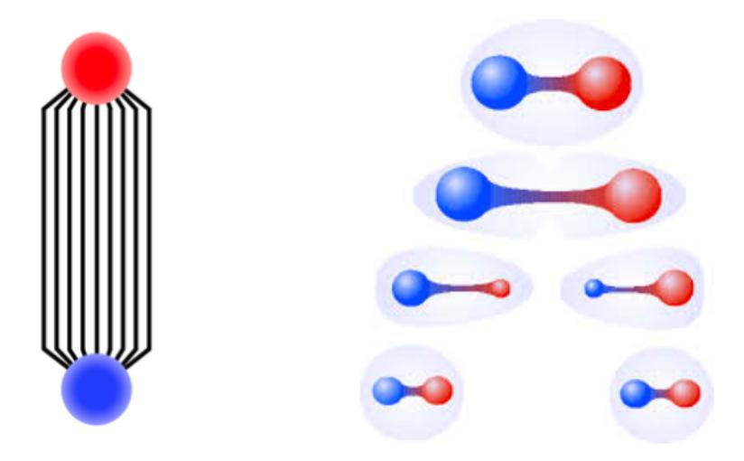

Figure 2.2: On the left: Linear field lines between a quark pair. On the right: The formation of a quark anti-quark pair due to separations. Taken from [\[2\]](#page-55-1)

with quark antiquark condensates, ⟨0|ψψ¯ |0⟩ ≈ −(250MeV)3 , which break the (approximate) chiral symmetry of QCD. As these condensates are not directly observable, their consequences are visible in the hadronic mass spectra. Since it's a global symmetry breaking, it is accompanied by an almost massless Goldstone boson, which in the case of the up and down quarks, is the pion. This explains the rather small mass of the pion (≈ 140 MeV) compared to other hadrons. Furthermore, an exact chiral symmetry would imply degenerate chiral multiplets, which are hadronic states that are related through a chiral transformation. For example the vector ρ-meson (J P C = 1−−) and its chiral partner, the axial-vector a1-meson (J P C = 1++), or the pseudo scalar π (J P C = 0−+) and its partner the scalar σ (J P C = 0++), would all to be expected to have a similar mass, within the scale of the approximate symmetry breaking induced by the small quark masses. Fig. [2.3](#page-9-0) shows the observed mass spectrum of low mass mesons and their chiral partner, which shows a large mass-splitting. Since mass difference exceeds the explicit symmetry breaking induced by the small quark masses, this indicates a splitting of scalar and pseudo-scalar, as well as vector and axial-vector mesons. These phenomena are consequences of spontaneous chiral symmetry breaking.

To explain these phenomena, we start with the Lagrangian for massless fermions,

$$\mathcal{L} = i\bar{\psi}_j \partial \!\!\!/ \psi_j \tag{2.6}$$

where the subscript stands for the quarks, j = (u, d). We introduce the following transformations,

$$\Lambda_V: \quad \psi \to e^{-i\frac{\vec{\tau}}{2}\cdot\vec{\Theta}}\psi \simeq \left(1 - i\frac{\vec{\tau}}{2}\cdot\vec{\Theta}\right)\psi$$
(2.7)

$$\Lambda_A: \quad \psi \to e^{-i\gamma^5 \frac{\vec{\tau}}{2} \cdot \vec{\Theta}} \psi \simeq \left( 1 - i\gamma^5 \frac{\vec{\tau}}{2} \cdot \vec{\Theta} \right) \psi$$
(2.8)

Which are known as vectorial and axial vectorial transformations, where ⃗τ are the Pauli isospin matrices and Θ are angular transformations. It is possible to show that the Lagrangian is sym- ⃗ metric under both transformations in the massless limit. These symmetries are known as chiral symmetries. Of course, quarks are massive and thus introducing a mass term into the Lagrangian,

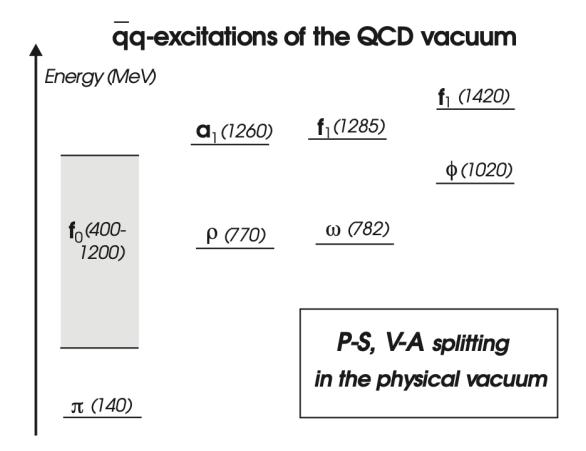

Figure 2.3: Masses of chiral partners as observed in vacuum. An average mass difference of 500 MeV is observed.[3]

we would get

$$\Lambda_A : m(\bar{\psi}\psi) \to m\bar{\psi}\psi - 2im\vec{\Theta} \cdot (\bar{\psi}\frac{\vec{\tau}}{2}\gamma_5\psi),$$
(2.9)

which breaks the axial symmetry, whereas the vectorial symmetry is still intact. Since the QCD scale is  $\Lambda \approx 200$  MeV and the light quarks are 5-10 MeV, the axial symmetry can be thought of as an approximate symmetry, which is the basis of the Partial Conserved Axial Current hypothesis (PCAC). To have a better understanding of these chiral symmetries, we can have a look at how meson states behave under chiral transformations. We can introduce combinations of quark fields that carry the same quantum number as the mesons:

pion-like state: 
$$\vec{\pi} \equiv i\bar{\psi}\vec{\tau}\gamma_5\psi$$
; rho-like state:  $\vec{\rho}_{\mu} \equiv \bar{\psi}\vec{\tau}\gamma_{\mu}\psi$  sigma-like state:  $\sigma \equiv \bar{\psi}\psi$ ;  $a_1$ -like state:  $\vec{a}_{1\mu} \equiv \bar{\psi}\vec{\tau}\gamma_{\mu}\gamma_5\psi$ 

Where the subscript  $\mu$  indicates states that transform under Lorentz transformations as vectors, with a total spin of 1. Vectorial transformations induce a rotation in Isospin space, such that

$$\vec{\pi} \longrightarrow \vec{\pi} + \vec{\Theta} \times \vec{\pi};$$
 (2.10)

$$\vec{\rho}_{\mu} \longrightarrow \vec{\rho}_{\mu} + \vec{\Theta} \times \vec{\rho}_{\mu}.$$
 (2.11)

This indicates conservation of Isospin in the strong interaction. Whereas transformations under  $\Lambda_A$  mix different states, such that

$$\vec{\pi} \longrightarrow \vec{\pi} + \vec{\Theta}\sigma;$$
 (2.12)

$$\sigma \longrightarrow \sigma - \vec{\Theta}\vec{\pi}.$$
 (2.13)

Similarly for the  $\rho$ -state, we have

$$\vec{\rho}_{\mu} \longrightarrow \vec{\rho}_{\mu} + \vec{\Theta} \times \vec{a}_{1\mu}.$$
(2.14)

States that, under axial transformation, become mixed are called chiral partners. We then have the chiral partners  $(\pi,\sigma)$  and  $(\rho, a_1)$ . Since we have already established that  $\Lambda_A$  is an (approximate) symmetry of the Lagrangian, we are now at a paradox, we would expect states that are connected via the symmetrical  $\Lambda_A$  transformation to have similar mass, however, this is not the case and the observed masses are vastly different;, which is much larger than the order of the explicit symmetry

breaking of the Lagrangian due to the small quark masses. A reason for these discrepancies is due to spontaneous symmetry breaking, which happens if the symmetry of the Hamiltonian is not realised in the ground state.

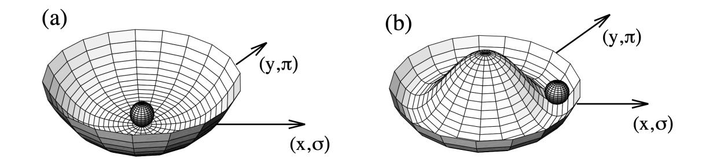

Figure 2.4: A: Potential which is symmetric in both the ground state and the zero particle state. B: Mexican Hat potential, whilst its symmetric in the zero-particle state, it is not symmetry in the ground state.[\[4\]](#page-55-3)

We can explain spontaneous symmetry breaking best using Fig. [2.4.](#page-10-0) We have defined a pion vector field and a σ scalar field. Fig. [2.4a](#page-10-0) shows a potential that is symmetric under rotations for both the ground state and the origin. In Fig. [2.4b](#page-10-0), known as the Mexican Hat potential, the minimum of this potential is found at

$$\langle 0|\vec{\pi}^2 + \sigma^2|0\rangle = f_{\pi}^2.$$
 (2.15)

This is a continuous circular minimum, which does not coincide with the origin, (⃗π, σ) = (⃗0, 0). Instead we are free to choose a point that corresponds to the ground state. A commonly chosen point is then:

$$\langle 0|\vec{\pi}|0\rangle = 0, \quad \langle 0|\sigma|0\rangle = f_{\pi}$$
 (2.16)

A consequence of this is that the vacuum state now has some non-zero expectation values for these fields. The origin remains rotationally invariant, but since we have chosen an arbitrary direction in space as the definition of the preferred ground state, which violates rotational symmetry, the symmetry is spontaneously broken. We can see that for a rotational excitation along the π direction (along the valley), there is no energy needed, which means that the pion can be treated as a massless Goldstone Boson[\[5\]](#page-55-4). For radial σ excitations (up the valley), energy is required as they have to move up the potential, resulting in massive σ.

We can move now to the mass limit, which introduces a −mqq¯ term. A consequence of this is that now the pion gains a mass:

$$m_{\pi}^{2} = \frac{\epsilon}{f_{\pi}} \neq 0 \tag{2.17}$$

An interpretation of this is that, now, instead of a smooth radial transformation (with no energy requirement), we get slight bumps in the valley due to this symmetry-breaking term.

This can be discussed in terms of quark fields. By interpreting the σ state as a quark-antiquark pair, it corresponds to the finite expectation values in the vacuum of quark-antiquark pairs, known as a quark condensate:

$$\langle 0|\bar{u}u + \bar{d}d|0\rangle \neq 0. \tag{2.18}$$

These quark condensates spontaneously break the chiral symmetry in QCD, accounting for over 99

Up until now, we have discussed the behaviour of hadronic matter in the QCD vacuum. Interestingly, its behaviour is vastly different in the presence of a hot and dense medium, such as one produced in nuclear collisions. In such a medium, the confined quarks and gluons become deconfined from their hadronic bonds, allowing for a free flow of quarks and gluons. This phase marks the melting of the quark condensates, which results in a chiral symmetry restoration. Consequences of this restoration are observable in the hadronic spectrum. Now, the chiral partners that experience a mass split will become degenerate again, which implies modifications in the hadronic spectra. The most important probes for this are the vector mesons, which mediate the interactions in the hadronic gas. In the following chapter, we will go over these phenomena, starting from the space-time collisions of heavy-ion collisions. We will discuss how the invariant mass spectrum of the dielectron allows us to probe properties of these heavy-ion collisions and how, finally, the in-medium modifications of the ρ-meson imply chiral symmetry restoration.

# 3 Heavy Ion Collisions

Fig. [3.1](#page-12-2) shows a schematic overview of the QCD phase diagram. Hadronic matter is described by the temperature, T, and the baryochemical potential µB. Ordinary matter exists at low temperature and a baryochemical potential of µb ≈ 935 MeV. The phase diagram shows two main regions, the hadron gas at low T and/or µb and the Quark-Gluon plasma at high T. The two phases are separated via phase transition at low µb with a critical temperature Tc ≈ 170 MeV. At low T and high µb, there exists a so-called colour superconductor, which is beyond the scope of this thesis.

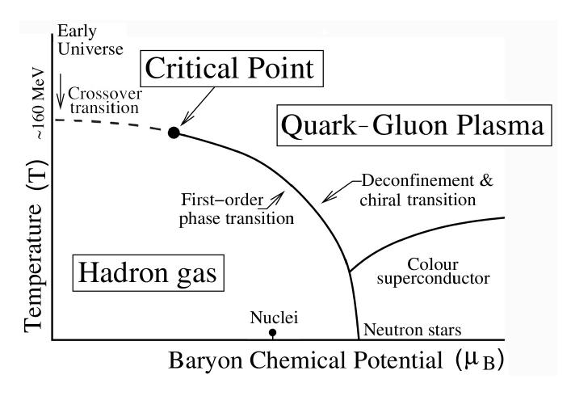

Figure 3.1: A schematic overview of the QCD phase diagram, showing relations between temperature T, and baryon chemical potential, µB. Key phases and their physical significance are highlighted.[\[6\]](#page-55-5)

It is believed that in the early moments after the Big Bang, the universe's temperature was above Tc and its baryochemical potential µb was close to zero. The trajectory of the early universe should be along the vertical axis at low µb. To recreate the conditions of the early universe, nuclear collisions are used. They produce a hot and dense medium, reaching high enough temperatures to allow the formation of a quark-gluon plasma, enabling us to study the state of matter that our universe consisted of under controlled conditions. Fig. [3.2](#page-13-0) shows the geometrical picture of two colliding nuclei. As they move at a relativistic speed, a laboratory observer sees them as two flat discs due to Lorentz contraction, as shown on the left of the figure. We can define an impact parameter, b, which is the relative distance of the two centres in the plane transverse to the collisional axis. Then, the particles in the interacting area of the nuclei are called the participants, whereas the remainder, the spectators, move past the collision area.

# 3.1 Space-Time Evolution

Nuclear collisions are characterised by multiple stages as shown in Fig. [3.3,](#page-13-1) which are summarized below.

Initial State The initial state of a nuclear collision can be described by the Colour Glass Condensate (CGC) [\[8\]](#page-55-6), which states that the incoming nuclei are largely gluonic matter. The number of gluons grows rapidly as a function of the collision energy. Fig. [3.4](#page-15-1) shows the Parton Distribution Function (PDF) of the proton, which represents the probability density of finding a parton carrying momentum fraction x, at energy scale Q2 . We call this fraction

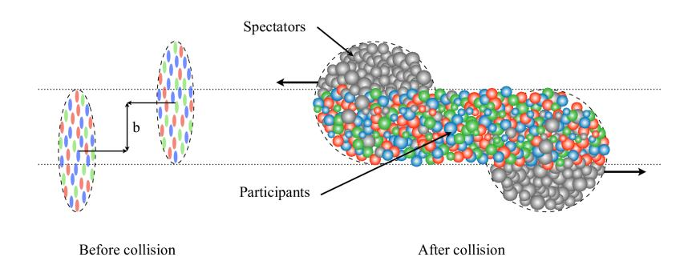

Figure 3.2: The collision of two nuclei. On the left: Initial conditions before the collision. Due to their relativistic speed, the nuclei appear as Lorentz-contracted discs. On the right: The aftermath of the collision. We can distinguish between participants, the particles in the area of the nuclei that have collided, and the spectators, which are the particles in the area outside the collision.

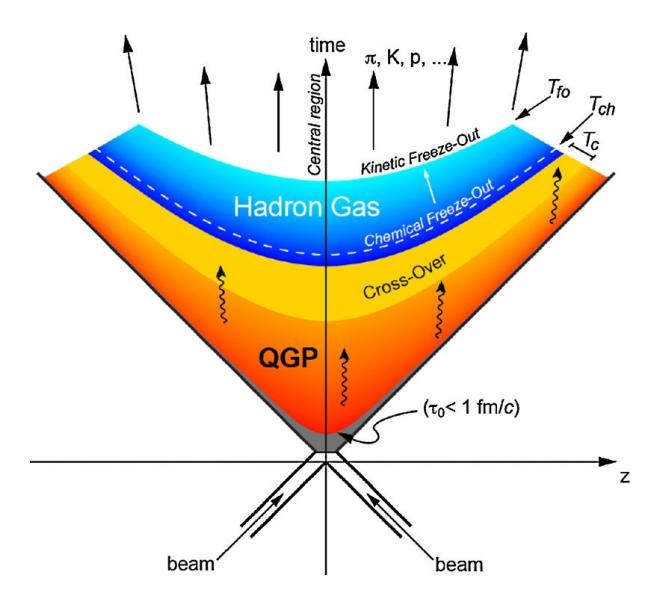

Figure 3.3: Schematic overview of the space-time evolution of nuclear collisions. [\[7\]](#page-55-7)

the Bjorken-x. We can see that at larger x, the momentum is mostly carried by the up and down quarks, the valence quarks of the proton, in a ratio of 2:1, respectively, as we would expect. At high energy scales, in the order of ΛQCD, we are able to probe smaller values of x, and thus favour smaller values of x. In this regime, as shown in Fig. [3.4,](#page-15-1) the gluons carry most of the momentum and dominate the wave function of the hadron. The incoming nuclei would then appear as gluonic clouds.

Pre-Equilibrium As the incoming nuclei collide, a large number of particles are produced. These produced particles interact with each other until they undergo rapid (τ < 1 fm/c) thermalisation and thermal equilibrium is reached. One of the tools to study this stage is via the Glasma-state[\[9\]](#page-55-8), which is a state of matter produced at the collision of two incoming CGCs.

Thermalization As the system reaches thermal equilibrium, the Quark-Gluon plasma is formed. In this medium, the quarks and gluons decouple and behave as free particles. Its space-time evolution can be described using relativistic hydrodynamics. Due to the immense pressure gradients, the plasma expands into the vacuum. Due to this expansion, the energy density and temperature decrease, cooling the system and causing it to undergo a phase transition, thereby confining the quarks and gluons back into their hadronic states.

Hadron Gas The phase transition confining quarks and gluons back into hadronic states is called hadronisation. After this hadronisation, the system continues to expand and cool, and is described by phenomenological models that utilise the hadronic degrees of freedom. The temperature that accompanies this phase transition is the critical temperature, Tc. During this phase, chemical and thermal equilibrium are maintained through (in)elastic interactions among the particles.

Freeze-Out At some point, the density becomes so low that it results in a large separation of the hadrons, making collisions infrequent. As the mean free path of the hadrons reaches the dimensions of the system, or if the rate of (in)elastic scatterings becomes lower than the rate at which the system expands, the hadrons decouple and reach the detectors with their momentum after the final scattering. The final phase is called freeze-out with a characteristic temperature of Tf .

### 3.2 Electromagnetic Probes

Electromagnetic probes are continuously produced at multiple stages of the QGP evolution. As they do not couple to the strong force, they move through the entire space-time evolution of the heavy-ion collisions undisturbed, allowing for the complete transfer of information about the collision process. Both photons and dileptons are the primary electromagnetic probes. Still, since dileptons have an additional kinematic variable, the invariant mass, they proved to be superior in terms of the signal-to-background ratio. Consequently, dileptons are the more promising of the electromagnetic probes.

The measured dileptonic spectrum essentially has a timeline, which can be divided into multiple phases. The pre-equilibrium phase, where the radiated dileptons mostly come from processes such as the Drell-Yan annihilation. After rapid thermalisation, the QGP phase is established. In this phase, dileptons are produced predominantly via quark-antiquark annihilations. At later stages, the QGP is now a hot hadronic gas and the dileptons are radiated from pion and kaon annihilation

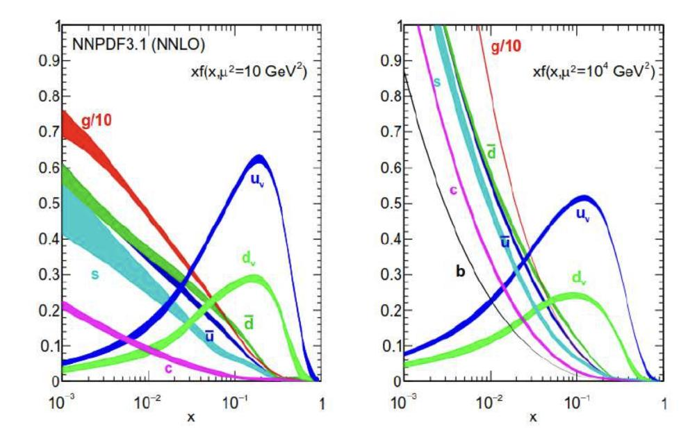

Figure 3.4: Parton Distribution Functions (PDF) representing the probability density of quarks and gluons as a function of momentum fraction x. Note that for high x, most of the momentum is carried by the up and down quarks in 2:1 ratio, as expected from the valence quarks of the proton. At low x, the gluons dominate and thus most momentum carried is by the gluons. [\[10\]](#page-55-9)

processes and other hadronic collisinos. In this phase, the formation of light vector mesons, such as the ρ, ω and ϕ, couples directly to dilepton pairs, which means that the invariant mass spectrum directly reflects the mass distributions of the vector mesons at the moment of decay. Through this, in-medium modifications of these vector mesons are directly visible in the dileptonic spectrum.

# 3.3 Invariant Mass Spectrum

A kinematic variable that describes dileptons is the invariant mass, given by

$$m_{l\bar{l}}^{Inv} = \sqrt{(E_1 + E_{\bar{l}})^2 - |\vec{p_1} + \vec{p_{\bar{l}}}|^2},$$
 (3.1)

where

$$E_l = \vec{p_l}^2 + m_l^2. (3.2)$$

Eq. [3.2](#page-15-2) is just the Einstein energy-momentum relation, with m the mass hypothesis for the given lepton. It's important to note that the invariant mass is by definition Lorentz-Invariant, hence the relation holds in all intertial frames. As a consequence, the invariant mass spectrum is not affected by Doppler shifts due to the expanding source. Fig. [3.5](#page-16-1) shows the invariant mass spectrum, divided into three regions. The largest contribution to correlated dielectron pairs comes from hadronic decays, with a significant abundance originating from light hadronic decays, which are composed of hadrons built from light quarks, specifically the up, down, and strange quarks. In the following sections, we'll discuss the three regions of the dielectronic spectrum and its relevance to the study.

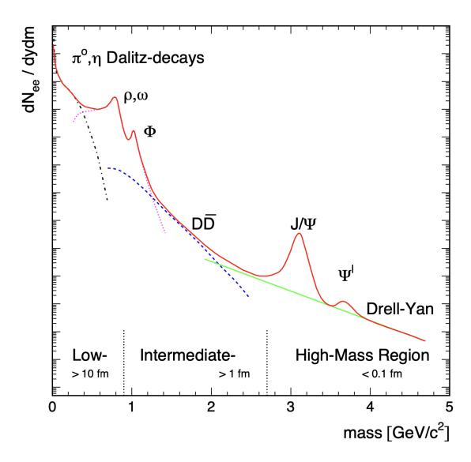

Figure 3.5: Dielectron invariant mass spectrum, showing the yield as a function of invariant mass. The primary sources of dielectrons for each mass region are shown.[\[3\]](#page-55-2)

#### 3.3.1 Low Mass region

As seen in Fig. [3.5,](#page-16-1) the low mass region is between 0 GeV/c < mee < 0.9 GeV/c. The dominant source of low-mass dielectrons is via Dalitz decays for mee < 0.5 GeV/c, which is a three-body decay of a neutral pseudoscalar meson, such as the π0, into a e +e − pair and a photon, where a virtual photon converts to a real lepton pair, resulting in the total process π0 → e +e −γ. Fig. [3.6a](#page-16-2) shows the Feynman diagram that corresponds to this process.

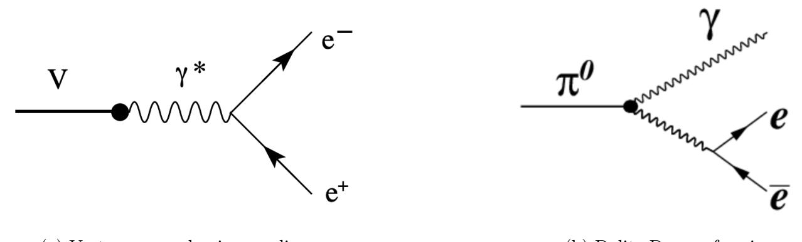

(a) Vector meson dominance diagram (b) Dalitz Decay of a pion

Figure 3.6: Feynman diagrams illustrating different dielectron sources.

For mee > 0.5GeV/c, peaks show in the invariant mass spectrum, which belong to vector meson decays described by the Vector meson Dominance Model (VDM). A vector meson decays into a virtual photon, which in turn can decay directly into a e +e − pair, since the vector mesons have the same angular momentum as the photon, J = 1, which is why pseudoscalar mesons, that have angular momentum of zero, J = 0, must have an additional particle in their decay channel, due to conservation laws. The Feynman diagram corresponding to this process is shown in Fig. [3.6b.](#page-16-2) Table [1](#page-17-3) shows particles, their masses, and the prominent decay channels that consist of an e +e − pair. Notice that particles with an angular momentum of zero, J = 0, have an additional particle in their decay modes with dielectron pairs.

| Particle | 2 Mass (MeV/c )   | P C J | Decays                   | Branching Ratio                     |
|----------|-------------------------|----------|--------------------------|-------------------------------------|
| 0 π   | 134.9768 ± 0.0005 | 0−+      | +e −γ e            | 10−2 (1.174 ± 0.035) ×  |
|          |                         |          | +e −e +e − e | 10−5 ± × (3.34 0.16)    |
| η        | 547.862 ± 0.017   | 0−+      | +e −γ e            | 10−3 (6.9 ± 0.4) ×      |
|          |                         |          | −e − +e +e e | 10−5 (4.9 ± 0.4) ×      |
| ′ η   | ± 957.78 0.06     | 0−+      | +e −γ e            | 10−4 ± × (4.91 0.27)    |
|          |                         |          | +e −ω e            | 10−4 (2.0 ± 0.4) ×      |
| ρ        | 775.26 ± 0.23     | 1−−      | − +e e             | 10−5 (4.72 ± 0.05) ×    |
| ω        | 782.66 ± 0.13     | 1−−      | +e − e             | 10−5 (7.38 ± 0.23) ×    |
| ϕ        | ± 1019.461 0.016  | 1−−      | +e − e             | 10−4 ± × (2.979 0.033)  |
|          |                         |          | +e −η e            | 10−4 (1.08 ± 0.04) ×    |
|          |                         |          | +e −π 0 e       | +0.7 10−5 (1.3 −0.10) × |

Table 1: The most important sources of dielectrons shown with their mass, decay channel and branching ratios.

#### 3.3.2 Intermediate Mass Region

For mϕ < mee < mJ/Ψ we are in the intermediate mass region (IMR). This region is sensitive to thermal radiation from the QGP. A large part of the production comes from open charma decays, which are pair-produced DD¯ mesons followed by a semi-leptonic decay, i.e., D → e +/− + X. Using angular correlations of the dielectrons, information on both the quarks and pair production mechanisms can be accessed.

#### 3.3.3 High Mass Region

The high mass region, mee > mJ/Ψ, has a dielectron contribution from the pre-equilibrium stages of the collision, via hard Drell-Yan processes. This region is associated with the study of deconfinement via the spectral shapes of the J/Ψ heavy flavour mesons.

### 3.4 Chiral Symmetry Restoration

As discussed previously, in a vacuum, the quark condensates lead to the generation of hadronic masses and the spontaneous breaking of chiral symmetry, inducing a mass splitting between chiral partners in the light hadronic spectrum of approximately 500 GeV. Interesting chiral partners to study are the (ρ, a1) and the (π, σ), where the first pair is especially important in probing the chiral symmetry restoration via the ρ-meson's decay channel as it (via a virtual photon) couples into a e +e − pair. In a hot and dense medium, chiral symmetry is restored around a temperature of ≈ 160 MeV. A question now arises: how does the invariant mass spectrum of the e +e − pairs provide us with evidence of chiral symmetry restoration?

Studies [\[11\]](#page-55-10) show us that the broadening of the ρ spectral function in the dielectron spectrum indicates chiral symmetry restoration. When chiral symmetry is restored, the ρ−a1 mass splitting is burned off, and the states become degenerate. The calculations assume the decrease of the chiral condensates calculated in lattice QCD, and they use first-principle Weinberg sum rules to relate the difference between vector and axial-vector spectral functions. Fig. [3.7](#page-18-0) shows the spectral functions from the calculations, which show broadening and degeneracies of the vector and axialvector spectra at temperatures characteristic of hadronic gas. The broadening of the ρ-meson spectral function in in-medium dielectronic spectra, thus implies chiral symmetry restoration.

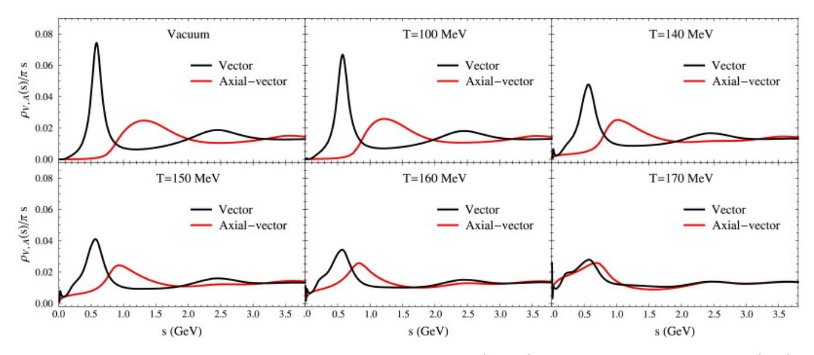

Figure 3.7: Temperature evolution of the ρ vector meson (black) and a1 axial vector meson (red). As the temperature increases, the spectral functions exhibit increasing broadening and degeneracy, indicating the restoration of chiral symmetry in a hot and dense medium. [\[11\]](#page-55-10)

# 4 A Large Ion Collider Experiment

The Large Hadron Collider (LHC) is located at CERN near Geneva. It is a particle collider designed for proton-proton collisions at a centre-of-mass energy  $\sqrt{s} = 14$  TeV and lead-lead collisions at  $\sqrt{s} \approx 5$  TeV. There are four major experiments at the LHC: ATLAS, CMS, LHCb, and the experiment relevant to this thesis, ALICE.

A Large Ion Collider Experiment (ALICE) is designed for heavy-ion collisions to investigate strong interactions under extreme conditions. It is especially optimised to deal with high-density particle environments as they arise in heavy-ion collisions. A schematic overview of the detector system at ALICE is shown in Fig. 4.1. It can be divided into two parts, the Central Barrel,  $|\eta| < 0.8$ , which is used for hadron, electron and photon analysis. The second part is the Forward Muon Spectrometer,  $-4 < \eta < -2.5$ , which primarily focuses on muon measurements. We focus on three subsystems of the detector that are relevant to our current dielectron study: the Inner Tracking System (ITS), the Time Projection Chamber (TPC), and the Time-of-Flight (TOF). In this chapter, we will go over the most important properties of these detectors.

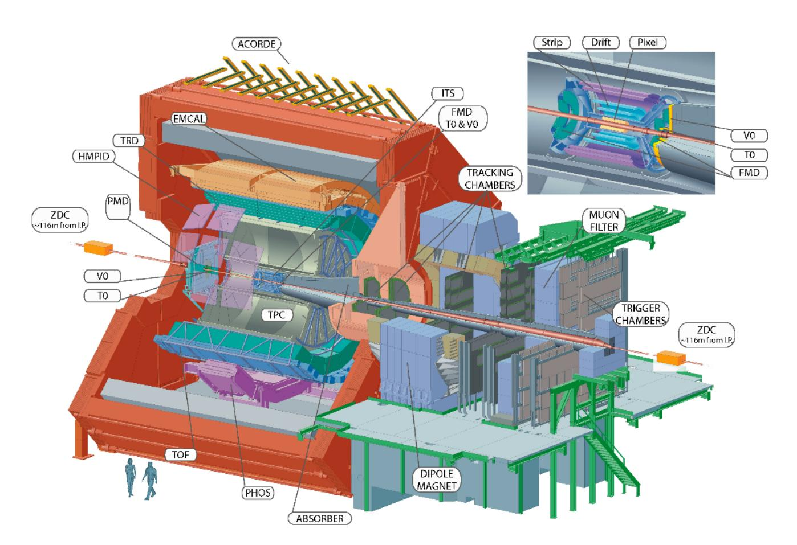

Figure 4.1: A schematic overview of the ALICE detector system.

### 4.1 Inner Tracking System

The Inner Tracking System[\[12\]](#page-55-11) is the first detector encountered for particles of |η| < 0.8. It is primarily used for determining the primary and secondary vertices. It also enables the tracking and identification of low-momentum particles that do not reach the Time Projection Chamber via energy loss signals.

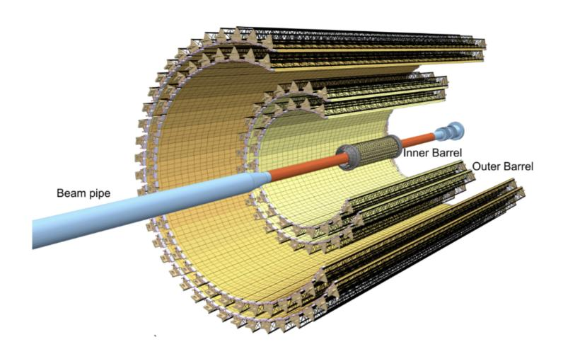

Figure 4.2: Schematic overview of the Inner Tracking System. [\[13\]](#page-55-12)

Fig. [4.2](#page-20-2) shows the geometry of the ITS. It consists of 7 layers, which can be divided into two parts: the inner barrel, comprising the first three layers, and the outer barrel, comprising the remaining layers.

### 4.2 Time Projection Chamber

The Time Projection Chamber[\[14\]](#page-55-13) is the second detector encountered. It is the largest and main tracking system used in the ALICE Central Barrel. It is used for track reconstruction, charged particle momentum measurements using the curvatures induced by the magnetic field, and particle identification via particle-specific energy loss signals in the TPC gas. Fig. X shows a schematic overview of the TPC. It is a hollow, cylindrical detector with an inner radius of 85 cm and an outer radius of 250 cm. It is aligned along the beam axis.

The TPC volume is filled with a gas, which is a mixture of 90% Ne and 10% CO2. An electric field is applied parallel to the beam axis, allowing charged particles traversing through the volume to ionise the gas. A combination of the particle momentum and the energy loss information can then be used for particle identification.

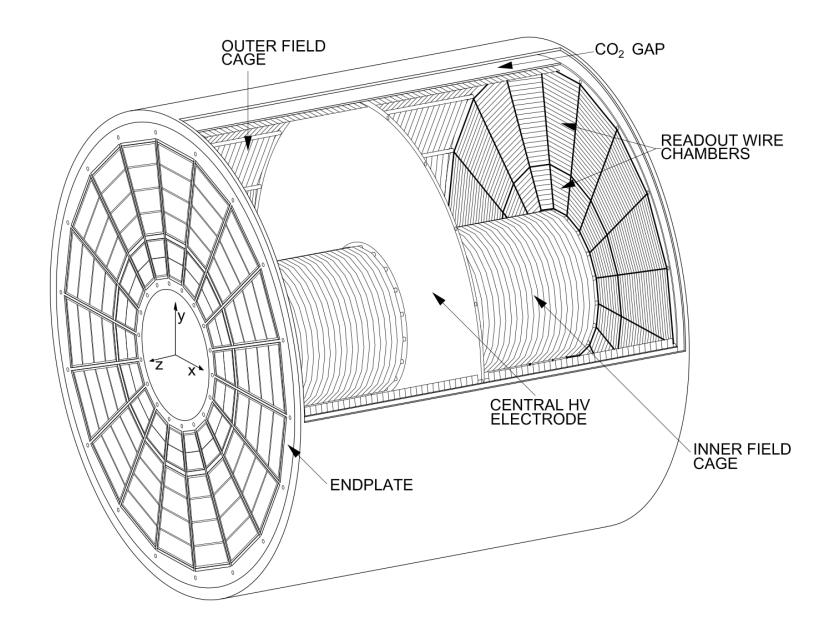

Figure 4.3: A schematic overview of the Time Projection Chamber.[\[15\]](#page-55-14)

### 4.3 Time Of Flight

The Time of Flight[\[16\]](#page-56-0) is mainly used for the separation of pions, kaons, and protons. It measures the time for the particle to travel from the collision to the detector. The measurement depends on the time difference thit − tt0 where t0 is the starting time determined by the T0 detector. It has a cylindrical shape that covers the polar angle from 45 degrees to 135 degrees over the entire azimuthal range. It has 18 modal structures in ϕ, and each module consists of detector elements that are called MRPC strips. Fig. [6.5](#page-37-2) shows a schematic overview of the time-of-flight (TOF) system.

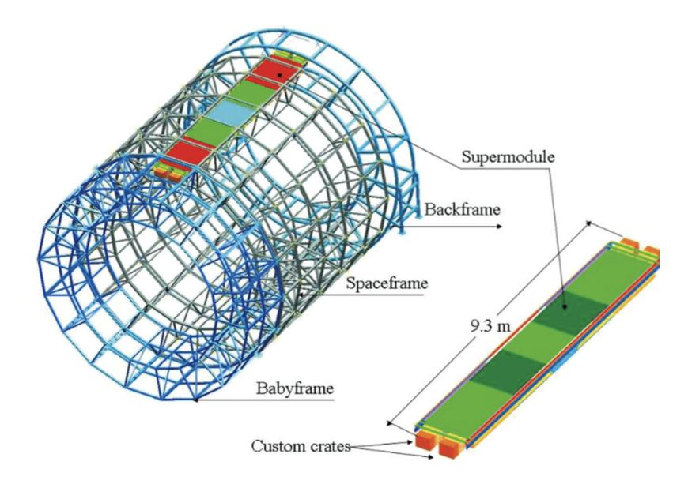

Figure 4.4: A schematic overview of the Time of Flight. [\[17\]](#page-56-1)

# 5 Machine Learning

Machine Learning approaches are gaining popularity in physics; they are already widely used in gravitational wave detection, where machine learning algorithms are employed to identify anomalies. Many machine learning algorithms exist, such as XGBoost, Random Forest, and Neural Networks. Machine learning methods can be broadly categorised into two main types: supervised and unsupervised learning. Supervised learning algorithms train on a labelled dataset and aim to map input x onto some class label y, i.e. y = G(x), where G is some complex mapping function. Unsupervised algorithms work differently; in such a dataset, no labels are available, which means that the algorithm uses solely the intrinsic properties of the dataset to predict classes. In some cases, the unlabeled datasets only slightly differ in distribution from a known labelled dataset. In such cases, domain adaptation methods can be employed to accurately classify an unlabeled dataset.

Training an algorithm essentially involves finding the different parameters such that the mistakes a model makes are minimised. Generally, the vast majority of the learning algorithms use a method called gradient descent. In this chapter, we will cover the key concepts that underpin our current understanding of machine learning.

### 5.1 XGBoost

XGBoost (eXtreme Gradient Boosting)[\[18\]](#page-56-2) is a widely used machine learning library that uses gradient-boosted decision trees. It is a high-performing supervised learning algorithm recognised for its efficiency and scalability across various scenarios. It is the prime example of gradient boosting algorithms. Its essence lies in the concept of gradient boosting, a method of building new models upon the errors of previous ones to correct them.

We start by defining tree models. Fig. [5.1](#page-22-2) shows a schematic overview of a tree model. It's a structure used to make decisions or predictions, and is commonly used in Machine Learning algorithms. It takes in data and splits the data at each node until it reaches the final leaves, which allows us to define a probabilistic model and form a prediction using decision theory.

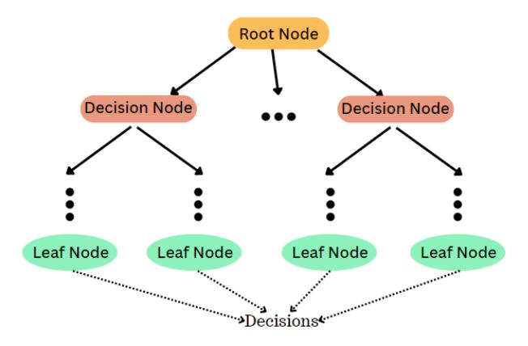

Figure 5.1: Schematic Overview of a tree model, illustrating each component.

This section follows the line of reasoning from [\[18\]](#page-56-2). We define a data set with n examples and

m features  $D = \{(\mathbf{x_i}, y_i)\}$  where  $\mathbf{x_i} \in \mathbb{R}^m$  and  $y_i \in \mathbb{R}$ . For an ensemble method of K trees, we can then define the output value  $\hat{y_i}$  as

$$\hat{y}_i = \phi(x_i) = \sum_{k=1}^K f_k(x_i), \quad f_k \in \mathcal{F},$$
(5.1)

where  $\mathcal{F}$  is the space of regression trees,  $\mathcal{F} = \{f(x) = w_{q(x)} \mid q : \mathbb{R}^m \to T, w \in \mathbb{R}^T\}$ . We define q as the specific tree structure for each example to its corresponding leaf index, T is the number of leaves, and  $f_k$  is the complete tree structure q with weights w. To reach a decision for input vector  $\mathbf{x_i}$ , we sum the weights for each corresponding leaf. Fig. 5.2 shows an example of a tree ensemble.

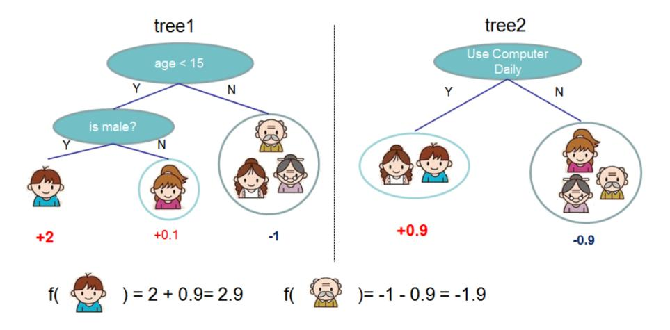

Figure 5.2: An illustration of a Tree Ensemble Method. [18]

Learning becomes now a task of minimising the loss, which is a measurement of the difference between the predicted output  $\hat{y}_i$  and its target  $y_i$ . We can define the objective to minimise as follows:

$$\mathcal{L}(\phi) = \sum_{i} l(\hat{y}_i, y_i) + \sum_{k} \Omega(f_k), \quad \text{where } \Omega(f) = \gamma T + \frac{1}{2} \lambda ||w||^2.$$
 (5.2)

l is the loss function, and  $\Omega$  is a penalty function against the complexity of trees, set in place to avoid overfitting. Traditional gradient boosting sets  $\Omega = 0$ .

A way to train the tree ensemble defined in Eq. 5.2, is by additively building trees such that they minimise the objective. Take the prediction at the t-th iteration at the i-th instance,  $\hat{y}_i^t$ . We then add  $f_t$  to minimise our revised objective:

$$\mathcal{L}^{(t)} = \sum_{i=1}^{n} l(y_i, \hat{y}_i^{(t-1)} + f_t(x_i)) + \Omega(f_t)$$
(5.3)

After second-order approximations and removing constant terms, we get the following objective at step t:

$$\mathcal{L}^{(t)} = \sum_{i=1}^{n} \left[ g_i f_t(x_i) + \frac{1}{2} h_i f_t^2(x_i) \right] + \Omega(f_t)$$
 (5.4)

Where g and h are first and second order *gradients*. We will dive more into gradients and their significance in Machine Learning later this chapter. Enumerating between each possible tree structure q is not an efficient approach. Instead, an algorithm starts from the leaf node and iteratively adds branches and calculates the loss after each split using the following formula:

$$L_{\text{split}} = \frac{1}{2} \left[ \frac{\left(\sum_{i \in I_L} g_i\right)^2}{\sum_{i \in I_L} h_i + \lambda} + \frac{\left(\sum_{i \in I_R} g_i\right)^2}{\sum_{i \in I_R} h_i + \lambda} - \frac{\left(\sum_{i \in I} g_i\right)^2}{\sum_{i \in I} h_i + \lambda} \right] - \gamma.$$
 (5.5)

#### 5.2 Neural Networks

Neural Networks are algorithms that utilise neurons in multiple layers to identify complex patterns in datasets and construct a probabilistic model. The name originates from attempts to derive a mathematical model of biological information processing, hence neural networks. From a practical standpoint, neural networks are essentially models that utilise statistical pattern recognition through the application of decision theory. A schematic overview of a neural network is shown in Fig. 5.3. For an input vector  $\mathbf{x} \in \mathbb{R}^N$ , the input layer consists of N neurons, one for each dimension, which are the nodes as shown in the figure. Similarly, an output vector  $\mathbf{y} \in \mathbb{R}^D$  would require D neurons in its output layer, each representing a class to which the input vector could belong. The layers between the input and output layer are called hidden layers, which essentially have no constraint on the number of neurons per layer or the number of layers themselves. Deeper neural networks, i.e. networks with a large number of layers and neurons per layer, take more computational power but can recognize more difficult patterns in the data, whereas shallow networks, i.e. a smaller number of neurons and layers, are computationally more efficient but are less capable when it comes to more complex patterns. Each dataset requires its own network, and depending on its complexity, it can be either a deep or shallow network. Careful inspection and knowledge of your datasets, combined with hyperparameter optimisation, are key when it comes to finding the right network for your unique dataset.

Each neuron has some value assigned to it, called an activation. A network trains by feeding its data forward through the layers, and each neuron in the hidden layers gets an activation. Since the layers are connected, activations in one layer determine the activations in the following layer. This is loosely analogous to how, in biological networks, certain neurons cause the activation of other neurons. Higher-valued neurons are more important, as they will have the greatest impact when moving to the next layer, with the neuron that receives the highest activation value. When the data reaches the final layer, the activation for each neuron represents how much the system believes that a given input vector corresponds to a particular output class. If we zoom in on a single neuron in the first hidden layer, we can assign a weight,  $w_{MD}^{(1)}$ , corresponding to each preceding neuron to which it is connected, as shown in Fig. 5.3. Then, after a weighted sum with all the previous activations, we arrive at a single value; the activation again. Thus, the problem of training a network becomes one of adjusting all the weights so that it makes the smallest number of misclassifications. When a network makes an error, how do we determine which weights to adjust? A method of adjusting the weights is called *backpropagation*. We start with the second-to-last layer and change each weight in that layer. Since the activation of each single neuron is a weighted sum of the activations of the previous layer, we would need to go back to the layer before that and continue until the *first* hidden layer. Thus, we work our way backwards.

In this section, we'll cover the essential mathematics that describes neural networks. Sec. 5.2.1

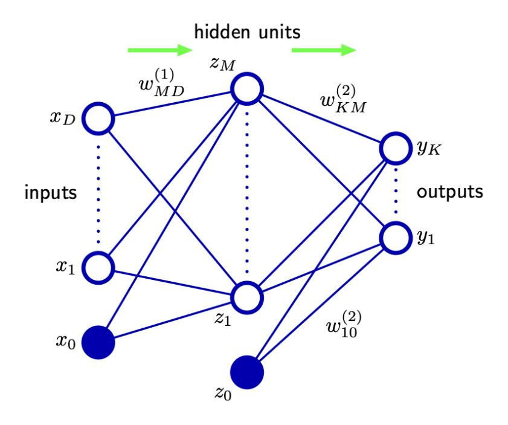

Figure 5.3: Illustration of a simple Neural Network, consisting of one hidden layer. [\[19\]](#page-56-3)

goes over the mathematics of the architecture, followed by Sec. [5.2.2,](#page-26-0) where the training of a network is explained in more depth. Sec. [5.2.3](#page-27-0) and Sec. [5.2.4](#page-28-0) cover important learning algorithms, SGD and Adam. Backpropagation is explained in more depth in Sec. [5.2.5.](#page-28-1)

#### 5.2.1 Mathematical Overview

This section follows the line of reasoning from [\[19\]](#page-56-3). A simple neural network can be described by the following series of transformations. We start by introducing an input vector x, which has dimensions D. We then construct M linear combinations in the form

$$a_j = \sum_{i=1}^{D} w_{ji}^{(1)} x_i + w_{j0}^{(1)}$$
(5.6)

where j = 1, .., M, and the superscript (1) indicates the n-th layer of the Neural Network. As introduced before, wji, is the weight and wj0 is the bias, and we call aj the activation. As this is just a linear transformation, doing this for multiple layers will not be beneficial for our model, since the combination of multiple linear transformations remains linear, meaning that the layers essentially could all be condensed into one. We would need to introduce a nonlinearity, h(·), called an activation function. Generally, h(·), is chosen as the logistic sigmoid or the tanh function. Transforming Eq. [5.6](#page-25-2) using h gives

$$z_j = h(a_j) (5.7)$$

where zj corresponds to the values of the hidden neurons. The number of times those steps are repeated corresponds to the number of hidden layers in the Neural Network. We constrict ourselves to a Neural Network with a single hidden layer for simplicity. We use another linear combination in the following way.

$$a_k = \sum_{j=1}^{M} w_{kj}^{(2)} z_j + w_{k0}^{(2)}$$
(5.8)

Where k = 1, ..., K, with K the number of output classes. The values ak correspond to the values of each output neuron. Where the superscript (2) corresponds the second layer of the network, and w (2) kj and w (2) k0 to the weights and biases respectively.

In the case of a binary classification, we have a single target output, y, for which a value of y = 1 denotes class C1 and y = 0 denotes class C2. We can then transform a such that

$$y = \sigma(a) \tag{5.9}$$

where

$$\sigma(a) = \frac{1}{1 + \exp(-a)}.\tag{5.10}$$

We can interpret y(x, w) as the conditional probability p(C1|x) and 1 − y(x, w) = p(C2|x). Combining these steps gives us the final form of the Neural Network as

$$y(\mathbf{x}, \mathbf{w}) = \sigma \left( \sum_{j=1}^{M} w_j^{(2)} h \left( \sum_{i=1}^{D} w_{ji}^{(1)} x_i + w_{j0}^{(1)} \right) + w_0^{(2)} \right).$$
 (5.11)

We can now define θ as the parameters of y, such that y = G(x; θ), where G is the function that maps x onto a final probability y given by Eq. [5.11.](#page-26-1)

#### 5.2.2 Network Training

Up until this point, we described Neural Networks as a set of functions that take in some input vector x and puts out some target vectors y. But how does this network of functions with many weights and biases actually learn? The answer to this question is found in the Gradient Descent.

To train the network, we want a large labeled dataset, which allows us to run it through the network, assign it an output class and check whether the network has been correct and adjust all the different weights and biases to increase the network's performance. We begin by defining a labeled dataset, where some input vector xn corresponds to target label tn. Using [5.11,](#page-26-1) we can then define an error function as

$$E(\mathbf{w}) = \frac{1}{2} \sum_{n=1}^{N} \|\mathbf{y}(x_n, \mathbf{w}) - t_n\|^2.$$
 (5.12)

This is known as the Mean Squared Error loss. From now on, for consistency, we will go with the term loss instead of error. There are many different ways of calculating the error of a classification task. Another loss function is the Binary Cross Entropy loss, which is defined as:

$$L_{\text{BCE}}(\mathbf{w}) = -\frac{1}{N} \sum_{i=1}^{N} \left[ t_i \log(y_i) + (1 - t_i) \log(1 - y_i) \right].$$
 (5.13)

This sum is small for a model that performs well and classifies each input vector, x, correctly, and large for the opposite case. The goal of a Neural Network would then be to find the right weights and biases such that this function is minimized. Mathematically put, we then aim to solve

$$\nabla L(\mathbf{w}) = 0. \tag{5.14}$$

Solving this analytically is not possible due to the complexity of neural network, so we go for a numerical approach.

#### 5.2.3 Stoichastic Gradient Descent

To solve Eq. [5.14](#page-27-1) numerically, we introduce an algorithm called Stochastic Gradient Descent (SGD). Algorithms that aim to minimize the loss function are often called optimizers. Since a neural network consists of many weights and biases, adjusting each one has an impact on the performance of the model, and thus on the loss. This implies that a loss surface becomes highly complex. Fig. [5.4](#page-27-2) shows the loss surface in the parameter space. The lowest possible point in a loss surface is called a global minimum. Any other minimum is called a local minimum.

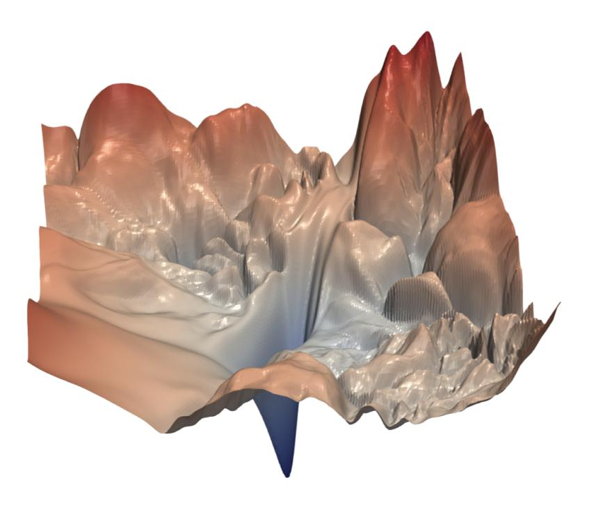

Figure 5.4: Visualisation of the Loss surface of Neural Networks,x with a clear global minimum.[\[20\]](#page-56-4)

Finding the global minimum may never happen, and the model will settle in a local minimum. SGD uses an iterative numerical procedure, which can be described by the following equation:

$$\mathbf{w}^{(\tau+1)} = \mathbf{w}^{(\tau)} - \eta \nabla L_n(\mathbf{w}^{(\tau)}). \tag{5.15}$$

d

In this method, a starting point is chosen at random, and the gradient of the loss is calculated. Using the gradient information of the loss, the parameters are updated in the opposite direction of the function ∇Ln(w(τ) ), making sure we move in a direction towards a lower point on the loss surface in the parameter space. η is called the learning rate, which determines the step sizes taken in the calculated direction. Moving iteratively through this surface, using the gradient information, will eventually lead to a minimum.

#### 5.2.4 Adaptive Moment Estimation

Nowadays, a popular optimizer used in many machine learning tasks is Adam[\[21\]](#page-56-5), derived from adaptive moment estimation. It's an optimizer that builds on Gradient Descent methods as described in Sec. [5.2.3.](#page-27-0) It uses an adaptive learning rate by taking note of past gradient calculations. It is built on two main ideas, momentum and Root Mean Squared propagation. Momentum uses past gradient calculations to speed up the training by accelerating in the direction of the past gradients, if they pointed in the same direction. It adds a fraction of the previous gradient to the current one. RMS propagation uses the steepness of the gradient to control its step size. For steep gradients, it decreases the stepsize so as not to overshoot a minimum, whereas for the opposite case, it increases the stepsize to speed up training.

The Adam algorithm can be described by the following set of equations:

$$m_t = \beta_1 \cdot m_{t-1} + (1 - \beta_1) \cdot g_t \tag{5.16}$$

$$v_t = \beta_2 \cdot v_{t-1} + (1 - \beta_2) \cdot g_t^2 \tag{5.17}$$

Where for convenience we set gt = ∇θtLt , which is the gradient at step t. Eq. [5.16](#page-28-2) describes the momentum, with its hyperparameter β1, and Eq. [5.17](#page-28-3) describes the RMS propagation, with its corresponding hyperparameter β2. As it starts with values mt−1 and vt−1 as vectors of 0's, an initial correction is used to counter biases towards zero values in the initial parts of training, which are given by:

$$\hat{m}_t = \frac{m_t}{1 - \beta_1^t} \tag{5.18}$$

$$\hat{v}_t = \frac{v_t}{1 - \beta_2^t} \tag{5.19}$$

Putting this together yields the Adam update rule:

$$\theta = \theta - \left(\alpha \cdot \frac{m_t}{\sqrt{\hat{v}_t} + \epsilon}\right). \tag{5.20}$$

#### 5.2.5 Backpropagation

Evaluating the derivatives of the loss function with respect to the weights is key when it comes to the optimisation algorithms as described above. To find this gradient of the loss function in weight space, a technique called backpropagation is used.

This section follows the line of reasoning in Bishop. As each node in each layer is dependent on the nodes from the previous layer, the calculation of the gradient of the loss function in weight space essentially becomes a sum of chain rules. To calculate the derivative of the loss for a given input sample n with respect to the weight, we would require the activation of the preceding layer:

$$\frac{\partial L_n}{\partial w_{ji}} = \frac{\partial L_n}{\partial a_j} \cdot \frac{\partial a_j}{\partial w_{ji}}.$$
(5.21)

We define the first derivative as the error in the following way:

$$\delta_j = \frac{\partial L_n}{\partial a_j}. (5.22)$$

Since we have defined aj as aj = P i wjizi , we then have

$$\frac{\partial a_j}{\partial w_{ji}} = z_i. {(5.23)}$$

Thus, the problem of finding the derivative with respect to a weight wji becomes the problem of calculating the error, and filling it in the following formula:

$$\frac{\partial L_n}{\partial w_{ji}} = \delta_j z_i. \tag{5.24}$$

We can expand this error calculation for the hidden layers by taking a sum:

$$\delta_j \equiv \frac{\partial L_n}{\partial a_j} = \sum_k \frac{\partial L_n}{\partial a_k} \cdot \frac{\partial a_k}{\partial a_j}.$$
 (5.25)

Where the sum is over all units k to which unit j sends connections. After some derivation, we obtain the final formula used for backpropagation:

$$\delta_j = h'(a_j) \sum_k w_{kj} \frac{\partial L_n}{\partial a_k} \tag{5.26}$$

This tells us that for a hidden unit, the error can be obtained by propagating the errors from the backmost layer back to the hidden unit, which is where the name backpropagation originates from.

# 5.3 Domain Adaptation

Until now, we looked at the case where a large labelled dataset is present. What if there isn't such a dataset? In particle physics, we can simulate a labelled dataset using Monte Carlo methods, but such a dataset shows discrepancies with actual detector data. A problem arises, our model has been trained on a dataset that does not align in distribution, but is slightly shifted. In this case, domain adaptation techniques are used to overcome these discrepancies.

This section follows the line of reasoning in [\[22\]](#page-56-6). We start by defining two distributions, S(x, y) and T (x, y) in X ⊗ Y , which refer to the domains source and target, respectively. It's assumed that these distributions are similar, but there exists a domain shift between them. The goal is to be able to predict labels, given target input x. We define a binary domain label di , which indicates whether input vector xi comes from source or target data, i.e., xi ∈ S if di = 1 and xi ∈ T if di = 0.

We can now define a feed-forward neural network that takes input x and predicts its class label y, and the domain label d. The proposed architecture is shown in Fig. [5.5.](#page-30-0) The mapping from x to y and d can be broken down in three parts. We first map x onto a D-dimensional feature vector f ∈ R D, using a feed-forward neural network. The parameters of f are given by θf , such that the mapping is given by f = Gf (x; θf ). Using this feature vector f, we can now define the mapping functions Gd(f; θd), which maps f to the domain label d, and Gy(f; θy), which maps f to the class label y.

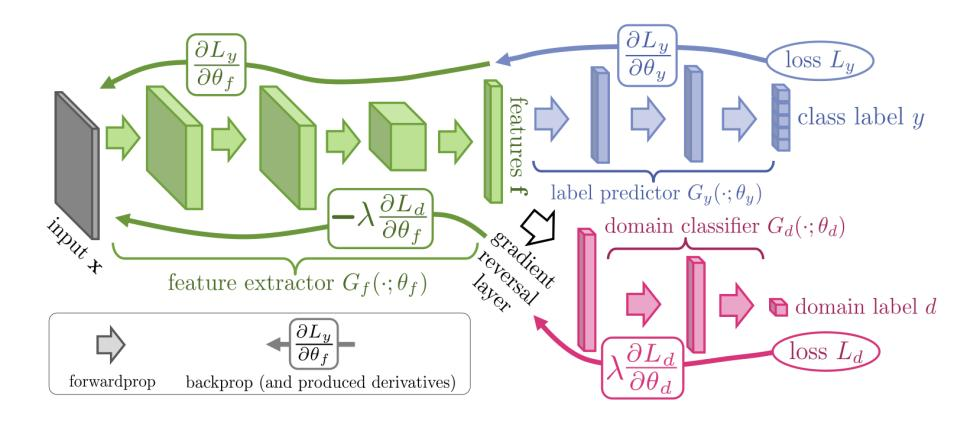

Figure 5.5: The architecture of a Domain Adversarial Neural Network. The network consists of three components: feature extractor (purple), label classifier (blue), domain classifier (pink). In between the domain classifier and the feature extractor an implementation of a gradient reversal layer is shown.[\[22\]](#page-56-6)

This three-way neural network aims to train the feature extractor such that its features become discriminative, by optimizing θf and θy to minimize the class loss, Ly. At the same time we want domain invariance of the features f, i.e. S(f) = {Gf (x; θf )|x ∈ S(x)} must be similar to T(f) = {Gf (x; θf )|x ∈ T(x)}. We seek to optimize θf and θd such that they maximize the domain loss, Ld. We can then say under the covariant shift assumption[\[13\]](#page-55-12) that the class label prediction accuracy is the same for both the source and target domains. Putting this together gives us the following function:

$$E(\theta_f, \theta_y, \theta_d) = \sum_{\substack{i=1...N\\d_i=0}} L_y(G_y(G_f(x_i; \theta_f); \theta_y), y_i) + \lambda \sum_{i=1..N} L_d(G_d(G_f(x_i; \theta_f); \theta_d), y_i).$$
 (5.27)

Where λ controls the trade-off between the two tasks. We thus seek the parameters ˆθf , ˆθd and ˆθy that belong to a saddle point of Eq. [5.27:](#page-30-1)

$$(\hat{\theta}_f, \hat{\theta}_y) = \arg\min_{\theta_f, \theta_y} E(\theta_f, \theta_y, \hat{\theta}_d)$$
(5.28)

$$\hat{\theta}_d = \arg\max_{\theta_d} E(\hat{\theta}_f, \hat{\theta}_y, \theta_d)$$
 (5.29)

A way of implementing a method that searches for such a saddle point can be understood by the use of Gradient Reversal Layer (GRL). We can define the function Rλ(x):

$$R_{\lambda}(\mathbf{x}) = \mathbf{x} \tag{5.30}$$

$$\frac{dR_{\lambda}}{d\mathbf{x}} = -\lambda \mathbf{I} \tag{5.31}$$

During the forward pass, this function acts as an identity transformation, which leaves the input unchanged. During backpropagation, the gradient is multiplied by −λ and passed to the preceding layer. We insert this layer between the feature extractor and the domain classifier, as seen in Fig. [5.5.](#page-30-0) We can now define a new function:

$$\tilde{E}(\theta_f, \theta_y, \theta_d) = \sum_{\substack{i=1...N\\d_i=0}} L_y(G_y(G_f(x_i; \theta_f); \theta_y), y_i) + \sum_{i=1..N} L_d(G_d(R_\lambda(G_f(x_i; \theta_f))); \theta_d), y_i).$$
 (5.32)

Common gradient descent methods, such as SGD or Adam, are then able to identify the optimal features, thereby reaching the saddle point described by equations [\(5.28\)](#page-30-2) and [\(5.29\)](#page-30-3).

### 5.4 Precision and Recall

A crucial aspect of Machine Learning is evaluating the model after training. Many metrics exist, such as the accuracy, precision and recall. In this section, we'll review the most critical metric used in this study, the area under the precision-recall curve.

Precision and Recall are two important metrics used in Machine Learning. Before introducing the equations, it's essential to define some key metrics. In a binary classification, we can define the positive and negative classes as described before. Using that terminology, we can now define true positives and negatives and false positives and negatives. A true positive is a datapoint which belongs to the positive class, thus is positive, and is classified correctly, hence true. A true negative is a negative which is misclassified as positive. Similarly, true negatives are instances that are correctly classified as negatives, and false negatives are instances that are misclassified as negatives. We can now define the precision and recall as follows:

$$Precision = \frac{TP}{TP + FP}$$
 (5.33)

$$Recall = \frac{TP}{TP + FN} \tag{5.34}$$

A precision and recall curve visualises the trade-off between precision and recall. We can vary the precision and thus the recall by changing the threshold. If a pure sample is required, we can obtain a high-precision sample by lowering its recall, and vice versa. An example of a precision-recall curve for different models is shown in Fig. [5.6,](#page-32-2) where a perfect model is illustrated, corresponding to an area of one. It's an important metric for imbalanced datasets, as it only focuses on the positive samples.

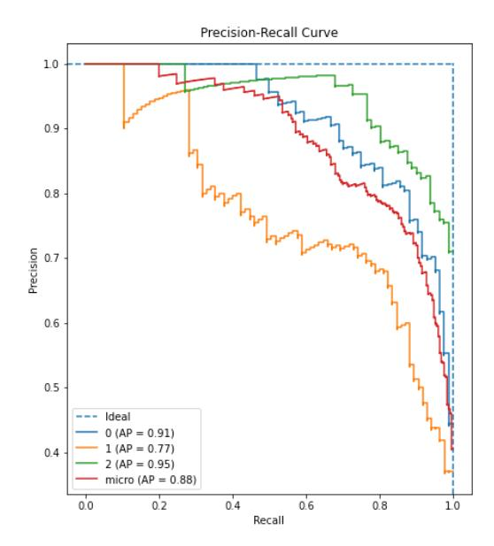

Figure 5.6: Different Precision-Recall curves. The dashed line indicates a perfect model, with an AUPRC of one.

# 6 Data Analysis

To study the in-medium effects of light vector mesons, the dielectronic invariant mass spectrum is required, as discussed in Chapter [3.2.](#page-14-0) To set up such a spectrum, multiple steps are needed to ensure a high-quality spectrum, optimized towards a high-purity electron sample to minimize the impact of hadronic signals. The study begins by selecting tracks based on several criteria to ensure high-quality tracks, which are discussed in Sec. [6.1.](#page-32-1) The particle identification techniques used in this analysis consist of a combination of the TPC energy loss per unit path length and the TOF time-of-flight measurement, which we will go over in Sec. [6.2.](#page-34-0) The electron sample selection is machine learning-based, with XGBoost as the starting point in Sec. [6.3.](#page-37-1) The initial selection is performed using Monte Carlo simulated data, and a domain adversarial neural network is employed to adapt the machine learning model for identifying a pure electron sample in detector data, as discussed in Sec. [6.4.](#page-39-0) A major challenge in the pair analysis that follows is in the combinatorial background, i.e., pairs that contribute to the data but do not contribute to the underlying physics. Sec. X goes over the pair analysis and the challenges involved in setting up the final dielectronic mass spectrum.

### 6.1 Track Selection

In high-energy collisions, a large number of tracks are produced. For a high-quality analysis, selecting tracks of interest is essential. We can differentiate between primary tracks, i.e., tracks produced by the particles in the primary vertex, and secondary tracks, i.e., tracks generated by photon conversions in the detector material, are called secondary tracks. Note that dielectrons that are produced from a virtual photon conversion originating from the interaction region produce primary tracks. Several criteria have been applied to both detector and general kinematic variables to ensure high-quality tracks. An emphasis was placed on Monte Carlo and real data differences, as both datasets are shifted with respect to each other. A cut on a variable that is vastly different in real data could either over- or underemphasize the efficiency in the mass spectrum. Thus, the distributions have been compared and the cuts have been made to account for differences, resulting in looser cuts when the distributions are poorly matched. In this section, we will go over those criteria.

A charged particle leaves discrete signals, which can be used to measure the positions in space where it passed within an uncertainty. Using discrete signals in multiple detectors, track reconstruction is possible. Before the track reconstruction can be realised, SPD measurements allow for a precise localisation, which constrains tracks to this vertex. The reconstruction algorithms begin at the back-end of the TPC, due to the lower track density, which allows for easier identification of potential track candidates. Once a track candidate is identified, a Kalman filter [\[23\]](#page-56-7) can then propagate the track towards the outermost part of the ITS. If the track is successfully reconstructed throughout the TPC, it is said that it is refitted in the TPC. A prolongation of this track is then searched for in the ITS and reconstructed towards the innermost vertex, resulting in a refit in the ITS. The next step is then an outer pass towards the back end of the TOF from the inner part of the ITS. This approach is optimised to deal with the characteristics of high-density regions for heavy-ion collisions. All tracks require a refit in the ITS and TPC.

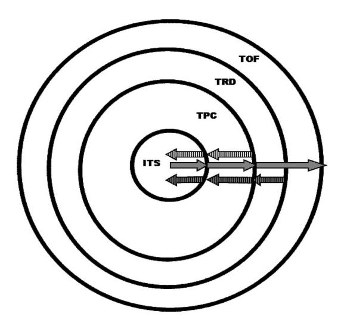

Figure 6.1: Schematic overview of the track refitting procedure. Top rows indicate the first step, middle rows the second and the third rows the final step in the procedure. [\[14\]](#page-55-13)

The ITS is important to reject secondary tracks, since photons can not produce a signal in the SPD. Requiring a hit in the SPD rejects electrons produced from photon conversions in later detector material. This is reflected in the distance-of-closest-approach (DCA) of a track to the reconstructed vertex. Fig. [6.2](#page-34-2) shows the DCA for tracks with a required hit in the first layer, and tracks that do not require this. The DCA in the xy-plane, transverse to the beam, shows a great reduction in the induced ITS constraint; only tracks < 0.5 cm obey this requirement. For the DCA in the z-direction, alongside the beam, a significant reduction is seen, keeping most of the tracks within 0.5cm the reconstructed vertex. To further ensure a high-quality track in the ITS, the number of clusters in the ITS has to be at least 4.

Charged particles produce ionisation as they travel through the TPC, and these signals are then read out. If the charge exceeds a certain threshold, it is referred to as a cluster, with a maxi-

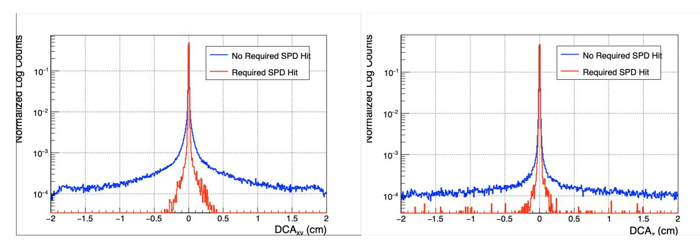

Figure 6.2: DCA comparison for a hit in the first ITS layer and no hit in the first layer using Monte Carlo simulated data. The left is the DCA in the xy-plane, and the figure on the right is the DCA in the z-plane.

mum of 159 clusters. The minimum number of TPC clusters required is 70. The effective number of TPC clusters of a track is called the number of crossed rows, as it's essentially the number of rows travelled through by the particle. The minimum number of crossed rows required is set at 100. The quality of the fit for the reconstructed tracks in the TPC is defined by χ 2 per number of clusters. The maximum value for the χ 2/ncl has been set at 4.

Other selection criteria have been set based on kinematic variables. The tracking efficiency in the TPC decreases for low-momentum particles, as the magnetic field deflects them before they can store sufficient information in the TPC. The requirement for pT has set to be pT ∈ (0.1,∞] GeV/c. The pseudorapidity, η, has only been accepted in the range η ∈ [−0.8, 0.8], since the tracking and PID efficiency is the highest for these tracks, due to limited geometrical coverage of the ALICE detectors.

Since Monte-Carlo-simulated and real data are shifted with respect to each other, it is important to account for this in the track selection criteria. Fig. [6.3](#page-35-0) shows both MC-simulated and real data to highlight their differences; the vertical dashed line indicates the selection criteria. The most prominent disagreements were observed in the TPC χ 2/ncl and the DCAz. To address this, the TPC χ 2/ncl cut has been made looser to account for this. The DCAz shows the most significant disagreement for |DCAz| > 0.5 cm, leading to the decision to reject tracks with |DCAz| > 0.5.

### 6.2 Particle Identification

Particle identification within the ALICE detector system utilises characteristic signals from the various particle species. Since the signals for each species of particle differ, we can use these signals, along with a combination of detectors, to identify the different particles. The prominent detectors used for particle identification are the Time Projection Chamber (TPC) as described in Sec. [4.2](#page-20-1) and the Time of Flight-detector (TOF) as described in Sec. [4.3.](#page-21-0)

#### 6.2.1 Energy Loss

As charged particles move through matter, they can both lose energy and be deflected from their incident path. The most dominant mechanisms which result in this are:

6 DATA ANALYSIS 32

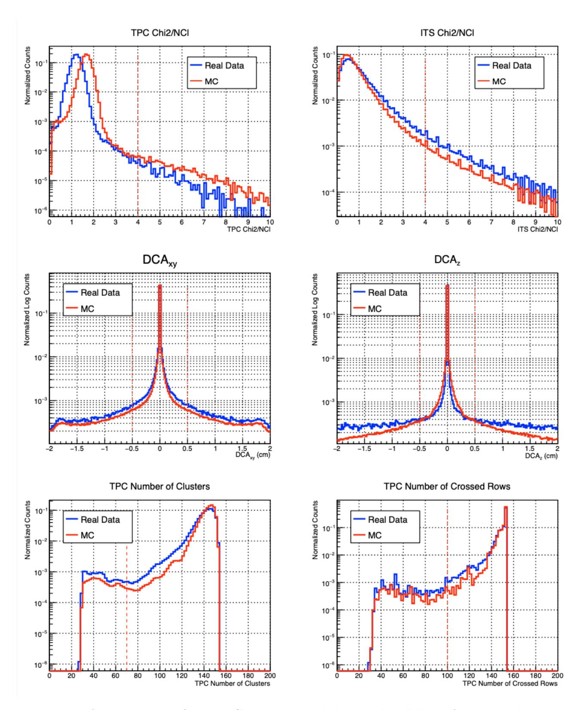

Figure 6.3: A comparison of Monte-Carlo simulated data and real data, for some relevant track selection variables used. Vertical dashed lines indicate the track selection cuts decided upon.

6 DATA ANALYSIS 33

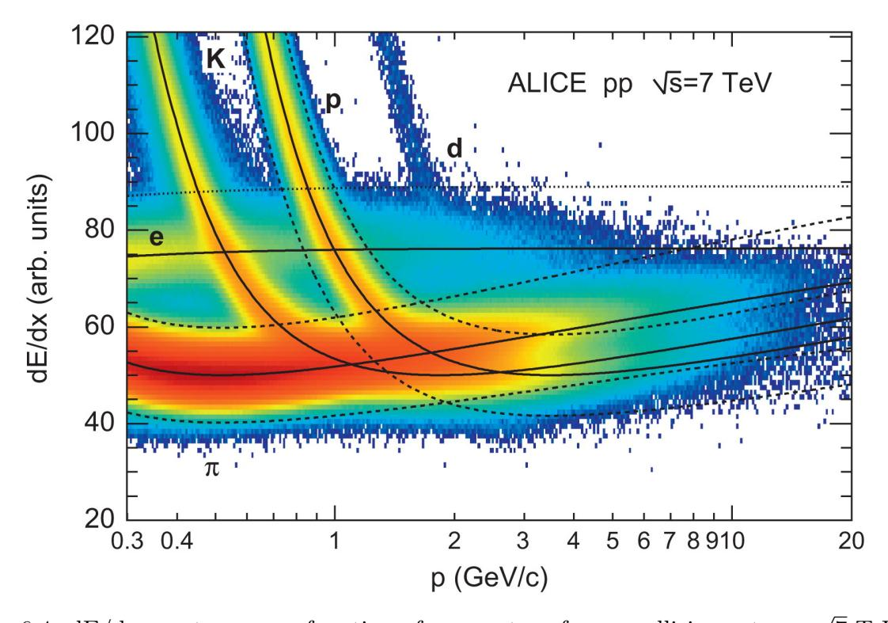

Figure 6.4: dE/dx spectrum as a function of momentum for pp collisions at s = 7 TeV.[\[24\]](#page-56-8)

- Inelastic collisions with atomic electrons.
- Elastic scattering from nuclei.

Of course, there are additional mechanisms, such as bremsstrahlung or the emission of Cherenkov radiation, but as these are rare in comparison, we focus on the ones we currently have at hand. In inelastic collisions, energy is transferred to the atom, which causes ionization or excitation. This happens infrequently, but this form of energy loss becomes dominant due to the large number of collisions per unit path length. Elastic collisions do happen frequently, but less energy is transferred due to the large mass difference between the heavier nuclei and the charged particle.

Due to the statistical nature of these collisions, quantum mechanics was used to calculate an average energy loss, ⟨ dE dx ⟩, per unit path length by Bethe and Bloche. They arrived at the Bethe-Bloch formula:

$$\langle -\frac{dE}{dx} \rangle = 2\pi N_A r_e^2 m_e c^2 \frac{Z}{A} \frac{z^2}{\beta^2} \left[ \frac{1}{2} \ln \left( \frac{2m_e \gamma^2 v^2 W_{\text{max}}}{I^2} \right) - \beta^2 - \frac{1}{2} \delta \right]. \tag{6.1}$$

The maximum energy transfer happens at a head-on collision. For an incident particle with mass M, we have:

$$W_{\text{max}} = \frac{2m_e c^2 \beta^2 \gamma^2}{1 + 2m_e \gamma / M + \left(\frac{m_e}{M}\right)^2}.$$
 (6.2)

Fig. [6.4](#page-36-0) shows the measured energy loss as a function of momentum with the parametrisations for each particle given by the Bethe-Bloch formula defined above. Each particle leaves a clear and distinct signal. The detector response can be expressed in terms of the deviation between the measured signal and the expected value given the mass hypothesis for a particle. This can be expressed in units of the detector PID resolutions, σ. The response for an electron is then given by:

$$n\sigma_{\rm TPC} = \frac{\langle dE/dx \rangle_{\rm meas} - \langle dE/dx \rangle_{\rm exp}(\rm elec)}{\sigma_{\rm TPC}^{\rm elec}}$$
(6.3)

#### 6.2.2 Time of Flight

Similar to TPC signal, we can calculate nσTOF for a given particle. Using the track length, momentum and time-of-flight signal, a particle's mass can be calculated via:

$$m = p \cdot \frac{t_{\text{TOF}}}{L} \cdot \sqrt{1 - \frac{L^2}{c^2 t_{\text{TOF}}^2}}$$
 (6.4)

Then, using this information, we arrive at the equation for nσTOF:

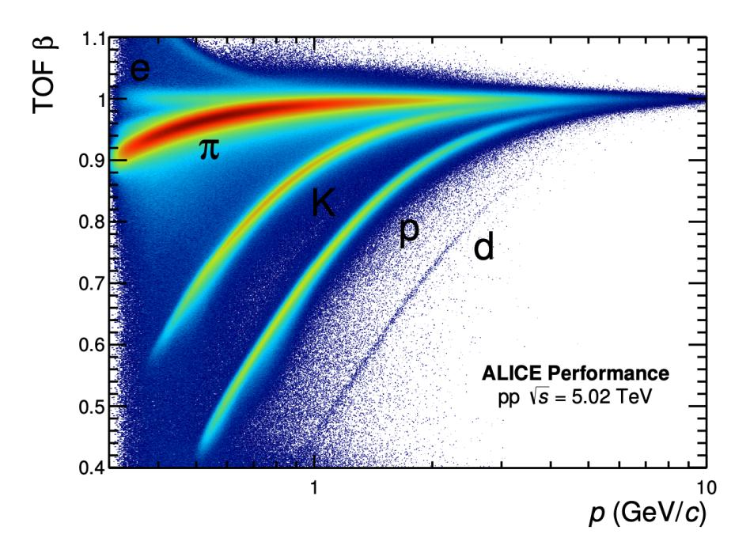

Figure 6.5: Particle speed as measured in the TOF as a function of momentum for pp collisions at s = √ 5.02 TeV.

$$n\sigma_{\text{TOF}} = \frac{t_{\text{meas}} - t_{\text{exp}}(\text{elec})}{\sigma_{\text{TOF}}^{\text{elec}}}$$
 (6.5)

### 6.3 XGBoost

As a starting point in producing a high-purity electron sample, we utilised the XGBoost machine learning library, as discussed in Sec. [5.1.](#page-22-1) Due to the easy implementation of XGBoost, it is possible to study feature importance and optimise the features before proceeding to more complex machine learning algorithms. To study the impact of the Domain Adaptation techniques used later on, we use the trained XGBoost model to produce a probability distribution on a real dataset. The XGBoost model was implemented using the XGBoost Machine Learning library in Python 2.7.0. 6 DATA ANALYSIS 35

Hyperparameter optimisation was carried out using the Optuna framework[25]. Table 2 shows the hyperparameters that have been optimised and their respective ranges. The objective used was binary:logistic, the evaluation metric was AUCPR, and the booster was gbtree.

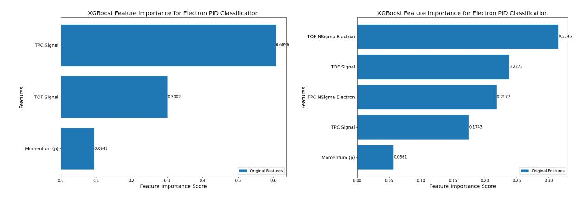

Figure 6.6: Left: Feature Importance for 3 input features. Right: Feature Importance for 5 input features.

The input data consisted of the TPC signal,  $dE/dx_{\rm elec}$ , the TOF signal,  $t_{\rm elec}$ , and momentum. Where we define  $t_{\rm elec}$  as:

$$t_{\text{elec}} = \frac{t_{\text{meas}} - t_{\text{exp}}^{\text{elec}}}{t^{\text{elec}}},\tag{6.6}$$

and  $dE/dx_{\rm elec}$  as

$$dE/dx_{\text{elec}} = \frac{dE/dx_{\text{meas}} - dE/dx_{\text{exp}}^{\text{elec}}}{dE/dx_{\text{elec}}^{\text{elec}}}.$$
(6.7)

Which essentially centres the TPC and TOF signals around the electron signal, since this value is expected to be zero for electrons, and deviates from zero for other particle species. This normalises the TPC and TOF signals, such that the network has input values in the same order of magnitude, ensuring numerical stability. We optimised the model and measured the feature importance. The left side of Fig. 6.6 shows the feature importance, indicating a clear imbalance where most of the network depends on a single variable, which can lead to instability. To ensure a more robust model,  $n\sigma$  values were used for both detectors, described by Eq. 6.3 and 6.5. The right side of Fig. 6.6 shows the feature importances with the addition of the two new variables. No single variable stands out in particular, and the importance is distributed across multiple variables, allowing for a more robust model.

| Variable             | Range                                                                              |  |  |  |
|----------------------|------------------------------------------------------------------------------------|--|--|--|
| $\max_{-} depth$     | Maximum tree depth, sampled from [2, 12]                                           |  |  |  |
| $min\_child\_weight$ | Minimum sum of instance weight (Hessian) needed in a child, sampled from $[1,\ 6]$ |  |  |  |
| subsample            | Subsample ratio of the training instance, sampled from [0.6, 1.0]                  |  |  |  |
| $colsample\_bytree$  | Subsample ratio of columns when constructing each tree, sampled from $[0.6,\ 1.0]$ |  |  |  |

| Variable | Definition                                                                                  |  |  |  |
|----------|---------------------------------------------------------------------------------------------|--|--|--|
| gamma    | Minimum loss reduction required to make a further partition, sampled from [0.01, 5.0] |  |  |  |
| learning | Boosting learning rate (shrinkage), sampled from [0.01,                                     |  |  |  |
| rate     | 0.3]                                                                                        |  |  |  |
| tree     | Tree construction algorithm, sampled from                                                   |  |  |  |
| method   | {auto, exact, approx, hist}                                                                 |  |  |  |

Table 2: Optuna hyperparameter search space for XGBoost.

We can visualise the Optuna hyperparameter search using Fig. [6.7,](#page-39-3) which shows each trial plotted from lightest to darkest, corresponding to the trial number. It shows for each hyperparameter, as the search continues, the area towards the search-space converges. The y-axis shows the objective value, and the x-axis shows the search space for each hyperparameter.

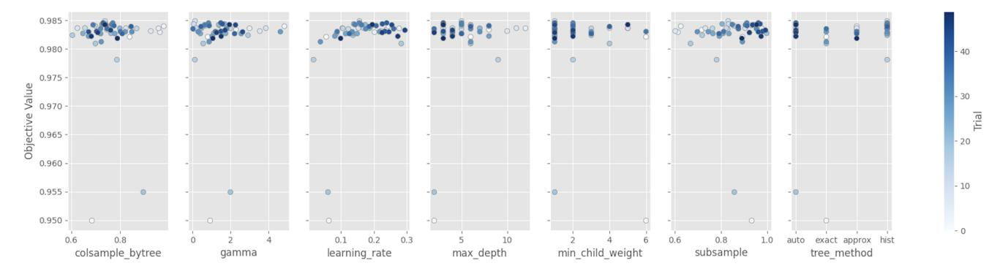

Figure 6.7: XGB Optuna hyperparameter optimisation Slice Plot.

### 6.4 Domain Adaptation

The network was implemented in Python 3.11.6 using the Machine Learning library PyTorch 2.7.0 [\[26\]](#page-56-10). The architecture is discussed in Sec. [6.4.2](#page-41-0) and the training set-up in Sec. [6.4.3.](#page-42-0)

#### 6.4.1 Input Parameters

As input, the network receives the properties of the tracks, measured in the TPC and TOF, as shown in Table [3.](#page-41-1) Fig. [6.8](#page-40-0) shows the differences between Monte-Carlo simulated data and real detector data. As seen in the figures, each input differs from the Monte Carlo simulations in slightly shifted ways. The data resemble each other in distributions, with slight shifts. Domain Adaptation methods are expected to solve these discrepancies.

To capture the importance of momentum dependence in the data, two momentum-weighted input parameters have been used: dE/dxelec ·e −p and dE/dxelec ·ln(1+p). In addition to momentum dependence, these values highlight the domain difference for the TPC signal. Since momentum and TOF signals do not have a strong deviation from Monte Carlo, as seen in Fig. [6.8,](#page-40-0) the domain adaptation must focus more on the TPC signal discrepancies and correct for those. Thus, by adding more TPC signal-related inputs, the network can learn to overcome the discrepancies better.

6 DATA ANALYSIS 37

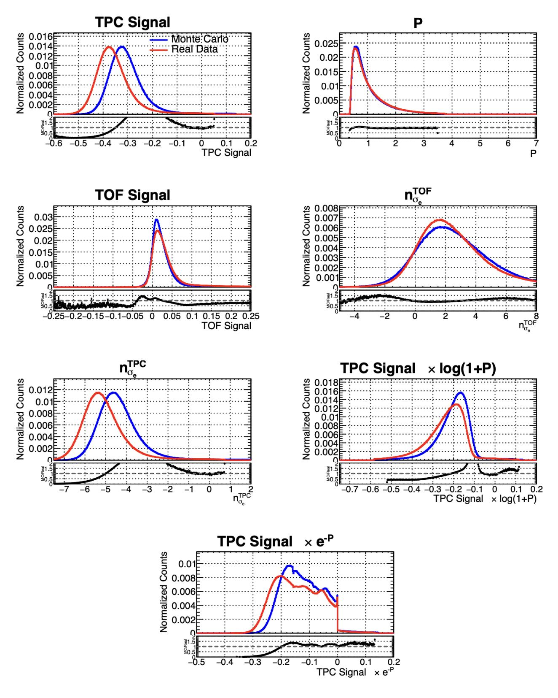

Figure 6.8: Input parameters within blue Monte Carlo distributions and red the Real Data distributions. Their differences are highlighted in ratio plots below.

| Variable                       | Definition                                                                                                                                                                  |
|--------------------------------|-----------------------------------------------------------------------------------------------------------------------------------------------------------------------------|
| p                              | Momentum                                                                                                                                                                    |
| nσT OF e                    | Deviation between the measured TOF signal and the expected value given the mass hypothesis for the electron, divided by the detector resolution for the TOF.          |
| nσT P C e                   | Deviation between the measured TPC signal and the expected value given the mass hypothesis for the electron, divided by the detector resolution for the TPC.          |
| telec                          | Deviation between the measured TOF signal and the expected value given the mass hypothesis for the electron, divided by the expected value given the mass hypothesis. |
| dE/dxelec                      | Deviation between the measured TPC signal and the expected value given the mass hypothesis for the electron, divided by the expected value given the mass hypothesis. |
| −p dE/dxelec · e      | Momentum-weighted energy loss (exponential)                                                                                                                                 |
| · dE/dxelec ln(1 + p) | Momentum-weighted energy loss (logarithmic)                                                                                                                                 |

Table 3: Input parameters for the Domain Adversarial Neural Network.

#### 6.4.2 Architecture

The choices for architecture fell on feed-forward neural networks. Hyperparameter optimisation has been carried out using the Optuna framework. The following parameters for the architecture have been optimised with their respective ranges, as seen in Table [4.](#page-41-2) The search space has been derived using the proposed architecture in [\[27\]](#page-56-11) as a starting point. Due to the relatively simplistic structure of the data, the choices fell for shallow neural networks. To stabilise training, dropout layers have been used in all the networks. For each model, the same hyperparameter search space has been used, but separate values were computed for each model.

| Feature                | Description                        | Range                                        |  |
|------------------------|------------------------------------|----------------------------------------------|--|
| feature out size | Feature extractor output dimension | {32, 256} 64, 128,                  |  |
| n layers            | Number of hidden layers            | [1, 3]                                    |  |
| activation             | Activation function                | {relu, leaky relu, elu, selu, tanh, gelu} |  |
| dropout                | Dropout rate                       | [0.1, 0.5]                                |  |
| hidden size i    | Hidden layer size for layer i   | {64, 512} 128, 256,                 |  |
| batch size          | Training batch size                | {256, 512, 1024}                       |  |
| lr                     | Learning rate (log scale)          | [10−7 10−2 , ]                      |  |

Table 4: Optuna hyperoptimisation search space for the DANN model

A model that only works to classify electrons has been trained in conjunction with the DANN

to measure the impact of domain adaptation. The choices in architecture for the second model, essentially a multilayered perceptron (MLP), were similar to the DANN. The data was fed through the same feature extractor and classifier to maintain consistency across both training methods. The MLP is essentially the same as the DANN, except for the absence of a domain classifier, which is exactly the impact we aim to measure.

The first hyperparameter optimisation in Optuna was carried out using domain probability and AUPRC as metrics, which established our architecture. Due to the tendency towards trivial solutions, i.e., solutions that have a single value for the domain probability across all datapoints, which result in an exact 0.5 accuracy, we examined other metrics that indicate the success rate of domain adaptation. Other popular methods include the Kolmogorov-Smirnov test[\[28\]](#page-56-12), or the Weiserstein-Distance[\[29\]](#page-56-13). Due to the magnitude of the datasets and the subtleties in classifying electrons, measuring distribution similarities in feature space is a challenging task. Using the KS test and the Wasserstein distance, we measured the differences in label probability distributions instead. In a feature-aligned space, which we aim towards, similarities of label distributions indicate similar classification performance under the covariant shift hypothesis.

After some tests on the label distributions of the DANN versus that of the MLP, we found that the KS test is unreliable when it comes to measuring distribution similarities, since our dataset has a large peak at the lower end of the distribution, due to the extensive background, the KS-test is less reliable since its very sensitivy to minor offsets in sharply defined peaks [\[30\]](#page-56-14). We proceeded to use the Wasserstein Distance as the metric to measure the differences in label probability distributions. A second Optuna hyperoptimization was carried out with the WD and AUPRC as metrics, instead of domain probabilities. Due to time constraints, rerunning an entire hyperparameter search over all variables was inefficient. Since the initial performance of the models optimized on AUPRC and accuracy was promising, we reran the hyperoptimization only on the training metrics and the drop-out sizes and kept the rest of the model's architecture consistent. Fig. [6.9](#page-42-1) shows the Optuna slice plot for 50 trials, with each trial running for 50 epochs. The figure shows that for the learning rates, there is a clear divergence towards a single value as the trials go on. Other features are more spread out, such as the dropout values. The RMSprop was the preferred optimizer in this case, as most of the later trials tended towards it. Trials that return an objective of zero are pruned trials.

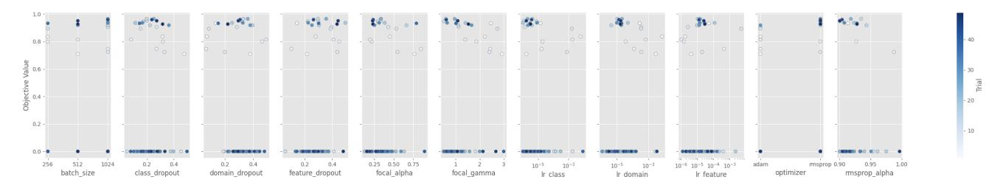

Figure 6.9: DANN Optuna hyperparameter optimisation Slice Plot.

#### 6.4.3 Training Procedure

The training hyperparameters have also been optimised using Optuna. Table [4](#page-41-2) shows the search space for the hyperparameters used during training. Each model uses the Adam optimiser with its respective learning rate, which is individually optimised. The choice for the loss function of the domain classifying part of training fell for the Binary Cross Entropy Loss, described in Sec. [5.2.2.](#page-26-0)

To address the class imbalance, we used a Focal Loss [\[31\]](#page-56-15) for the electron classifying part of the training. Since the output of both networks was raw logits, due to the absence of an activation function in both outer layers, PyTorch's BCEWithLogitsLoss was used. This function combines the Sigmoid output layer and the BCELoss, allowing it to be numerically more stable than using a Sigmoid output layer combined with BCELoss, by taking advantage of the log-sum-exp trick.

We divide the training and validation sets in a 70:30 ratio. During training, we use source-only batches to initialise the training of the class classifier, and then backpropagate the loss of the class classifier. For the domain classifier part of training, each batch consists of half of both source and target data. A code snippet is shown below. To suppress noisy signals from the domain classifier at the beginning of training, it's common to set a λ scheduler:

$$\lambda = \frac{2}{1 + \exp(-\gamma \cdot p)} - 1. \tag{6.8}$$

This gradually changes from 0 to 1 over training, where γ is set to 10. To study the impact of the λ scheduler, we trained the model for three different maximum values of λ, ranging from 0.1 to 1.

# 7 Results

We present the results of electron identification in pp collisions at √ s = 14 TeV. We begin with the XGBoost model's performance in classifying Monte Carlo data, and we run a real data sample to test its generalisation to domain-shifted data in Sec. [7.1.](#page-44-1) We then proceed to the domain adversarial neural network in Sec. [7.2.](#page-45-0) We start by evaluating the base-model DANN, i.e., λ = 0, and measure its performance on Monte Carlo and its ability to generalise to real data. We then proceed to the case of λ > 0, presenting both its ability to classify well on Monte Carlo data and its capacity to generalise its predictions for real detector data.

### 7.1 XGBoost

The area under the precision-recall curve (AUPRC) for the XGBoost model is 0.9886. We settled on a 99% purity sample, which corresponds to an 80% recall. To gauge the performance of the Monte Carlo-trained model when generalised to real data, we plot the label probability distributions. Fig. [7.1](#page-44-2) shows the label probability for Monte Carlo in blue, and real data in red, with the ratio plotted below. There is a clear disagreement regarding the probability distribution of both datasets. To quantify this disagreement, we used the Wasserstein Distance to calculate the distribution differences, which, in the case of XGBoost, turned out to be 0.000291. This value is small, as expected, since the distributions are generally similar. We can now use this value as a baseline indicator and observe how domain adaptation improves it.

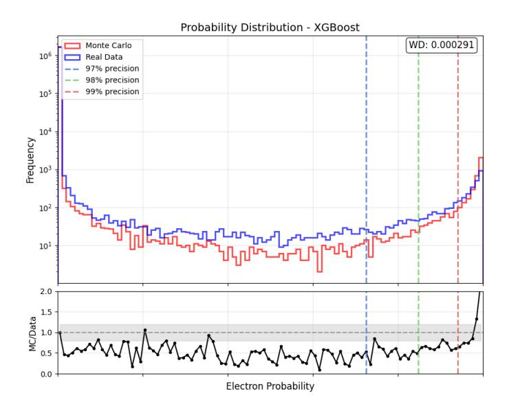

Figure 7.1: Label probability distribution for the XGBoost model. In red is the distribution for the Monte Carlo data run through the trained model, and in blue is the distribution for the real data. Below is a ratio plot, MC/Real Data. Dashed vertical lines indicate thresholds for different levels of purity, with in blue 97%, green 98% and in red 99% purity sample.

To further show both the performance on Monte Carlo and its generalisation, we plot the electron sample for the TPC signal at different thresholds. We select the thresholds corresponding to

97%, 98% and 99% purity samples. Fig. [7.2](#page-45-2) shows the electron sample on a Monte Carlo dataset on the left, and its generalisation for real data on the right.

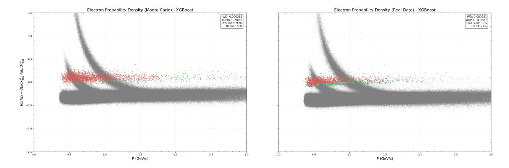

Figure 7.2: TPC energy loss distribution versus momentum for different purity bins. In red is the sample corresponding to 99% purity, in green 98% and blue 97%. On the left, we ran Monte Carlo data through the fully trained XGBoost model, and on the right, we ran a real dataset.

On the left of Fig. [7.2,](#page-45-2) we can see that the performance on Monte Carlo is excellent; however, when we run a real data sample through the model, it's obvious that both precision and recall decrease significantly. Conducting further analysis on the dielectrons would yield an imprecise invariant mass spectrum, unfit for actual data analysis. This is why domain adaptation is essential, and we'll move on to its application in the following sections.

### 7.2 Domain Adaptation

Despite its success in performance when it comes to Monte Carlo, XGBoost shows no promise when it comes to generalisation for real data samples. We require domain adaptation techniques to translate performance on Monte Carlo data to real data. We begin this section by examining the λ = 0 case, which allows us to directly assess the performance of the reversed gradient layer for values of λ > 0. We then examine the domain adaptation for different values of λ.

#### 7.2.1 Base-Line Model

Using λ = 0 essentially eliminates any impact the domain classifier might have on the feature space, rendering the model essentially into a multi-layered perceptron. Fig. [7.3](#page-46-0) shows the evolution of the AUPRC and the loss per epoch for both the training and validation phases. We can see that both the loss and the AUPRC start to flatten around the 80th epoch, showing no further improvement. After 100 epochs, the model reaches an AUPRC of 0.9862. The metric history shows the impact of the dropout layers on the model. We can see a clear difference, especially in the AUPRC, with the validation AUPRC consistently higher. Since the dropout layers essentially render a fraction of the neurons useless for each epoch, training becomes significantly more challenging, forcing the model to learn complex patterns that are overly dependent on only a specific subset of neurons. We plotted the label distributions for both Monte Carlo and real data, as shown in Fig. [7.4.](#page-46-1)

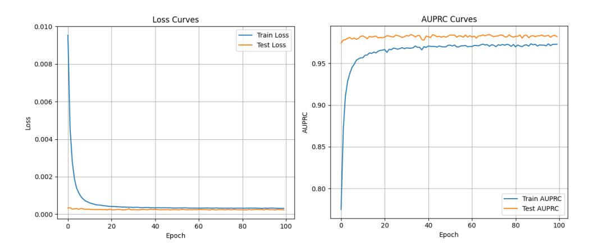

Figure 7.3: Training History for the losses and the AUPRC for the base-line neural network (λ = 0). In blue are the training curves and in orange the validation curves.

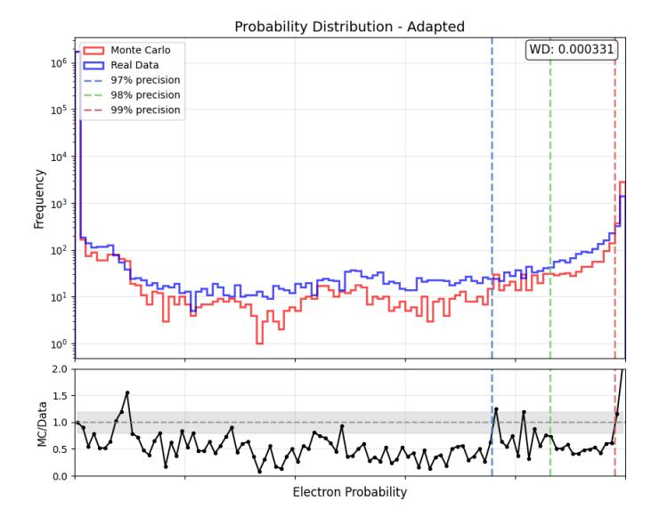

Figure 7.4: Label probability distribution for the base-line neural network (λ = 0). In red is the distribution for the Monte Carlo data run through the trained model, and in blue is the distribution for the real data. Below is a ratio plot, MC/Real Data. Dashed vertical lines indicate thresholds for different levels of purity, with in blue 97%, green 98% and in red 99% purity samples.

Again, the distributions show clear disagreements, with a WD value of 0.000331. Fig. [7.5](#page-47-1) shows the TPC signals with the electron sample highlighted for both Monte Carlo and real data. Again, we can see the impact of the shift in the distribution on the network's performance. Both recall and precision decrease, and further analysis would yield imprecise results.

Figure 7.5: TPC energy loss distribution versus momentum for different purity bins. In red is the sample corresponding to 99% purity, in green 98% and blue 97%. On the left we ran Monte Carlo data through the fully trained base-line neural network, and on the right we ran a real dataset.

#### 7.2.2 Domain Adversarial Neural Network

We now move on to the case of λ ̸= 0, where we analyse the results for multiple values of λ. Fig. [7.6](#page-48-0) shows the evaluation metrics per epoch for each value of λ. It shows no obvious change in the metric evolution per epoch, except for the domain loss at α = 0.1, which indicates that the reversed gradient layer is too weak and the change in the feature space induced by the label classifier is greater than that of the domain classifier.

We present the results of the domain adaptation for three values of λ. Fig. X shows the probability distributions for each value of λ. We observe an improvement in alignment as the strength of the domain adaptation parameter increases. This highlights the importance of the reversed gradient layer, and we can observe that a weak reversed gradient layer leads to the feature space being dominated by the label classifier, resulting in insufficient domain-invariant features. The WD distance for the λ = 0.1 case is 0.000231, representing a slight improvement with respect to the λ = 0 case. As we increase the parameter strength, we observe a substantial improvement in the distribution alignment of the label probabilities, reducing the WD to a value of 0.000135. Increasing the strength enables domain invariance in the feature space, as well as label-specific features. The best performance was observed for the λ = 1 case. Although the difference in label distribution alignment between λ = 0.5 and λ = 1 is not substantial, and the WD distance only drops to 0.000130, we can see that for higher probabilities, the alignment is noticeably improved.

While λ = 1 yields the best overall performance and shows promise, the quality of the generalisation of the Monte Carlo trained model goes down with momentum. This can be attributed to the severe class imbalance in our binary classification problem. As the domain classifier is trained (or rather, untrained), a large portion of the samples comes from the background. This leads to the domain adaptation's main focus being on the majority negative class, resulting in difficulty to

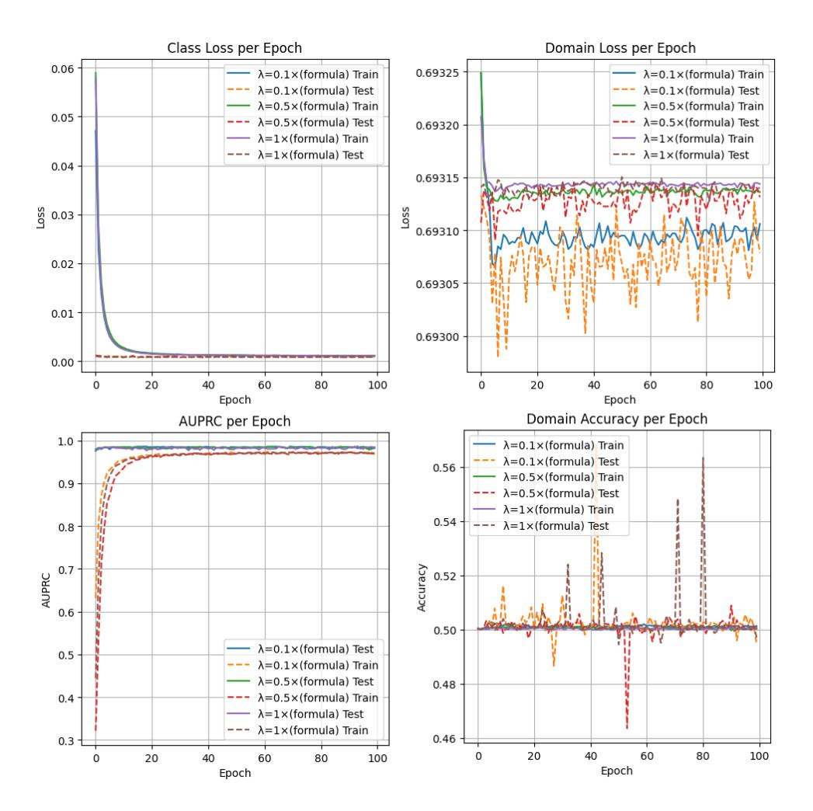

Figure 7.6: Training History for three values of λ, 0.1, 0.5 and 1. Dashed lines are the testing metrics.

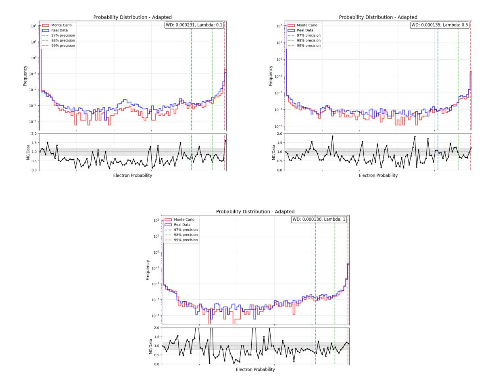

Figure 7.7: Label Probability distributions for increasing values of λ. From the top: λ = 0.1, 0.5, 1. In red the Monte Carlo distributions and in blue the real data distributions. Dashed vertical lines indicate thresholds for different levels of purity, with in blue 97%, green 98% and in red 99% purity sample.

learn domain-invariant features for the positive class. This becomes especially true in the higher momentum region, as the sample decreases with momentum, which is reflected in the TPC signal illustrated in Fig. [7.8.](#page-50-1)

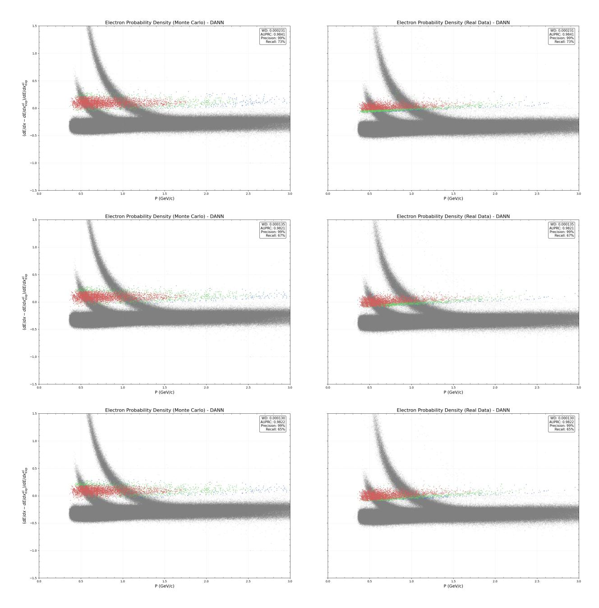

Figure 7.8: TPC energy loss distributions for increasing λ. From the top: λ = 0.1, 0.5, 1. On the left the Monte Carlo distributions and on the right the real data distributions.

#### 7.2.3 t-SNE visualisation

Fig. [7.9](#page-51-1) illustrates the feature space for the 99% purity sample of the λ = 1 model. We used the t-SNE[\[32\]](#page-57-0) dimensional reduction tool to project the 128-dimensional feature space onto a 2-

dimensional space. The axes are arbitrary.

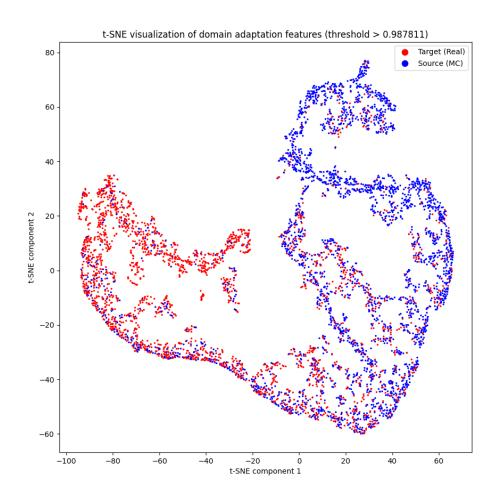

Figure 7.9: t-SNE visualisation of the feature space for the 99% purity sample. In blue we have the Monte Carlo data and in red the real data. The axis are arbitrary.

We can now see the problem of the aim for a domain accuracy of 50%. While it suggests successful domain confusion on a global scale, there still is a separation locally. Since our positive class is the minority, the separation of domains would fail to impact the global accuracy of 50%. Fig. [7.6](#page-48-0) illustrates this especially, we can see that for each λ value, the domain accuracies all fluctuate around 50%, yet show significant differences in their domain adaptation abilities. To address this challenge, we instead used the WD value as a metric to measure the success of the domain adaptation. We discuss this in the following section.

#### 7.2.4 Wasserstein Distance

Fig. [7.10](#page-52-0) shows the probability distribution of the model optimised to minimise the WD value. The WD value is lower, 0.000111, but there is a clear difference in distributions, which undermines practical performance. Note that the maximum value of the probability assigned to any data point is now 85% instead of 100%. This compression of the probability reduces the separation between the signal and background, resulting in a skewed WD value. Fig. [7.11](#page-52-1) presents the TPC signal for the electron samples at the different purity thresholds. The consequences of the misalignment become apparent when comparing the Monte Carlo and real data distributions.

While producing a numerically superior value, the model did not perform better. We can see that, by optimising directly for the minimisation of the WD value, the model instead prioritised alignment in the low probability region. This is shown in the label probability distribution, which reaches a maximum value of 0.85. This again demonstrates that a global distribution metric, in the case of imbalanced datasets, is a poor proxy for performance on the smaller and more sensitive positive class.

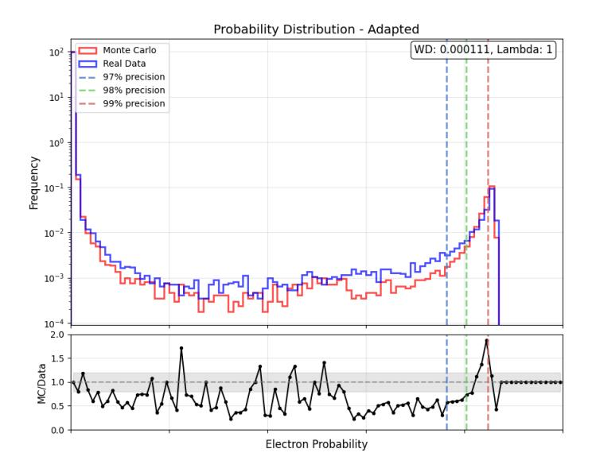

Figure 7.10: Label probability distributions for the model optimised to minise WD value. In blue real data distributions and in red Monte Carlo. The dashed vertical lines indicate purity thresholds.

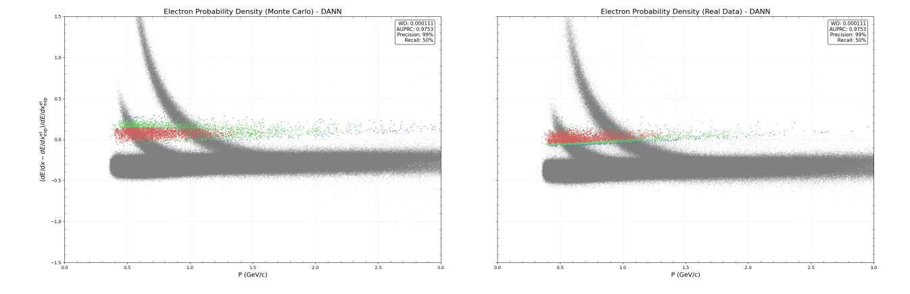

Figure 7.11: TPC Singal for the model optimised to minise the WD value for different purity samples. On the left the Monte Carlo data sample and on the right the real data sample.

# 8 Summary and Outlook

This thesis investigated the application of machine learning techniques to enhance electron identification methods in nuclear collisions, with the ultimate physics goal of studying the restoration of chiral symmetry in a hot and dense medium. Specifically, the focus was on training a model that can generalise its performance on Monte Carlo data to real detector data, using domain adaptation techniques. We started by training an XGBoost model on Monte Carlo data, and tested its ability to generalise by running a real detector data sample through the model. This proved unsuccessful, as the discrepancies between Monte Carlo and real data undermined the ability to perform well on a real data set. Thus, the requirement for a technique that overcomes these discrepancies was established. A domain adversarial neural network was trained that utilises a gradient reversal layer, consisting of three neural networks working together. It incorporates both Monte Carlo and real data, running it through a feature extractor that maps the input features onto a higherdimensional space. A mapped data sample is then run through a domain classifier, with the sole aim of establishing whether the data sample came from Monte Carlo or real data. As it predicts an output, the gradients are backpropagated through a gradient reversal layer, which multiplies the gradients by a negative constant, λ. This essentially reverses the training process and unlearns domain-specific features, thereby making the feature space domain-invariant. At the same time, a neural network is trained to classify electrons using the Monte Carlo dataset, ensuring that classspecific features are present in the space. Thus, when running a real dataset through the trained network, the label predictor will be able to generalise accurately and ensure a pure electron sample.

The results of the domain adversarial neural network demonstrate a significant improvement over a network trained solely on Monte Carlo data; however, further research is necessary to improve the quality of the domain adaptation. Due to the class imbalance, focusing on domain adaptation for the positive class is a challenging task. Since the domain classifier does not focus on a specific class or area, but rather on the complete dataset, relatively small areas of domain separation would not significantly impact the overall success of the adaptation. Yet, these areas of separation can have impacts on the generalisation of the label classifier itself, as shown in the presented results. This highlights the issue with using a metric like domain accuracy. Since this is a global metric, it is not sensitive to imbalances in the class labels, but rather focuses on the entire dataset. Thus, follow-up research would aim to address the class imbalance and focus the domain adaptation on areas most impactful for the label classifier. This can be achieved by finding a more suitable objective for the hyperparameter optimisation search using frameworks such as Optuna. Of course, our study showed that other global metrics, such as the WD distance in theory, "cheat" the model by creating a probability distribution that minimises the label distribution distance by prioritising lower probability regions and shifting the entire distribution. Careful consideration of an objective is much needed in this case. A study[\[33\]](#page-57-1) shows that feature weighting for domain adaptation with iterative label distribution could significantly benefit imbalanced datasets. A way to implement this is by backpropagating the classification loss to create feature-space weights, which directly addresses the issue at hand. This ensures the model prioritises regions most relevant for separating electrons from the background, and thus focuses on relevant regions instead of the entire dataset. Furthermore, iterative label distribution strategies, i.e., running multiple models in succession upon each other, can utilise predictions that build upon each other using so-called pseudo-labels. Overall, the results show promise and with careful consideration using domain-adaptation techniques could significantly benefit the efficiency of particle identification for real detector data, ensuring high-quality physics analysis.

REFERENCES 52

# References

[1] A. S. Kronfeld, T. Bhattacharya, T. Blum, N. H. Christ, C. DeTar, W. Detmold, R. Edwards, A. Hasenfratz, H.-W. Lin, S. Mukherjee, et al., Lattice qcd and particle physics (2022), [2207.](2207.07641) [07641](2207.07641), URL <https://arxiv.org/abs/2207.07641>.

- [2] A. Caliva, Low-mass dielectron measurement in pb–pb collisions at \$ √ s NN = 2.76 TeV\$withaliceatthelhc(2018).
- [3] R. Rapp and J. Wambach, Chiral symmetry restoration and dileptons in relativistic heavy-ion collisions (1999), <hep-ph/9909229>, URL <https://arxiv.org/abs/hep-ph/9909229>.
- [4] V. Koch, International Journal of Modern Physics E 06, 203–249 (1997), ISSN 1793-6608, URL <http://dx.doi.org/10.1142/S0218301397000147>.
- [5] T. Horn and C. D. Roberts, Journal of Physics G: Nuclear and Particle Physics 43, 073001 (2016), ISSN 1361-6471, URL <http://dx.doi.org/10.1088/0954-3899/43/7/073001>.
- [6] Z. Fodor, S. Bors´anyi, P. Parotto, and C. Ratti, The qcd phase diagram and equation of state, [https://www.gauss-centre.eu/results/elementaryparticlephysics/](https://www.gauss-centre.eu/results/elementaryparticlephysics/the-qcd-phase-diagram-and-equation-of-state) [the-qcd-phase-diagram-and-equation-of-state](https://www.gauss-centre.eu/results/elementaryparticlephysics/the-qcd-phase-diagram-and-equation-of-state) (2021), principal Investigator: Zolt´an Fodor, University of Wuppertal.
- [7] P. Braun-Munzinger and B. D¨onigus, Nuclear Physics A 987, 144–201 (2019), ISSN 0375- 9474, URL <http://dx.doi.org/10.1016/j.nuclphysa.2019.02.006>.
- [8] F. Gelis, E. Iancu, J. Jalilian-Marian, and R. Venugopalan, Annual Review of Nuclear and Particle Science 60, 463–489 (2010), ISSN 1545-4134, URL [http://dx.doi.org/10.1146/](http://dx.doi.org/10.1146/annurev.nucl.010909.083629) [annurev.nucl.010909.083629](http://dx.doi.org/10.1146/annurev.nucl.010909.083629).
- [9] R. Venugopalan, Journal of Physics G: Nuclear and Particle Physics 35, 104003 (2008), ISSN 1361-6471, URL <http://dx.doi.org/10.1088/0954-3899/35/10/104003>.
- [10] L. A. Harland-Lang, A. D. Martin, P. Motylinski, and R. S. Thorne, The European Physical Journal C 75 (2015), ISSN 1434-6052, URL [http://dx.doi.org/10.1140/epjc/](http://dx.doi.org/10.1140/epjc/s10052-015-3397-6) [s10052-015-3397-6](http://dx.doi.org/10.1140/epjc/s10052-015-3397-6).
- [11] P. M. Hohler and R. Rapp, Physics Letters B 731, 103–109 (2014), ISSN 0370-2693, URL <http://dx.doi.org/10.1016/j.physletb.2014.02.021>.
- [12] N. Valle, Nuclear Instruments and Methods in Physics Research Section A: Accelerators, Spectrometers, Detectors and Associated Equipment 1079, 170596 (2025), ISSN 0168-9002, URL <http://dx.doi.org/10.1016/j.nima.2025.170596>.
- [13] H. Shimodaira, Journal of Statistical Planning and Inference 90, 227 (2000).
- [14] (2005).
- [15] J. Alme, Y. Andres, H. Appelsh¨auser, S. Bablok, N. Bialas, R. Bolgen, U. Bonnes, R. Bramm, P. Braun-Munzinger, R. Campagnolo, et al., Nuclear Instruments and Methods in Physics Research Section A: Accelerators, Spectrometers, Detectors and Associated Equipment 622, 316–367 (2010), ISSN 0168-9002, URL <http://dx.doi.org/10.1016/j.nima.2010.04.042>.

REFERENCES 53

[16] N. Herrmann, ed., Technical Design Report for the CBM Time-of-Flight System (TOF) (GSI, Darmstadt, 2014), URL <https://repository.gsi.de/record/109024>.

- [17] D. Adamova, M. Aggarwal, G. Aglieri Rinella, M. Agnello, N. Agrawal, Z. Ahammed, S. Ahmad, S. Ahn, S. Aiola, A. Akindinov, et al., The European Physical Journal Plus 132 (2017).
- [18] T. Chen and C. Guestrin, in Proceedings of the 22nd ACM SIGKDD International Conference on Knowledge Discovery and Data Mining (ACM, 2016), KDD '16, p. 785–794, URL [http:](http://dx.doi.org/10.1145/2939672.2939785) [//dx.doi.org/10.1145/2939672.2939785](http://dx.doi.org/10.1145/2939672.2939785).
- [19] C. M. Bishop, Pattern Recognition and Machine Learning (Information Science and Statistics) (Springer, 2007), 1st ed., ISBN 0387310738, URL [http://www.amazon.](http://www.amazon.com/Pattern-Recognition-Learning-Information-Statistics/dp/0387310738%3FSubscriptionId%3D13CT5CVB80YFWJEPWS02%26tag%3Dws%26linkCode%3Dxm2%26camp%3D2025%26creative%3D165953%26creativeASIN%3D0387310738) [com/Pattern-Recognition-Learning-Information-Statistics/dp/0387310738%](http://www.amazon.com/Pattern-Recognition-Learning-Information-Statistics/dp/0387310738%3FSubscriptionId%3D13CT5CVB80YFWJEPWS02%26tag%3Dws%26linkCode%3Dxm2%26camp%3D2025%26creative%3D165953%26creativeASIN%3D0387310738) [3FSubscriptionId%3D13CT5CVB80YFWJEPWS02%26tag%3Dws%26linkCode%3Dxm2%26camp%](http://www.amazon.com/Pattern-Recognition-Learning-Information-Statistics/dp/0387310738%3FSubscriptionId%3D13CT5CVB80YFWJEPWS02%26tag%3Dws%26linkCode%3Dxm2%26camp%3D2025%26creative%3D165953%26creativeASIN%3D0387310738) [3D2025%26creative%3D165953%26creativeASIN%3D0387310738](http://www.amazon.com/Pattern-Recognition-Learning-Information-Statistics/dp/0387310738%3FSubscriptionId%3D13CT5CVB80YFWJEPWS02%26tag%3Dws%26linkCode%3Dxm2%26camp%3D2025%26creative%3D165953%26creativeASIN%3D0387310738).
- [20] H. Li, Z. Xu, G. Taylor, C. Studer, and T. Goldstein, Visualizing the loss landscape of neural nets (2018), <1712.09913>, URL <https://arxiv.org/abs/1712.09913>.
- [21] D. P. Kingma and J. Ba, Adam: A method for stochastic optimization (2017), <1412.6980>, URL <https://arxiv.org/abs/1412.6980>.
- [22] Y. Ganin and V. Lempitsky, Unsupervised domain adaptation by backpropagation (2015), <1409.7495>, URL <https://arxiv.org/abs/1409.7495>.
- [23] Y. Pei, S. Biswas, D. S. Fussell, and K. Pingali, An elementary introduction to kalman filtering (2019), <1710.04055>, URL <https://arxiv.org/abs/1710.04055>.
- [24] W. Yu (ALICE TPC), Nucl. Instrum. Meth. A 706, 55 (2013).
- [25] T. Lin, P. Goyal, R. B. Girshick, K. He, and P. Doll´ar, CoRR abs/1708.02002 (2017), <1708.02002>, URL <http://arxiv.org/abs/1708.02002>.
- [26] A. Paszke, S. Gross, F. Massa, A. Lerer, J. Bradbury, G. Chanan, T. Killeen, Z. Lin, N. Gimelshein, L. Antiga, et al., CoRR abs/1912.01703 (2019), <1912.01703>, URL [http:](http://arxiv.org/abs/1912.01703) [//arxiv.org/abs/1912.01703](http://arxiv.org/abs/1912.01703).
- [27] Lukasz Kamil Graczykowski, M. Jakubowska, K. R. Deja, and M. Kabus, Using machine learning for particle identification in alice (2022), <2204.06900>, URL [https://arxiv.org/](https://arxiv.org/abs/2204.06900) [abs/2204.06900](https://arxiv.org/abs/2204.06900).
- [28] V. Berger and Y. Zhou, Kolmogorov–Smirnov Test: Overview (2014), ISBN 9781118445112.
- [29] P. Naumann, J. Kauffmann, and G. Montavon, Wasserstein distances made explainable: Insights into dataset shifts and transport phenomena (2025), <2505.06123>, URL [https:](https://arxiv.org/abs/2505.06123) [//arxiv.org/abs/2505.06123](https://arxiv.org/abs/2505.06123).
- [30] A. Lipp and P. Vermeesch, Geochronology 5, 263 (2023), URL [https://gchron.copernicus.](https://gchron.copernicus.org/articles/5/263/2023/) [org/articles/5/263/2023/](https://gchron.copernicus.org/articles/5/263/2023/).
- [31] T.-Y. Lin, P. Goyal, R. Girshick, K. He, and P. Doll´ar, in 2017 IEEE International Conference on Computer Vision (ICCV) (2017), pp. 2999–3007.

REFERENCES 54

[32] L. van der Maaten and G. Hinton, Journal of Machine Learning Research 9, 2579 (2008), URL <http://www.jmlr.org/papers/v9/vandermaaten08a.html>.

[33] T. Westfechtel, H.-W. Yeh, Q. Meng, Y. Mukuta, and T. Harada, in WACV (IEEE, 2023), pp. 392–401, ISBN 978-1-6654-9346-8, URL [http://dblp.uni-trier.de/db/conf/wacv/](http://dblp.uni-trier.de/db/conf/wacv/wacv2023.html#WestfechtelYMMH23) [wacv2023.html#WestfechtelYMMH23](http://dblp.uni-trier.de/db/conf/wacv/wacv2023.html#WestfechtelYMMH23).